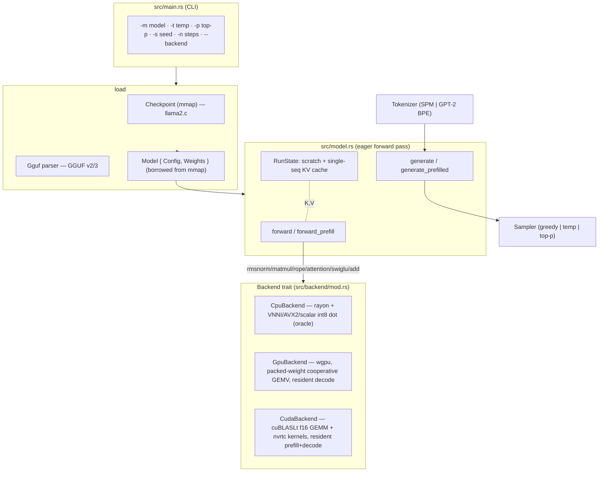

# 00. rusty_llama Architecture: End-to-End Overview

## Summary

`rusty_llama` is a from-scratch Llama-family inference engine in Rust (Llama, Qwen2, Phi-3, Gemma2, and Mixtral / Qwen2-MoE) — "llama.cpp, the
Rust way." It loads Karpathy llama2.c checkpoints **and** GGUF files, and runs the
Llama-family transformer (RMSNorm, RoPE incl. YaRN/llama3 scaling, grouped-query
attention, SwiGLU FFN). The whole design turns on one abstraction: a single
**`Backend` trait** (`src/backend/mod.rs`) that every heavy op goes through, so
the model code is written once and runs on three interchangeable backends — CPU,
wgpu (Vulkan/DX12/Metal), and CUDA/cuBLASLt. The engine is **eager and per-op**
(no compute graph): `model::forward` calls trait methods in sequence. ~10.8k LOC
of source; two optional features (`gpu`, `cuda`) keep the base build at three
small dependencies.

This document is the map; the eight numbered docs that follow are the territory.

─────────────────────────────────────────────────────────────────────────────

## Provenance

- This repository (`rusty_llama`), branch `main`, commit `e2a7d5d`, captured
  **2026-06-18**.
- Size: **10,772 LOC** under `src/` + **866** under `tests/`.
- Every claim in this capture is cited to `path:line` in the source at that
  commit. The companion external capture of llama.cpp lives in `docs/Research/`;
  cross-refs to it appear where a subsystem has a direct counterpart.
- Honest status, perf numbers, and the forward roadmap live in
  `09-status-and-roadmap.md`.

─────────────────────────────────────────────────────────────────────────────

## The Backend-trait design

The contract is strict and small: the transformer in `src/model.rs` never touches
a kernel — it only calls `Backend` methods. Adding a backend is a new
`impl Backend`; the model code is untouched. This mirrors llama.cpp's
ggml/backend split (`docs/Research/02-backends-and-dispatch.md`) but at the trait
level rather than a compute-graph + scheduler.

─────────────────────────────────────────────────────────────────────────────

## Crate map

| Module | LOC | Role | Detailed in |
|---|---:|---|---|
| `backend/mod.rs` | 224 | The `Backend` trait + batched default impls | `02` |
| `backend/cpu.rs` | 572 | `CpuBackend` — rayon, quantized-matmul dispatch, the parity oracle | `02` |
| `backend/gpu.rs` | 3463 | `GpuBackend` — wgpu, 21 WGSL pipelines, packed GEMV, resident decode | `03` |
| `backend/cuda.rs` | 1508 | `CudaBackend` — cuBLASLt f16 GEMM, nvrtc kernels, resident prefill+decode | `04` |
| `model.rs` | 747 | `Weights`/`Model`/`RunState`, `forward`/`forward_prefill`/`generate`, GGUF load | `01`, `06` |
| `config.rs` | 398 | `Config`, `RopeScaling`, `RopeTable` precompute | `01` |
| `math.rs` | 27 | small scalar math helpers | `01` |
| `quant.rs` | 1590 | `GgmlType`, block layouts, int8 dot kernels (VNNI/AVX2/scalar) | `05` |
| `tensor.rs` | 98 | `QMatrix` (f32 view / quantized block view) | `05` |
| `gguf.rs` | 301 | GGUF parser (`Gguf`, `MetaValue`) | `06` |
| `loader.rs` | 40 | `Checkpoint` (mmap, llama2.c) | `06` |
| `dummy.rs` | 391 | synthetic GGUF builders for tests | `06` |
| `tokenizer.rs` | 957 | `Tokenizer` (SPM, GPT-2 BPE), pretokenizer | `07` |
| `sampler.rs` | 158 | `Sampler` (greedy/temp/top-p) | `07` |
| `main.rs` | 209 | CLI + wiring | `07` |
| `error.rs` | 39 | `Error`/`Result` | — |
| `tests/` | 866 | parity (CPU oracle), golden fixtures, benches | `08` |

Features: `gpu = [wgpu 29, pollster]`; `cuda = [cudarc 0.19 (dynamic-loading,
cublaslt, nvrtc, f16), half]`. Base deps: `fancy-regex`, `memmap2`, `rayon`.

─────────────────────────────────────────────────────────────────────────────

## Public API surface

Re-exported from `src/lib.rs`: `Backend`, `CpuBackend`, `CudaBackend` (cuda),
`GpuBackend` (gpu), `Config`, `RopeScaling`, `RopeTable`, `Error`, `Result`,
`Gguf`, `Checkpoint`, `forward`, `forward_prefill`, `generate`, `Model`,
`RunState`, `Weights`, `GgmlType`, `Sampler`, `QMatrix`, `Tokenizer`.

─────────────────────────────────────────────────────────────────────────────

## End-to-end generation lifecycle

From a prompt to streamed tokens (`src/main.rs` → `generate`):

1. **Load.** `main.rs` branches on `Gguf::is_gguf`: GGUF → `Model::from_gguf`
   (mmap, zero-copy tensor borrow); else llama2.c → `Checkpoint` + `Model::parse`.
   Weights are borrowed straight from the mmap (`QMatrix`), staying compressed. → `06`
2. **Tokenize.** `Tokenizer::from_gguf` picks SPM (`llama`) or GPT-2 BPE (`gpt2`)
   from `tokenizer.ggml.model`; `encode(prompt, bos=true, …)` → token ids. → `07`
3. **Prefill.** If the prompt has ≥2 tokens, `generate_prefilled` runs
   `forward_prefill` once — a batched pass that fills the KV cache for the whole
   prompt and leaves only the last position's logits. → `01`
4. **Decode loop.** For each step, `forward` (or the backend's resident
   `forward_step`) runs one token at position `pos`: embed → per layer {rmsnorm,
   q/k/v matmul (K/V written into the cache), rope, GQA attention, o-proj,
   residual, rmsnorm, SwiGLU FFN, residual} → final rmsnorm → lm_head logits.
   Each op is a `Backend` call. → `01`, `02`
5. **Sample.** `Sampler::sample` selects the next token: greedy (temp 0),
   temperature + multinomial, or top-p nucleus. → `07`
6. **Stream + stop.** The token is decoded to bytes and streamed via `on_piece`;
   it becomes the next single-token step. BOS (id 1) doubles as the stop token. → `01`

On the GPU/CUDA backends, steps 3–4 are **resident**: `forward_prefill` and
`forward_step` are overridden to keep activations + KV on device across the loop,
collapsing host↔device round-trips. → `03`, `04`

─────────────────────────────────────────────────────────────────────────────

## The three backends at a glance

| | CPU (`02`) | wgpu (`03`) | CUDA (`04`) |
|---|---|---|---|
| Feature | base (always) | `gpu` | `cuda` |
| API | native Rust + `core::arch` | wgpu 29 (Vulkan/DX12/Metal) | cudarc 0.19 (dynamic-load) |
| Matmul | int8 dot: VNNI→AVX2→scalar | packed-weight cooperative GEMV (f32 + int8 DP4A) | cuBLASLt `Matmul<f16>` (f32 accum) |
| Weights | borrowed, dequant per-block | resident, packed (Q8_0/Q4_K/Q6_K) | resident, dequant→f16 cache (~2.2 GB) |
| Prefill | per-op (loops single-token) | per-op (default trait path) | **resident fused** |
| Decode | per-op (`forward`) | **resident** (`fused_step`) | **resident** (`forward_step`) |
| Role | **parity oracle** for the others | portable GPU | tensor-core GPU |

─────────────────────────────────────────────────────────────────────────────

## Performance snapshot

TinyLlama-1.1B Q4_K_M, Core Ultra 9 285H + RTX 5070 Ti (Blackwell), vs llama.cpp
`b9672` (`PERFORMANCE.md`):

| Path | Metric | rusty_llama | llama.cpp | Gap |
|---|---|---:|---:|---|
| CPU | decode tok/s | 49.8 (AVX2) | 73.6 | 1.48× |
| wgpu | decode tok/s | 45.9 | 375.9 (Vulkan) | 8.2× |
| CUDA | prefill pp512 tok/s | ~5,230 | 19,637 | ~3.8× |
| CUDA | decode tg128 tok/s | ~289 | 415 | ~1.4× |

The decode gap is weight **bandwidth** (we stream f16 ≈2 B/weight vs Q4_K ≈0.56);
the prefill gap is GEMM kernel quality (cuBLASLt vs llama.cpp's fused MMQ). Full
analysis + roadmap in `09-status-and-roadmap.md`.

─────────────────────────────────────────────────────────────────────────────

## How to read this capture

- **Core:** `01-model-and-forward-pass.md` → `02-backend-trait-and-cpu.md`.
- **Backends:** `03-gpu-backend-wgpu.md`, `04-cuda-backend.md`.
- **Data:** `05-quantization.md`, `06-gguf-and-loading.md`.
- **Text:** `07-tokenizer-and-sampler.md`.
- **Quality:** `08-testing-benchmarking-parity.md`.
- **Where it stands / what's next:** `09-status-and-roadmap.md`.
- **External comparison:** `../Research/` (the llama.cpp capture).

─────────────────────────────────────────────────────────────────────────────

## Status & known gaps (brief)

Six architectures (Llama, Qwen2, Phi-3, Gemma2, + Mixtral / Qwen2-MoE), single sequence (no batching/server), four
sampler behaviors, six quant types consumed (no quantize-to-disk). The CUDA
backend is the speed frontier (prefill at the cuBLASLt wall, decode at the f16
bandwidth wall). The honest, ROI-ranked treatment — plus the doc-drift items this
capture surfaced — is `09-status-and-roadmap.md`.
