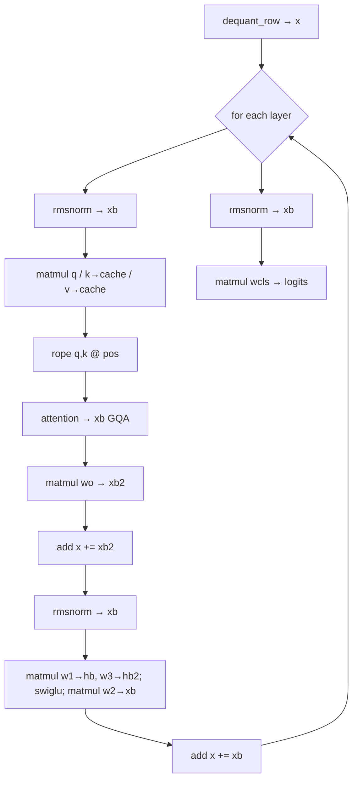

# 01. Model & Forward Pass

## Summary

This is the heart of the engine: the in-memory model representation (`Config`, `Weights`, `Model`) and the op-by-op transformer forward pass (`forward`, `forward_prefill`) plus the autoregressive driver (`generate`). Three things matter most: (1) every matmul weight is a `QMatrix` borrowed from the memory-mapped file and dequantized on the fly, while only the tiny RMSNorm vectors are kept/owned as plain `f32`; (2) the forward pass never touches a kernel directly — every primitive (rmsnorm, matmul, rope, attention, swiglu, add) is a `Backend` trait call, so the orchestration is backend-agnostic; (3) RoPE long-context scaling (None/Linear/Llama3/YaRN) is folded into a single precomputed `RopeTable` at load time, so the hot path only multiplies by precomputed inverse frequencies. The KV cache is single-sequence, sized `(n_layers, seq_len, kv_dim)`, and positions index it directly.

Sources: `src/model.rs`, `src/config.rs`, `src/math.rs`, `src/tensor.rs`, `src/backend/mod.rs`. GGUF/llama2.c *loading* mechanics (`from_gguf`, `parse`, dequant helpers) are doc `06-gguf-and-loading.md`'s job and only referenced here.

─────────────────────────────────────────────────

## `Config` — transformer hyper-parameters

`Config` (`src/config.rs:62-90`) is `Copy`; the first eight fields mirror the llama2.c checkpoint header, the last four are GGUF-explicit knobs llama2.c leaves implicit.

```rust
pub struct Config {
    pub dim: usize,            // model / residual-stream width
    pub hidden_dim: usize,     // SwiGLU inner width
    pub n_layers: usize,       // transformer blocks
    pub n_heads: usize,        // query heads
    pub n_kv_heads: usize,     // key/value heads (< n_heads ⇒ GQA)
    pub vocab_size: usize,     // vocabulary size
    pub seq_len: usize,        // max context the KV cache is sized for
    pub shared_weights: bool,  // classifier reuses token-embedding matrix
    pub rope_freq_base: f32,   // θ: 1e4 Llama-2, 5e5 Llama-3, 1e6 Qwen2
    pub rms_eps: f32,          // RMSNorm epsilon
    pub rope_dim: usize,       // RoPE-rotated dims/head; 0 ⇒ full rotary
    pub rope_scaling: RopeScaling, // long-context freq scaling
}
```

`Default` (`src/config.rs:92-109`) zeroes the shape fields and sets the Llama-2 implicit defaults: `shared_weights=true`, `rope_freq_base=10000.0`, `rms_eps=1e-5`, `rope_dim=0`, `rope_scaling=None`.

Derived helpers (`src/config.rs:115-142`):

| Helper | Formula | Meaning |
|---|---|---|
| `head_size()` | `dim / n_heads` | per-head width |
| `kv_dim()` | `dim * n_kv_heads / n_heads` | total K/V projection width |
| `kv_mul()` | `n_heads / n_kv_heads` | query heads sharing one KV head |
| `rotary_dim()` | `rope_dim==0 ? head_size : rope_dim` | dims RoPE rotates per head |

`validate()` (`src/config.rs:268-299`) enforces the invariants the inference code assumes: non-zero `dim/n_heads/n_kv_heads/vocab_size`, `dim % n_heads == 0`, `n_heads % n_kv_heads == 0`, **even** `head_size` (RoPE rotates pairs), and finite-positive `rope_freq_base`/`rms_eps`.

### Header parsing — `read_header`

`Config::read_header` (`src/config.rs:226-265`) parses the 7×`int32` little-endian llama2.c header (`HEADER_BYTES = 7*4 = 28`, `src/config.rs:113`): `dim, hidden_dim, n_layers, n_heads, n_kv_heads, vocab_raw, seq_len`. The format smuggles `shared_weights` into the **sign** of `vocab_size`: `shared_weights = vocab_raw > 0`, and `vocab_size = vocab_raw.unsigned_abs()` (`src/config.rs:249,257`). The remaining real-model fields fall back to `Default` via `..Default::default()` (`src/config.rs:261`), then `validate()` runs. (GGUF populates the same `Config` directly in `from_gguf`; see doc 06.)

─────────────────────────────────────────────────

## RoPE scaling & the precomputed `RopeTable`

`RopeScaling` (`src/config.rs:11-39`) is a `Copy` enum, default `None`:

```rust
pub enum RopeScaling {
    None,                                   // plain base^(-2j/d)
    Linear { factor: f32 },                 // position interpolation
    Llama3 { factor, low_freq_factor, high_freq_factor, orig_ctx },
    Yarn   { factor, orig_ctx, attn_factor, beta_fast, beta_slow },
}
```

`read_rope_scaling` (`src/model.rs:245-277`) reads `{arch}.rope.scaling.*` from GGUF. Defaults when keys are absent: `factor=1.0`; Llama3 `low_freq_factor=1.0`, `high_freq_factor=4.0`; YaRN `attn_factor=1.0`, `beta_fast=32.0`, `beta_slow=1.0` (the last two have no standard GGUF keys, so llama.cpp's defaults are hard-coded). An unknown `type` is a hard `Error::Format`.

`RopeTable` (`src/config.rs:47-53`) is the precomputed product, built **once at load time** by `Config::rope_table` (`src/config.rs:150-223`) and stored on `Model.rope` (`src/model.rs:55`, set at `103`/`219`):

```rust
pub struct RopeTable {
    pub inv_freq: Vec<f32>, // one per rotated (even,odd) pair = rotary_dim/2
    pub mscale:   f32,      // rotation magnitude scale (1.0 unless YaRN)
}
```

Base frequencies: `inv_freq[j] = base^(-2j/rotary_dim)` for `j in 0..rotary_dim/2`, with `base = rope_freq_base` in `f64` (`src/config.rs:153-156`). Each variant then rewrites them:

| Variant | Effect on `inv_freq` | `mscale` |
|---|---|---|
| `None` | unchanged (`:160`) | 1.0 |
| `Linear { factor }` | `*= 1/factor` (`:161-166`) | 1.0 |
| `Llama3` | per-pair piecewise on wavelength `2π/freq`: high-freq extrapolate (unchanged), low-freq `/factor`, medium band smooth blend (`:167-192`) | 1.0 |
| `Yarn` | NTK-by-parts ramp between correction indices `low`/`high` (`corr(n_rot)`), blending `freq_scale=1/factor` (interpolate) and 1.0 (extrapolate) (`:193-216`) | `attn_factor * (1 + 0.1*ln(factor))` (`:218`) |

`inv_freq.len() == rotary_dim/2`; for partial rotary it is shorter than `head_size/2`, and the backend leaves the trailing (unrotated) pairs of each head untouched. The math mirrors llama.cpp's `rope_yarn` / HF `_compute_*_parameters`.

─────────────────────────────────────────────────

## `Weights` — tensor layout

`Weights<'a>` (`src/model.rs:20-46`) splits into matmul matrices (`QMatrix`, borrowed from mmap, possibly quantized) and RMSNorm vectors (`Cow<'a,[f32]>`, plain f32):

| Field | Type | Shape | Notes |
|---|---|---|---|
| `token_embedding_table` | `QMatrix` | `(vocab_size, dim)` | rows double as per-token input embeddings |
| `wcls` | `QMatrix` | `(vocab_size, dim)` | output classifier; **may alias** `token_embedding_table` when `shared_weights` |
| `rms_att_weight` | `Cow<[f32]>` | `(n_layers, dim)` | per-layer attention norm |
| `rms_ffn_weight` | `Cow<[f32]>` | `(n_layers, dim)` | per-layer FFN norm |
| `rms_final_weight` | `Cow<[f32]>` | `(dim,)` | final norm |
| `wq` | `Vec<QMatrix>` | each `(dim, dim)` | query proj |
| `wk` | `Vec<QMatrix>` | each `(kv_dim, dim)` | key proj |
| `wv` | `Vec<QMatrix>` | each `(kv_dim, dim)` | value proj |
| `wo` | `Vec<QMatrix>` | each `(dim, dim)` | attn output proj |
| `w1` | `Vec<QMatrix>` | each `(hidden_dim, dim)` | SwiGLU **gate** |
| `w2` | `Vec<QMatrix>` | each `(dim, hidden_dim)` | SwiGLU **down** |
| `w3` | `Vec<QMatrix>` | each `(hidden_dim, dim)` | SwiGLU **up** |

`QMatrix` (`src/tensor.rs:15-29`) is `F32 { data: Cow<[f32]>, rows, cols }` or `Quant { ty: GgmlType, data: Cow<[u8]>, rows, cols }`, row-major `(rows=out features, cols=in features)`. `dequant_row(row, out)` (`src/tensor.rs:84-97`) expands one row into `out` (len must == `cols`) — used both for the embedding lookup and per-row inside the matmul kernel.

**Source matters for borrow vs. own:**
- llama2.c `parse` (`src/model.rs:64-124`): every `QMatrix` is an `F32` view over mmap bytes via `f32_slice`/`f32_layers`; RMSNorm vectors are `Cow::Borrowed`. Per-layer matrices come from one contiguous `(n_layers, rows, cols)` slab split by `f32_layers` (`src/model.rs:281-286`).
- GGUF `from_gguf` (`src/model.rs:136-236`): matmul matrices stay quantized and **borrowed** (`qmatrix_from_gguf`, `:292-312`); RMSNorm vectors are dequantized and **owned** (`Cow::Owned` via `concat`/`deq_tensor`, `:196-203,224-226`).

Per-layer organization is one `QMatrix` per `(layer, projection)`; the model never holds a full f32 expansion of a quantized weight in RAM.

─────────────────────────────────────────────────

## `RunState` — scratch + KV cache

`RunState` (`src/model.rs:323-334`) is mutable scratch reused across single-token forward passes. `RunState::new(c)` (`src/model.rs:338-353`) allocates:

| Buffer | Length | Role |
|---|---|---|
| `x` | `dim` | residual stream |
| `xb` | `dim` | general scratch (norm out, attn out) |
| `xb2` | `dim` | general scratch (o-proj out) |
| `hb` | `hidden_dim` | FFN gate scratch |
| `hb2` | `hidden_dim` | FFN up scratch |
| `q` | `dim` | query vector (all heads) |
| `att` | `n_heads * seq_len` | attention scores scratch |
| `logits` | `vocab_size` | output logits |
| `key_cache` | `n_layers * seq_len * kv_dim` | K cache |
| `value_cache` | `n_layers * seq_len * kv_dim` | V cache |

**KV cache layout** is flat `(n_layers, seq_len, kv_dim)`, row-major. Position indexing in `forward` (`src/model.rs:418-419`): `loff = layer*seq_len*kv_dim` selects the layer block; `kv_at = loff + pos*kv_dim` is the write slot for the current position; the attention read spans the whole layer block `loff .. loff + seq_len*kv_dim`. This is **single-sequence** — there is no batch/sequence dimension.

`logits()` / `logits_mut()` expose the result buffer (the sampler scales it in place). Under `gpu`/`cuda` features, `key_cache()`/`value_cache()` (`src/model.rs:367-376`) and `store_prefill_kv` (`src/model.rs:382-386`) let a device backend mirror or repopulate the host cache so subsequent CPU `forward_step` decode reads correct keys/values.

─────────────────────────────────────────────────

## The forward pass, op by op (`forward`)

`forward(model, state, backend: &dyn Backend, token, pos)` (`src/model.rs:393-477`) runs one transformer step for `token` at absolute position `pos`, reads/writes the KV cache, and leaves next-token logits in `state.logits()`. It mirrors llama2.c's `forward()` op-for-op. Every primitive is a `Backend` call (`src/backend/mod.rs:32-224`); shapes are passed explicitly.



Step-by-step with `Backend` mapping:

| # | Op | Code | Backend call |
|---|---|---|---|
| 0 | Embed: seed residual `x` with token row | `:407` | `QMatrix::dequant_row` (not a Backend op) |
| 1 | Attn RMSNorm `x → xb` | `:411-416` | `rmsnorm(out,x,weight,eps)` |
| 2 | Q proj `xb → q` | `:421` | `matmul(out,x,w)` |
| 3 | K proj `xb →` `key_cache[kv_at..]` | `:422-426` | `matmul` (writes straight into cache) |
| 4 | V proj `xb →` `value_cache[kv_at..]` | `:427-431` | `matmul` (writes straight into cache) |
| 5 | RoPE rotate `q` and cached `k` in place @ `pos` | `:433-441` | `rope(q,k,pos,head_size,kv_dim,inv_freq,mscale)` |
| 6 | GQA attention over cache `0..=pos` `→ xb` | `:443-455` | `attention(out,q,key_cache,value_cache,att,pos,n_heads,n_kv_heads,head_size,seq_len,kv_dim)` |
| 7 | Output proj `xb → xb2` | `:457` | `matmul` |
| 8 | Residual `x += xb2` | `:458` | `add(out,x)` |
| 9 | FFN RMSNorm `x → xb` | `:461-466` | `rmsnorm` |
| 10 | Gate `xb → hb` (`w1`) | `:467` | `matmul` |
| 11 | Up `xb → hb2` (`w3`) | `:468` | `matmul` |
| 12 | SwiGLU `hb = silu(hb)*hb2` | `:469` | `swiglu(hb,hb2)` |
| 13 | Down `hb → xb` (`w2`) | `:470` | `matmul` |
| 14 | Residual `x += xb` | `:471` | `add` |
| 15 | Final RMSNorm `x → xb` | `:475` | `rmsnorm` (into `xb` to avoid aliasing `x`) |
| 16 | Classifier `xb → logits` (`wcls`) | `:476` | `matmul` |

Notes on the subtle bits:
- **K/V are written before RoPE**: the projection matmuls (steps 3-4) write directly into the cache slot, then `rope` rotates `q` (the local buffer) and the just-written `k` (the cache slice) **in place** (`src/model.rs:433-441`). `v` is never rotated.
- **GQA**: `attention` gets both `n_heads` and `n_kv_heads`; query head→KV head mapping uses `kv_mul = n_heads/n_kv_heads`. The CPU kernel computes the softmaxed scores into `att`; the contract (`src/backend/mod.rs:65-87`) says `att` contents are unspecified after the call — callers must not rely on them.
- **RoPE is partial-rotary aware**: only the first `inv_freq.len()` pairs (`rotary_dim/2`) of each head are rotated; trailing pairs pass through (`src/backend/mod.rs:44-63`).
- `slice(tensor, layer, stride)` (`src/model.rs:713-715`) borrows the per-layer RMSNorm row out of the flat `(n_layers, dim)` buffer.

`forward` itself is invoked indirectly: the decode loop calls `backend.forward_step` (`src/backend/mod.rs:194-204`), which for the CPU backend *is* the per-op `forward`; a device backend may override it to keep state resident (must match the per-op result).

─────────────────────────────────────────────────

## Batched prefill (`forward_prefill`)

`forward_prefill<B: Backend + ?Sized>(model, state, backend, tokens, pos_base)` (`src/model.rs:491-588`) runs the whole prompt through every layer at once. It is **exactly equivalent** to calling `forward` once per token in order — the batched `Backend` ops (`*_batch`) have default impls that just loop the single-token op (`src/backend/mod.rs:101-192`), so any backend is correct for free; a batching backend (GPU/CUDA) overrides them to fuse each op into one large kernel and collapse host↔device round-trips.

Differences from `forward`:
- **Batch scratch is local**, not from `RunState`: `x, xb, xb2, q` are `(n, dim)` and `hb, hb2` are `(n, hidden_dim)`, allocated per call (`src/model.rs:508-513`) because prefill runs once per prompt. Only `key_cache`/`value_cache`, `att`, and `logits` come from `state`.
- Each row `r` is seeded with its token's embedding into `x[r*dim..]` (`src/model.rs:516-519`).
- Per layer it calls `rmsnorm_batch`, three `matmul_batch` (Q→`q`, K→cache `kv_start..`, V→cache, where `kv_start = loff + pos_base*kv_dim`, `kv_span = n*kv_dim`), `rope_batch` (row `r` rotates at `pos_base+r`), `attention_batch` (causal: query row `r` attends keys `0..=pos_base+r`), `matmul_batch` for `wo`, `add`, then the SwiGLU block (`rmsnorm_batch`, `w1`/`w3` `matmul_batch`, `swiglu`, `w2` `matmul_batch`, `add`) (`src/model.rs:521-580`).
- **Only the last row is classified**: `forward_prefill` norms+classifies just `x[(n-1)*dim..]` via single-token `rmsnorm`+`matmul` into `state.logits` (`src/model.rs:582-587`). The classifier is the widest matmul, so running it `n×` would be wasted work — a greedy/sampling decoder only needs the prompt's final-position logits.
- `pos_base` is general but normally `0`, making the prompt's cache rows contiguous (`src/model.rs:489-490`).

The `Backend::forward_prefill` trait method (`src/backend/mod.rs:215-223`) defaults to `crate::model::forward_prefill`; a backend with a resident fused prefill (CUDA) overrides it but **must** leave `state`'s KV cache populated for the prompt rows so subsequent `forward_step` decode is correct.

─────────────────────────────────────────────────

## Generation driver (`generate` / `generate_prefilled`)

`generate(model, state, backend, tokenizer, sampler, prompt, steps, on_piece)` (`src/model.rs:596-652`) is the public autoregressive loop; returns the count of generated tokens (excluding the prompt) and streams decoded bytes to `on_piece`.

1. Encode prompt with BOS: `tokenizer.encode(prompt, true, false)` (`:606`).
2. Clamp `steps = steps.min(seq_len)` (`:607`).
3. **Fast path** (`:613-624`): if `n >= 2 && steps >= n`, delegate to `generate_prefilled` — only taken when every prompt token would be processed anyway, so the emitted stream is byte-identical to the sequential loop.
4. **Sequential loop** (`:626-649`): start at `token = prompt_tokens[0]`, `pos = 0`. Each iteration calls `backend.forward_step(model, state, token, pos)`, then picks `next`: while `pos < prompt_tokens.len()-1` it **forces** the next prompt token; otherwise it `sampler.sample(state.logits_mut())`. `pos += 1`. If `next == 1` (BOS doubles as EOS) it breaks. Else `on_piece(tokenizer.decode(token, next))`, advance `token = next`, `generated += 1`.

`generate_prefilled(...)` (`src/model.rs:660-709`) — caller guarantees `prompt_tokens.len() >= 2` and `steps >= len`:

1. `backend.forward_prefill(model, state, prompt_tokens, 0)` fills the KV cache for the whole prompt in one batched pass (dispatched through the trait so a resident CUDA prefill is used) (`:675`).
2. **Echo prompt transitions** so streamed output matches the sequential loop: for `r in 0..n-1`, `on_piece(tokenizer.decode(prompt_tokens[r], prompt_tokens[r+1]))`; a mid-prompt BOS returns early, matching the loop's break (`:679-686`).
3. Sample the first generated token from the **last prompt position's** logits left by prefill (`:692`), then single-token decode from `pos = n` onward via `forward_step` + `sample`, same BOS-stop and `steps` clamp (`:690-706`).

Both paths produce the identical token stream; only the prompt's KV fill differs (looped `forward_step` vs. one batched `forward_prefill`). `decode(prev, cur)` renders `cur`'s piece, so BOS (id 1) is the de-facto end-of-sequence delimiter throughout, matching llama2.c.

`math.rs` (`src/math.rs`) supplies the two numeric helpers these kernels lean on: `softmax` (max-subtracted, in place; `:7-21`) used inside attention, and `silu(x) = x*sigmoid(x)` (`:25-27`) used by SwiGLU.

─────────────────────────────────────────────────

## Status, gaps & notes

- **Single-sequence KV cache only.** `key_cache`/`value_cache` are flat `(n_layers, seq_len, kv_dim)` with no batch/sequence dimension (`src/model.rs:332-334`); no paged attention, no concurrent sequences, no cache eviction/sliding window. Context is hard-capped at `seq_len` (steps clamped, `src/model.rs:607`).
- **Llama-family architecture only.** `from_gguf` assumes the `llama` tensor naming (`attn_q/k/v/output`, `ffn_gate/up/down`, `*_norm`) and the RMSNorm→RoPE→GQA→SwiGLU block; no MoE, no parallel-residual / GPT-NeoX layouts, no per-layer norm bias, no attention/QK norm.
- **BOS-as-EOS stop.** Generation stops only on token id `1` (`src/model.rs:642,681,695`); there is no configurable EOS set, no stop strings, no max-new-token vs. context distinction beyond the `seq_len` clamp.
- **No batched logits from prefill.** `forward_prefill` discards all but the final-position logits (`src/model.rs:582-587`), so it cannot serve prompt-token logprobs or scoring use cases.
- **Doc-comment drift:** `from_gguf`'s doc comment still says partial rotary and long-context RoPE scaling are "not yet handled" (`src/model.rs:133-135`), but both are in fact implemented (`rope_dim` at `:156-163`, `read_rope_scaling` at `:166`). The comment is stale; the code is correct.
- **Eager, per-op dispatch.** The forward pass is a straight-line sequence of `Backend` calls with no graph/fusion at this layer; fusion (if any) lives inside a backend's `forward_step`/`*_batch` overrides (CPU does not fuse). Contrast llama.cpp, which builds a `ggml` compute graph.

**llama.cpp counterparts:** `docs/Research/06-inference-pipeline.md` (decode loop, KV cache, batching) and, for the eager-vs-graph contrast, `docs/Research/01-ggml-core-and-graph.md`. Sibling docs: `02-backend-trait-and-cpu.md` (kernel implementations of every op above), `05-quantization.md` (`QMatrix`/`dequant_row`), `06-gguf-and-loading.md` (`parse`/`from_gguf`), `07-tokenizer-and-sampler.md` (`encode`/`decode`/`sample`).
