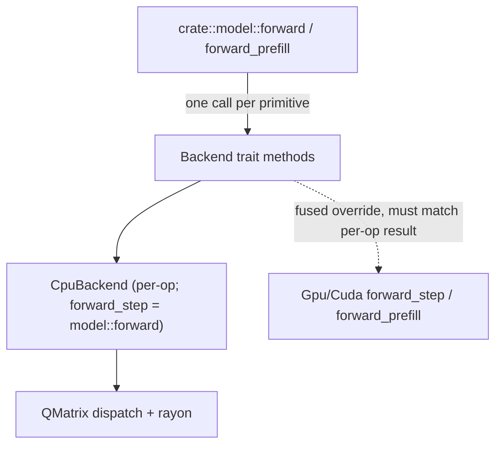

# 02. Backend Trait & CPU Backend

## Summary

Every primitive the transformer needs — RMSNorm, matmul, RoPE, attention, SwiGLU, residual add — is expressed through the single `Backend` trait (`src/backend/mod.rs:32`). The forward pass in `crate::model` never touches a raw kernel; it only calls trait methods, so a new backend is "just" a new `impl Backend`. The trait ships **default batched impls** that loop the single-token op (`src/backend/mod.rs:112-192`) and a default `forward_prefill` that mirrors the per-op model path (`src/backend/mod.rs:222`), so any backend is *correct for free* and only overrides for speed. `CpuBackend` (`src/backend/cpu.rs:39`) is a stateless ZST: rayon parallelizes over output rows in `matmul`/`attention`, the inner f32 loops are written to autovectorize, and the quantized `matmul` performs a **two-tier dispatch** — by `GgmlType` to pick an activation-quant scheme + `vec_dot` function pointer (`src/backend/cpu.rs:74-103`), which then runs its own runtime SIMD dispatch inside `quant.rs`.

llama.cpp counterpart: `docs/Research/02-backends-and-dispatch.md`.

─────────────────────────────────────────────────────────

## The `Backend` trait: the single abstraction

`pub trait Backend: Send + Sync` (`src/backend/mod.rs:32`). `Send + Sync` is required so the orchestration (and rayon inside the CPU impl) can share `&self` across threads. Everything operates on plain `f32` slices except matmul weights, which arrive as a `&QMatrix` (`src/tensor.rs:15`) so the kernel can dequantize on the fly. Shapes are passed explicitly; the contract between model and backend is fully transparent (no hidden tensor metadata).

### Single-token (decode) primitives

| Method | Signature (verbatim) | Semantics |
|---|---|---|
| `rmsnorm` | `fn rmsnorm(&self, out: &mut [f32], x: &[f32], weight: &[f32], eps: f32)` | `out = x / sqrt(mean(x²)+eps) * weight`; all three slices same length (`mod.rs:36`) |
| `matmul` | `fn matmul(&self, out: &mut [f32], x: &[f32], w: &QMatrix)` | `out = W·x`; `x.len()==w.cols()`, `out.len()==w.rows()`. *The* hot path (`mod.rs:42`) |
| `rope` | `fn rope(&self, q: &mut [f32], k: &mut [f32], pos: usize, head_size: usize, kv_dim: usize, inv_freq: &[f32], mscale: f32)` | In-place rotary on `q` (`n_heads*head_size`) and `k` (`kv_dim`) at absolute `pos`; one `inv_freq` per rotated pair; `mscale` is YaRN magnitude (1.0 otherwise) (`mod.rs:54-63`) |
| `attention` | `fn attention(&self, out: &mut [f32], q: &[f32], key_cache: &[f32], value_cache: &[f32], att: &mut [f32], pos: usize, n_heads: usize, n_kv_heads: usize, head_size: usize, seq_len: usize, kv_dim: usize)` | Grouped-query attention for the current position; scores `q` vs cached keys `0..=pos`, softmax, value-weighted sum into `out`. `att` is caller scratch of length `n_heads*seq_len`, contents unspecified after the call (`mod.rs:74-87`) |
| `swiglu` | `fn swiglu(&self, hb: &mut [f32], hb2: &[f32])` | `hb[i] = silu(hb[i]) * hb2[i]`; whole-slice, so it doubles as the batched form (`mod.rs:93`) |
| `add` | `fn add(&self, out: &mut [f32], x: &[f32])` | Residual `out[i] += x[i]`; whole-slice, doubles as batched residual add (`mod.rs:99`) |

The `att` aliasing note matters: the CPU backend leaves the softmaxed scores in `att`, the GPU backend does not — callers MUST NOT rely on either (`src/backend/mod.rs:70-72`).

`swiglu` and `add` have **no separate `*_batch`** variant: because they are pure elementwise over the whole slice, a `(rows, dim)` row-major buffer is processed correctly by one call (`src/backend/mod.rs:90-98`).

### Batched (prefill) variants — correct for free

These process `rows` token positions at once so a backend can fuse them into one large kernel (the GPU's sweet spot, far fewer host↔device round-trips). The **default impls just loop the single-token op**, so any backend is correct for free and `forward_prefill` is exactly equivalent to `rows` sequential `forward` calls — a backend overrides only to go faster (`src/backend/mod.rs:101-108`).

| Batched method | Default body | Cite |
|---|---|---|
| `matmul_batch(&self, out, x, w, rows)` | loops `self.matmul` over `r` row-slices of width `w.rows()`/`w.cols()` | `mod.rs:112-117` |
| `rmsnorm_batch(&self, out, x, weight, eps, rows)` | loops `self.rmsnorm` per `dim`-wide row | `mod.rs:121-126` |
| `rope_batch(&self, q, k, pos_base, rows, head_size, kv_dim, q_dim, inv_freq, mscale)` | loops `self.rope` at `pos_base + r` | `mod.rs:131-154` |
| `attention_batch(&self, out, q, key_cache, value_cache, att, pos_base, rows, n_heads, n_kv_heads, head_size, seq_len, kv_dim)` | loops `self.attention`; reuses single-row `att` scratch across rows | `mod.rs:161-192` |

### `forward_step` / `forward_prefill`: the step contract

```rust
// REQUIRED — no default body (mod.rs:204)
fn forward_step(&self, model: &Model, state: &mut RunState, token: usize, pos: usize);

// DEFAULTED — mirrors the per-op model path (mod.rs:215-223)
fn forward_prefill(&self, model: &Model, state: &mut RunState, tokens: &[usize], pos_base: usize) {
    crate::model::forward_prefill(model, state, self, tokens, pos_base);
}
```

- `forward_step` runs one decode step for `token` at `pos`, leaving next-token logits in `state`. The straightforward implementation is the per-op `crate::model::forward` — one `Backend` call per primitive — and that is what the CPU backend does. A latency-bound backend (the GPU) may override it to keep state resident and collapse host↔device round-trips, **but the result must match the per-op path** (`src/backend/mod.rs:194-203`). Note `forward_step` is the **only required method without a default** — every backend must supply at least this entry point.
- `forward_prefill` prefills `tokens` (token `i` at `pos_base + i`), leaving the final position's logits in `state` (read via `RunState::logits`). The default mirrors `crate::model::forward_prefill`. An overriding backend must (a) match the default result and (b) **leave the KV cache populated for all prompt rows** so a subsequent `forward_step` decode is correct (`src/backend/mod.rs:206-214`). `state` carries the per-backend KV cache across steps.

This "result must match the per-op path" invariant is what the parity tests pin (see `08-testing-benchmarking-parity.md`): the per-op CPU path is the oracle; the GPU/CUDA fused overrides are the optimization that must agree with it.



The `QMatrix` weight type the matmul consumes is an enum — `F32 { data: Cow<[f32]>, rows, cols }` or `Quant { ty: GgmlType, data: Cow<[u8]>, rows, cols }` (`src/tensor.rs:15-29`). It keeps compressed bytes (typically borrowed straight from the mmap'd GGUF file) and exposes `rows()`/`cols()`/`dequant_row()` (`src/tensor.rs:68,76,84`); the full f32 expansion never has to live in RAM. Construction validates row width vs block size and byte length (`src/tensor.rs:45-58`). See `06-gguf-and-loading.md`.

─────────────────────────────────────────────────────────

## `CpuBackend`: parallelism & autovectorization

`pub struct CpuBackend;` — `#[derive(Debug, Default, Clone, Copy)]`, a stateless zero-sized type; `CpuBackend::new()` returns `CpuBackend` and carries no state (`src/backend/cpu.rs:38-46`). Because it is a ZST, sharing `&self` across rayon threads is free and there is no per-thread allocation of backend state.

Two kernels are parallelized; the rest are tight scalar/elementwise loops the compiler autovectorizes:

- **`matmul`** — `out.par_iter_mut().enumerate().for_each(...)` splits the **output rows** across the rayon pool; each task computes one dot product (`src/backend/cpu.rs:66-69`, `82-84`, `93-95`, `99-101`). One row = one independent task, so there is no cross-task aliasing.
- **`attention`** — `out.par_chunks_mut(head_size).zip(att.par_chunks_mut(seq_len))` makes **one task per head**; `out` and `att` are sliced into disjoint per-head chunks so closures never alias (`src/backend/cpu.rs:165-168`). Each head computes scaled dot-product scores over `att_h[..=pos]`, `softmax`es them (`src/math::softmax`), zeroes `out_h`, then accumulates the value-weighted sum. Grouped-query mapping: `kv_mul = n_heads / n_kv_heads`, `kv_off = (h / kv_mul) * head_size` (`src/backend/cpu.rs:160,171`).
- **`rmsnorm`** (`cpu.rs:49-58`), **`rope`** (`cpu.rs:109-144`), **`swiglu`** (`cpu.rs:196-201`), **`add`** (`cpu.rs:203-208`) are single-threaded loops — small/cheap relative to matmul. The inner loops use iterator `zip` chains over contiguous slices so LLVM autovectorizes them (build with `-C target-cpu=native`, see the module doc-comment `src/backend/cpu.rs:1-7`). `rope` rotates consecutive `(even, odd)` pairs per head, looking up the pair's precomputed `inv_freq[pair]`; pairs `< kv_dim` rotate both q and k, the rest rotate q only, and pairs past `inv_freq.len()` (partial rotary) pass through unchanged (`cpu.rs:119-143`).

`forward_step` is implemented as a thin delegate — the CPU per-op path is already efficient, so it just calls `crate::model::forward(model, state, self, token, pos)` (`src/backend/cpu.rs:210-219`). `CpuBackend` does **not** override `forward_prefill` or any `*_batch` method, so CPU prefill is exactly the default loops of single-token ops.

─────────────────────────────────────────────────────────

## Quantized `matmul` dispatch by `GgmlType`

`CpuBackend::matmul` (`src/backend/cpu.rs:60-106`) first matches the `QMatrix` variant, then for `Quant` matches on `ty: GgmlType`. There are **two tiers of dispatch**:

**Tier 1 — by `GgmlType` (in `cpu.rs`, compile-time match + fn pointer):**

| `GgmlType` | block | type_size | activation quant | per-row dot fn | cite |
|---|---|---|---|---|---|
| `F32` | 1 | 4 B | — (contiguous f32 row dot) | inline `row·x` sum | `cpu.rs:64-70` |
| `Q8_0` | 32 | 34 B | `quantize_activation_q8` → `Q8Activation` | `vec_dot_q8_0` | `cpu.rs:76-85` |
| `Q4_0` | 32 | 18 B | `quantize_activation_q8` → `Q8Activation` | `vec_dot_q4_0` | `cpu.rs:76-85` |
| `Q4_K` | 256 | 144 B | `quantize_activation_q8k` → `Q8KActivation` | `vec_dot_q4_k` | `cpu.rs:87-96` |
| `Q6_K` | 256 | 210 B | `quantize_activation_q8k` → `Q8KActivation` | `vec_dot_q6_k` | `cpu.rs:87-96` |
| `F16` | 1 | 2 B | — (block-by-block dequant) | `dot_quant_row` | `cpu.rs:98-102` |

(block/type sizes from `GgmlType::block_size`/`type_size`, `src/quant.rs:72,81`; `MAX_BLOCK = QK_K = 256`, `src/quant.rs:24`.)

The structure of the two integer paths is identical, differing only in the activation-quant scheme and the function pointer:

```rust
// Q8 activation (32-block) for the simple formats — cpu.rs:76-85
GgmlType::Q8_0 | GgmlType::Q4_0 => {
    let act = quantize_activation_q8(x);                  // quantize x ONCE per matmul
    let dot: fn(&[u8], &Q8Activation) -> f32 = match ty { // fn-pointer dispatch
        GgmlType::Q8_0 => vec_dot_q8_0,
        _ => vec_dot_q4_0,
    };
    out.par_iter_mut().enumerate().for_each(|(i, o)| *o = dot(row(i), &act));
}
// Q8_K activation (256-block) for the k-quants — cpu.rs:87-96
GgmlType::Q4_K | GgmlType::Q6_K => {
    let act = quantize_activation_q8k(x);
    let dot: fn(&[u8], &Q8KActivation) -> f32 = match ty {
        GgmlType::Q4_K => vec_dot_q4_k,
        _ => vec_dot_q6_k,
    };
    out.par_iter_mut().enumerate().for_each(|(i, o)| *o = dot(row(i), &act));
}
```

**The activation-quant step is the key trick.** Rather than dequantizing each weight row to f32 and doing a float dot product, the CPU **quantizes the activation `x` once per matmul** (`quantize_activation_q8` for 32-blocks, `quantize_activation_q8k` for 256-blocks — `src/quant.rs:316,436`) and then does each row's dot product in **integer arithmetic** against the still-compressed weight bytes, applying a single f32 scale at the end. `row(i)` is a byte-slice view `&data[i*rb .. i*rb+rb]` where `rb = ty.bytes_for(cols)` (`cpu.rs:71-73`). `act` is shared (by reference) across every parallel row task — quantized once, read many times.

- `Q8Activation { qs: Vec<i8>, scales: Vec<f32> }` — one scale per 32-block (`src/quant.rs:289-292`).
- `Q8KActivation { qs: Vec<i8>, d: Vec<f32>, ... }` — one scale per 256-super-block plus per-group quant sums to fold in k-quant mins (`src/quant.rs:415-417`).

**Tier 2 — by runtime CPU feature (inside `quant.rs`, doc 05).** The `vec_dot_*` functions are themselves dispatchers: they pick AVX-512 VNNI → AVX2 → scalar at runtime via cached `OnceLock` feature detection, and every SIMD result is *bit-identical* to the scalar oracle (`src/quant.rs:348-360`, `380-391`, `476`, `528`). So `cpu.rs` chooses *which kernel*, and `quant.rs` chooses *which instruction set*. The block/dot kernels themselves are documented in `05-quantization.md`.

**F16 / fallback path.** Types with no integer path go through `dot_quant_row(ty, row, x)` (`src/backend/cpu.rs:21-35,98-102`): for each `type_size`-byte block it calls `dequant_block` (`src/quant.rs:130`) into a `[0.0f32; MAX_BLOCK]` stack buffer and does a plain f32 dot against the matching `block_size`-wide slice of `x` — avoiding materializing the full f32 row. `F32` weights take the fastest path: a contiguous `data[i*cols..]` row whose `iter().zip(x).map(*).sum()` autovectorizes directly (`cpu.rs:64-69`).

`QMatrix::dequant_row` (`src/tensor.rs:84-97`) is the separate, simpler routine used for the embedding lookup (and not by the hot matmul), expanding one full row via `dequantize_into`.

─────────────────────────────────────────────────────────

## In-file tests & benches (high level)

`#[cfg(test)] mod tests` (`src/backend/cpu.rs:222-572`) holds correctness tests for every primitive plus two ignored timing benches. Detail belongs to `08-testing-benchmarking-parity.md`; at a glance:

| Test | What it pins | Cite |
|---|---|---|
| `matmul_f32_basic` | `W·x` numeric correctness on f32 path | `cpu.rs:230-239` |
| `matmul_quant_matches_f32` | Q8_0 matmul within tolerance of exact f32 | `cpu.rs:241-261` |
| `matmul_routes_kquants_to_int8` | Q4_K / Q6_K rows route to the int8 `vec_dot_*` path (output equals the kernel applied directly) | `cpu.rs:303-346` |
| `rmsnorm_*`, `swiglu_known_value`, `rope_*`, `attention_*` | per-primitive numeric behavior incl. RoPE partial-rotary / mscale / theta | `cpu.rs:390-571` |
| `bench_q8_0_matmul` *(ignored)* | dequant-row vs int8 `vec_dot_q8_0`, 2048×2048, prints **speedup ratio** | `cpu.rs:263-301` |
| `bench_q4_k_matmul` *(ignored)* | dequant-row vs int8 `vec_dot_q4_k` speedup | `cpu.rs:348-388` |

The two benches contrast the **dequant-then-f32** approach (`dot_quant_row`) against the **quantize-activation-then-int8** approach (`quantize_activation_q8*` + `vec_dot_*`) on identical data — i.e. they directly measure the win from the activation-quant trick this backend relies on. They are `#[ignore]`d (`run with --release -- --ignored --nocapture`), so they don't run in normal `cargo test`.

─────────────────────────────────────────────────────────

## Status, gaps & notes

- **SIMD reach is broader than "AVX2 only".** The integer quant kernels (`quant.rs`, doc 05) have **hand-written AVX-512 VNNI** (`_mm256_dpbusd_epi32`, gated on `avx2+avx512f+avx512bw+avx512vl+avx512vnni`, `src/quant.rs:608-618,638-639`) **and an AVX2** path (`_mm256_maddubs_epi16`, `src/quant.rs:823-826,835-844`), with a scalar fallback. Selection is runtime, cached in `OnceLock`, and overridable via `RUSTY_LLAMA_NO_VNNI` / `RUSTY_LLAMA_NO_AVX2` env vars. There is **no AMX / no AVX-512 BF16 / no NEON** path; on non-`x86_64` everything falls to scalar.
- **Explicit SIMD vs autovec split.** Only the quantized `vec_dot_*` kernels use explicit `core::arch` intrinsics. `CpuBackend`'s own f32 inner loops — `rmsnorm`, `rope`, `swiglu`, `add`, the `F32` matmul row, and `dot_quant_row` — are plain scalar Rust that depends on the **compiler autovectorizing** (hence the `-C target-cpu=native` recommendation, `src/backend/cpu.rs:1-7`). No SIMD width is guaranteed for these.
- **No fused CPU kernels.** `CpuBackend` overrides none of the `*_batch` methods nor `forward_prefill`; CPU prefill is literally `rows` sequential single-token ops. Fusion is reserved for the GPU/CUDA backends, whose overrides must match the CPU per-op result (`src/backend/mod.rs:202-214`). See `03-gpu-backend-wgpu.md` / `04-cuda-backend.md`.
- **Per-matmul activation re-quantization.** `quantize_activation_q8*` runs once per `matmul` call but is *not* cached across the several matmuls of one layer/step; for tiny matrices the quantize cost is non-trivial relative to the dot products.
- **`forward_step` is the only non-defaulted trait method** (`src/backend/mod.rs:204`) — a new backend can rely on defaults for everything else but must supply a step entry point.
- **`att` scratch contract is loose.** Callers must not depend on post-call contents of `att`; the CPU leaves softmaxed scores, other backends may not (`src/backend/mod.rs:70-72`). The `attention_batch` default reuses a single-row `att` across rows (`src/backend/mod.rs:159,182`).

llama.cpp counterpart: `docs/Research/02-backends-and-dispatch.md` (their `ggml_backend` vtable + scheduler vs our single static `Backend` trait).
