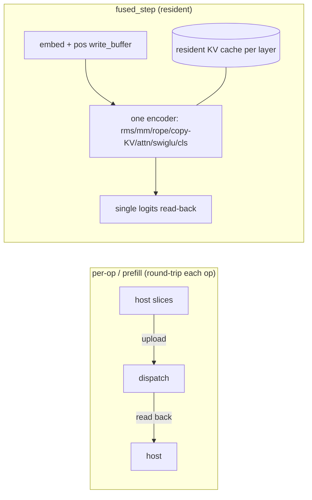

# 03. GPU Backend (wgpu)

## Summary

`src/backend/gpu.rs` is a second `impl Backend` that runs the transformer primitives as WGSL compute shaders through **wgpu 29** (Vulkan / DX12 / Metal), selected at runtime (`--backend gpu`) and gated behind the `gpu` cargo feature (`wgpu` + `pollster`, `src/backend/mod.rs:14`,`20`). Three things matter most: (1) matmul **weights stay resident and packed** on the device — uploaded once, keyed by source data pointer, and dequantized *in-shader* per token so the path streams ~4× less weight data; (2) the GEMV kernels are **cooperative, one workgroup per output row**, with a portable **f32** path for every `GgmlType` and an **int8 `dot4I8Packed` (DP4A)** path that mirrors the CPU integer oracles bit-for-bit; (3) single-token decode is **fully fused and resident** (`fused_step`) — one command submission, one logits read-back per step — whereas the per-op trait calls and prefill round-trip host↔device every op. Tensor cores via portable wgpu coopmat were **spiked and ruled out** on this hardware.

Companion CUDA backend: `04-cuda-backend.md`. Backend trait + CPU: `02-backend-trait-and-cpu.md`. Quant block formats: `05-quantization.md`.

─────────────────────────────────────────────────────────────────────────────

## 1. Feature gating & device setup

`GpuBackend::new() -> Result<Self, String>` (`src/backend/gpu.rs:1114`) initialises wgpu and compiles every shader; it returns an error string (not a panic) when no adapter exists so the CLI can fall back to CPU.

| Step | Code | Notes |
| --- | --- | --- |
| Instance | `wgpu::Instance::new(...new_without_display_handle_from_env())` `:1115` | no surface needed (compute only) |
| Adapter | `pollster::block_on(instance.request_adapter(...))` `:1117` | `PowerPreference::HighPerformance`, `force_fallback_adapter: false`, `compatible_surface: None`; prefers the discrete GPU |
| Device/queue | `pollster::block_on(adapter.request_device(...))` `:1130` | `required_features: Features::empty()`; **`required_limits: adapter.limits()`** — full adapter limits, since a 32000×2048 weight dequantized to f32 ≈ 262 MB exceeds wgpu's conservative defaults for `max_storage_buffer_binding_size`/`max_buffer_size` (`:1126-1129`) |
| Limit guard | `:1141-1148` | the `attention` kernel binds **6** storage buffers in one stage (`ATTENTION_STORAGE_BUFFERS = 6`, `:1108`); reject up front if `max_storage_buffers_per_shader_stage < 6` so a downlevel adapter fails in `new()` rather than panicking on the first token |
| Pipelines | `Pipelines { ... }` `:1150-1204` | 21 compute pipelines, one per primitive (see §3) |

`pollster::block_on` is the only blocking bridge — wgpu's async device/adapter requests are driven to completion synchronously because the `Backend` trait is sync.

### `GpuBackend` struct (`src/backend/gpu.rs:1074-1104`)

| Field | Type | Role |
| --- | --- | --- |
| `device`, `queue` | `wgpu::Device`/`Queue` | the wgpu handles |
| `pipelines` | `Pipelines` | compiled compute pipelines |
| `weights` | `Mutex<HashMap<usize, GpuWeight>>` | resident matmul weights, keyed by **source data pointer** |
| `weights_i8` | `Mutex<HashMap<usize, GpuWeightI8>>` | int8-relaid Q8_0 weights for the DP4A path (same key) |
| `tables` | `Mutex<HashMap<usize, Arc<Buffer>>>` | resident RoPE inv-freq tables + per-layer norm weights, keyed by pointer |
| `limits` | `wgpu::Limits` | granted limits, used to pre-check oversized weight buffers |
| `decode` | `Mutex<Option<DecodeState>>` | lazily-built resident decode state, reused across steps |
| `int8_decode` | `bool` | enable DP4A decode; default from `RUSTY_LLAMA_NO_INT8` env (`:1215`), overridable via `set_int8_decode` (`:1229`) |
| `adapter_name` | `String` | for logging (`adapter_name()`, `:1221`) |

The pointer key is stable across tokens (weights are borrowed from the mmap'd file / owned by `Model`) but only unique while the source stays alive — hence the documented rule: **one backend per model** (`:1080-1084`). `set_int8_decode` drops the cached `DecodeState` so the next step rebuilds with the new setting — the A/B seam used by benches/tests.

─────────────────────────────────────────────────────────────────────────────

## 2. Resident weight upload & format selection

`weight_buffer(&self, w: &QMatrix) -> GpuWeight` (`src/backend/gpu.rs:1399`) is the upload-once cache. `GpuWeight { buf: Arc<Buffer>, ty: GgmlType }` (`:948`) carries the *on-device* format so callers pick the matching kernel. Upload policy (`:1409-1429`):

| `QMatrix` | On device | Bytes uploaded |
| --- | --- | --- |
| `F32` | `GgmlType::F32` | borrowed f32 bytes, zero-copy (`f32_bytes`, `:2178`) |
| `Quant{ Q8_0 \| Q4_K \| Q6_K }` | the same quant type | **raw GGUF block bytes**, padded up to a `u32` boundary (`b.resize(next_multiple_of(4), 0)`) so the shader can read them as `array<u32>` |
| `Quant{ any other type }` | `GgmlType::F32` | host-`dequantize`d to f32 once (`:1426`) — the original "single f32 shader" fallback |

So Q8_0/Q4_K/Q6_K stream their compact blocks and dequantize in-shader (~4× less weight traffic per token, `:359-361`); every other format (e.g. Q4_0, Q5_K) is expanded to f32 on the host. A `max_storage_buffer_binding_size`/`max_buffer_size` check panics with a "use --backend cpu" message if a single weight buffer is too big (`:1433-1442`).

`table_buffer` (`:1516`) caches small f32 buffers (RoPE inv-freq, RMSNorm weights) the same way. `weight_buffer_i8` (`:1456`) is the int8 analogue (see §4).

─────────────────────────────────────────────────────────────────────────────

## 3. WGSL kernel inventory

Each op is its own WGSL module (its own `@group(0)` bindings; they cannot be merged without binding-number clashes, `:38-40`). Scalar params ride in a small read-only storage buffer (dodging uniform-buffer 16-byte rules); f32 scalars passed via `f32::to_bits` (`:40-41`). `make_pipeline` (`:2108`) compiles a single-entry-point pipeline with an auto-derived bind-group layout.

| WGSL const | Line | Computes | Dispatch / wg size |
| --- | --- | --- | --- |
| `WGSL_MATMUL` | `:46` | f32 cooperative GEMV `out[row]=Σ w·x`; reduction over 256 lanes; `acc!=0` folds residual | `rows` wg × `@workgroup_size(256)` |
| `WGSL_RMSNORM` | `:73` | RMSNorm `x·inv·weight`, `inv=1/√(mean(x²)+eps)` | 1 wg × 256 lanes |
| `WGSL_ADD` | `:96` | elementwise residual `out[i]+=x[i]` | `ceil(n/64)` × 64 |
| `WGSL_SWIGLU` | `:109` | `hb[i]=silu(hb[i])*hb2[i]`, `silu=v·σ(v)` | `ceil(n/64)` × 64 |
| `WGSL_ROPE` | `:124` | RoPE rotate q/k pairs; partial rotary (`ph>=n_freqs` skipped) + `mscale`; k only while `i<kv_dim` | `ceil(dim/2/64)` × 64 |
| `WGSL_ATTENTION` | `:153` | one wg/head: scaled scores vs every cached key, max-subtracted softmax (`storageBarrier` at `:210`), value-weighted sum | `n_heads` wg × 64 |
| `WGSL_MATMUL_BATCH` | `:231` | batched f32 GEMV, **register-tiled `TN=4` over the batch** (each weight read once, reused across 4 rows; `:239-242`), out `(n,rows)` row-major | 2-D `[ceil(rows/64), ceil(n/4)]` × 64 |
| `WGSL_RMSNORM_BATCH` | `:253` | one wg per batch row | `rows` wg × 256 |
| `WGSL_ROPE_BATCH` | `:280` | 2-D: pair within head × batch row, abs pos `pos_base+r` | `[ceil(q_dim/2/64), rows]` × 64 |
| `WGSL_ATTENTION_BATCH` | `:314` | one thread/(row,head), causal **online (running-max) softmax**, no score buffer; `array<f32,128>` accumulator → `head_size<=128` only (`MAX_BATCH_HEAD`, `:355`) | `[ceil(rows·n_heads/64),1]` × 64 |
| `WGSL_QUANT_PRELUDE` | `:364` | shared helpers: `gb` (byte from `array<u32>`), `sext8`, `f16f32`, `scale_min_k4` (Q4_K 6-bit scale/min) | prepended to quant kernels at compile (`:1163`) |
| `WGSL_MATMUL_Q8_0` / `_BATCH` | `:390`/`:425` | in-shader Q8_0 dequant GEMV (34-byte blocks of 32) | `rows` wg × 64 / 2-D |
| `WGSL_MATMUL_Q4_K` / `_BATCH` | `:534`/`:577` | in-shader Q4_K dequant GEMV (144-byte superblocks of 256) | `rows` wg × 64 / 2-D |
| `WGSL_MATMUL_Q6_K` / `_BATCH` | `:628`/`:677` | in-shader Q6_K dequant GEMV (210-byte superblocks of 256) | `rows` wg × 64 / 2-D |
| `WGSL_QUANTIZE_Q8` | `:462` | f32 activation → int8 (4/u32) + per-32 f32 scale (symmetric `amax/127`) | `ceil(nblocks/64)` × 64 |
| `WGSL_MATMUL_Q8_0_I8` | `:492` | int8 Q8_0 GEMV via `dot4I8Packed` | `rows` wg × 64 |
| `WGSL_QUANTIZE_Q8K` | `:736` | f32 activation → Q8_K (asymmetric `iscale=-128/max`, per-256 scale, per-16 bsums) | `ceil(nblocks/64)` × 64 |
| `WGSL_MATMUL_Q4_K_I8` | `:783` | int8 Q4_K GEMV: unpack nibbles in-shader, `dot4I8Packed` vs Q8_K | `rows` wg × 64 |
| `WGSL_MATMUL_Q6_K_I8` | `:844` | int8 Q6_K GEMV: reconstruct signed 6-bit in-shader, `dot4I8Packed` vs Q8_K | `rows` wg × 64 |

The compiled set lives in `struct Pipelines` (`:908-942`); the three int8 k-quant pipelines (`quantize_q8k`, `matmul_q4_k_i8`, `matmul_q6_k_i8`) are `#[allow(dead_code)]` — proven by tests but deliberately not wired into decode (§4, §6).

─────────────────────────────────────────────────────────────────────────────

## 4. Packed-weight cooperative GEMV design

### 4a. f32 in-shader dequant path

The defining trick: quantized weights are uploaded as their **raw block bytes** and dequantized *inside* the matmul, exactly like the CPU's per-block path, streaming ~4× less data than expanding to f32 on upload (`:359-361`). Every quant GEMV is **one workgroup per output row**, `@workgroup_size(64)`, with the 64 lanes splitting the row's blocks and a tree-reduce over `var<workgroup> red: array<f32,64>`.

- **Q8_0** (`:390`): `nb=cols/32` blocks of 34 bytes (f16 `d` + 32 i8). Lane `tid` strides blocks by 64; `acc += d·f32(q)·x[xb+i]` over the 32 quants (`:405-413`).
- **Q4_K** (`:534`): 144-byte superblocks of 256 = 8 output chunks of 32. For chunk `oc`: sub-block scale/min via `scale_min_k4(oc)`, nibble high/low by `oc&1`, `acc += (d·sc·nib - dmin·mn)·x` (`:549-565`). Mirrors `quant::block_q4_k`.
- **Q6_K** (`:628`): 210-byte superblocks (128B `ql`, 64B `qh`, 16 signed-i8 scales, f16 `d`). Per chunk: 4-bit `ql` nibble + 2-bit `qh` → signed `q-32`, signed sub-scale, `acc += d·sc·q·x` (`:643-665`). Mirrors `quant::block_q6_k`.

`_BATCH` variants run a 2-D grid (x = output feature, y = batch-row **tile**) and are **register-tiled `TN=4`**: each weight nibble is dequantized **once** and dotted against 4 activation rows, so weight bytes and dequant work are amortized across the tile (`dot_q4k_tile` `:618`, `dot_q6k_tile` `:739`).

### 4b. int8 (DP4A) path — `dot4I8Packed`

On GPU, dequant-to-f32 + f32 dot is ~2.5× slower than an int8 dot via `dot4I8Packed` (one DP4A = 4 i8×i8 MACs) (`:455-457`). The activation is quantized to int8 **on-device once**, then weights and activation are dotted as packed int8. The integer arithmetic matches the CPU oracles bit-for-bit; only the per-block float scaling is f32 (`:726-729`).

**Stage 1 — Q8_0 (wired into decode):**
- `q8_0_relayout` (host, `:2131`) re-lays raw 34-byte Q8_0 blocks into contiguous int8 (`wq`, 4/u32) + per-32 f32 scales (`wscale`) — the layout `matmul_q8_0_i8` expects. Cached in `weights_i8` as `GpuWeightI8 { q, scale }` (`:958`) by the *same* source pointer as the f32 copy, so both coexist (the "Stage-1 2× weight-VRAM shortcut", `:1086-1089`).
- `WGSL_QUANTIZE_Q8` (`:462`): per-32-block symmetric `amax/127` → int8 (4/u32) + f32 scale.
- `WGSL_MATMUL_Q8_0_I8` (`:492`): `dot = Σ dot4I8Packed(wq, aq)`, then `acc += wscale·ascale·f32(dot)`; `acc!=0` folds the residual (`:515-525`).

**Stage 2 — Q4_K/Q6_K (built, proven bit-exact, NOT wired):**
- `WGSL_QUANTIZE_Q8K` (`:736`): per-256-block **asymmetric** int8 (`iscale=-128/max` where `max` is the largest-magnitude *signed* value), per-256 scale `d=1/iscale`, per-16 `bsums` — mirrors `quant::quantize_activation_q8k` (note the rule differs from Q8_0's symmetric `amax/127`, `:731-734`).
- `WGSL_MATMUL_Q4_K_I8` (`:783`): k-quant weights stay **PACKED** (reused from the existing `GpuWeight` block buffers — *no relayout, no extra VRAM*); unpack nibbles to int8 in-shader, `dot4I8Packed` vs Q8_K; `acc`/`min_acc` are exact i32 (min term folds via `bsums`), only `d·bigd`/`dmin·bigd` are f32. Matches `vec_dot_q4_k`.
- `WGSL_MATMUL_Q6_K_I8` (`:844`): reconstruct signed 6-bit `(q-32)` in natural order (`q6k_val` `:853`), `dot4I8Packed` vs Q8_K; symmetric so no min/bsums. Matches `vec_dot_q6_k`.

Why Stage 2 is dormant: k-quant weights stay packed either way, so the int8 GEMV streams the **same bytes** as the dequant GEMV — no bandwidth saving, and decode is bandwidth-bound, so the in-shader unpack + DP4A is pure added compute. The `bench_kquant_int8_vs_dequant_gemv` microbench measures int8 at **~0.94–0.98× (Q4_K)** / **~0.70× (Q6_K)** of the dequant GEMV — break-even to slower (`:929-935`, `PERFORMANCE.md:79-87`). Kept behind tests as a ready primitive should activations ever go f16.

### 4c. Eligibility gate

`model_q8_0_eligible` (`:2153`) enables the int8 decode path only when **every** matmul weight — the seven per layer plus the classifier `wcls` — is Q8_0, and `dim`/`hidden_dim` are multiples of 32. The token-embedding table is excluded (dequantized on host into the per-step embedding, never an int8 matmul, `:2151`). `kv_dim`/`vocab` are output row counts, so no divisibility constraint.

─────────────────────────────────────────────────────────────────────────────

## 5. Residency model

There are three execution regimes with very different host↔device traffic.

### 5a. Per-op trait methods (round-trip each call)

`impl Backend` (`:1876-2105`) implements `rmsnorm`/`matmul`/`rope`/`attention`/`swiglu`/`add` and their `_batch` variants. Each one uploads its inputs as fresh storage buffers, dispatches, and reads the result straight back (`run`/`run_grid` `:1289`/`:1302`; `read_back` `:1358`; `map_read` blocks on `device.poll(wait_indefinitely)` `:1376`). `matmul` is the cooperative GEMV (one wg per row, `:1894`); `matmul_batch` is the 2-D grid (`:1988`). This host↔device round-trip per op is the honest cost of fitting a per-op GPU backend behind a CPU-shaped trait (`:22-24`).

### 5b. Prefill (default trait path over batched ops)

`GpuBackend` does **not** override `forward_prefill`, so prefill uses the trait default (`src/backend/mod.rs:215-223`) which drives `crate::model::forward_prefill`, calling the overridden **batched** ops (`matmul_batch`, `rmsnorm_batch`, `rope_batch`, `attention_batch`). The whole prompt runs as a few large dispatches instead of n× single-token ops (`:225-228`), but each batched op still round-trips host↔device. The KV cache for prefill therefore lives on the host (`state.key_cache()`), to be synced into device residency at the first decode step (§5c).

`attention_batch` (`:2037`) uses the online-softmax kernel when `head_size<=128`, and falls back to looping `self.attention` per row for wider heads (`:2054-2072`); `att` scratch is unused on the GPU path (softmax state stays in registers, `:2093`).

### 5c. Fused single-token decode (resident)

`forward_step` → `fused_step` (`:2096`,`:1744`) runs an entire decode step on the device: **one command encoder, one submission, one logits read-back** (`:1742`).

- **`build_decode_state`** (`:1550`) runs once, lazily, and is cached in `self.decode` (rebuilt only if `dim`/`n_layers`/`vocab`/`seq_len` change, `:1752-1763`). It allocates resident activation buffers (`x`, `xb`, `q`, `k_tmp`, `v_tmp`, `att`, `hb`, `hb2`, `logits`, `logits_staging`), a per-layer **resident KV cache** (`key[l]`/`value[l]`, `seq*kv_dim` each, `:1575-1580`), constant param buffers, and **pre-built bind groups** for every op (`LayerBinds` `:967`, one per layer). Bind groups reference fixed buffers, so they're built once and reused; only per-step *contents* (pos, embedding) change (`:963-966`).
- **`DecodeState`** (`:1020-1054`) holds all of this plus `kv_filled` (positions already resident) and an `embed` scratch.
- **Per step** (`:1782-1793`): dequantize this token's embedding row into `embed`, `write_buffer` it into `x`; patch only the pos-dependent param words — rope's `pos` (3rd u32, byte 8) and attention's `np=pos+1` (5th u32, byte 16).
- **Step body** (`:1845-1867`, f32 path): for each layer, `pass(...)` records rms_att → mq/mk/mv → rope → **`copy_buffer_to_buffer` of k_tmp/v_tmp into the resident KV cache at `pos`** (`:1855-1856`) → attention → mo (residual fold via `acc=1`) → rms_ffn → m1/m3 → swiglu → m2 (residual fold). Then final rmsnorm + classifier, and `copy_buffer_to_buffer(logits → logits_staging)`. The matmul pipeline per weight is chosen from `mm_ty` (`:1848`).
- **`pass`** (`:1058`) records each dispatch as its **own compute pass** so wgpu inserts the read-after-write barrier against the previous pass on shared buffers (`:1056-1057`).
- **Prefill→decode KV handoff** (`:1766-1780`): on the first decode step, if `kv_filled < pos`, the host-side prompt KV (`state.key_cache()/value_cache()`) is `write_buffer`'d into the resident per-layer caches once; thereafter the cache stays on device.

### 5d. int8 decode overlay

When eligible and enabled, `build_decode_state` also builds a `DecodeInt8` overlay (`:1006`, `:1662-1713`): resident int8 activation buffers (`xb_i8`/`xb_scale`/`hb_i8`/`hb_scale`), the two reusable `quantize_q8` bind groups, and per-layer + classifier `matmul_q8_0_i8` bind groups (`LayerBindsInt8` `:990`). The f32 state is still built (the 2× VRAM shortcut lets the path toggle without a rebuild). The int8 step body (`:1812-1844`) keeps rmsnorm/rope/attention/swiglu **f32** (reusing `LayerBinds`) and routes the seven matmuls + classifier through `matmul_q8_0_i8`, each preceded by an on-device `quantize_q8` of its f32 input — five quantize passes per step (Amdahl tax, `PERFORMANCE.md:69-71`). One op per `pass` is required so the reused `xb_i8`/`hb_i8` buffers get their barriers.

─────────────────────────────────────────────────────────────────────────────

## 6. Cooperative-matrix (coopmat) ruling

Roadmap #3 (tensor cores) was spiked via the **ignored** test `probe_cooperative_matrix` (`src/backend/gpu.rs:3255`; `#[ignore]` at `:3254`). It is self-contained (its own instance/adapter/device) because it must request `EXPERIMENTAL_COOPERATIVE_MATRIX`, which `GpuBackend::new` does not (`:3251-3252`).

Findings (also written up in `PERFORMANCE.md:94-111` and `HANDOFF.md:17-23`,`:131-135`):

1. The probe reads `adapter.cooperative_matrix_properties()` (`:3278`) and checks for an **8×8×8 f32** config (`:3295-3304`) — the only shape wgpu 29 wires.
2. On the **RTX 5070 Ti (Blackwell, Vulkan `VK_KHR_cooperative_matrix`)** the adapter advertises **only f16-input configs** (16×16×16, 16×8×16, 16×8×8 with f16 A/B and f16-or-f32 accumulate) and **no 8×8 f32 config** (`PERFORMANCE.md:97-99`).
3. wgpu 29's coopmat backend **only wires 8×8 f32** — so the one shape wgpu supports, this driver doesn't expose, and the f16 16×16 shapes the driver exposes, wgpu doesn't wire (`PERFORMANCE.md:100-102`).
4. The probe then compiles + runs a minimal 8×8×8 f32 `coopMultiplyAdd` (WGSL `enable wgpu_cooperative_matrix;`, `coopLoadT`/`coopStoreT`, `:3329-3342`) under a validation error scope. It **compiles and runs with no validation error** (after the `unsafe ExperimentalFeatures::enabled()` token at `:3314`) yet returns **all-zero garbage** vs the CPU reference (`:3441-3453`) — a silent correctness failure.

**Conclusion:** the portable wgpu coopmat path is a dead end on this hardware until wgpu wires f16 16×16 (and naga's WGSL surface matures). The real tensor-core win here is the **NVIDIA-only CUDA backend** (`mma`/cuBLASLt); see `04-cuda-backend.md`. `dot4I8Packed` (roadmap #2) is also exhausted (`PERFORMANCE.md:108-111`).

─────────────────────────────────────────────────────────────────────────────

## 7. Parity & verification (see `08-testing-benchmarking-parity.md`)

- In-file unit tests (`src/backend/gpu.rs:2188+`): `matmul_f32_parity` (`:2239`), `matmul_quant_q8_0_matches_exact` (`:2253`), `matmul_q4_k/q6_k_matches_exact` (`:2303`,`:2319`), int8 vs exact integer dot — `matmul_q8_0_i8_matches_int_dot` (`:2394`), `matmul_q4_k_i8/q6_k_i8_matches_int_dot` (`:2577`,`:2605`), `int8_decode_gate_and_toggle` (`:2505`), plus `rmsnorm/add/swiglu/rope` parity.
- End-to-end parity vs CPU (`tests/gpu_parity.rs`): `prefill_matches_cpu` (`:87`), `decode_step_matches_cpu` (`:118`), `greedy_stream_matches_cpu` (`:156`) over F32 + Q8_0; `decode_step_int8_coherent_with_cpu` (`:188`) for the (looser) int8 path.
- Ignored timing benches: `bench_matmul/prefill/decode_gpu_vs_cpu`, `bench_decode_quant_vs_f32`, `bench_q8_0_int8_vs_f32_gemv`, `bench_kquant_int8_vs_dequant_gemv` (`:2730`–`:3053`).

─────────────────────────────────────────────────────────────────────────────

## Status, gaps & notes

- **Performance (measured TinyLlama-1.1B Q4_K_M, RTX 5070 Ti):** GPU decode **45.9 tok/s** vs llama.cpp Vulkan **375.9** (~8.2×) / CUDA **397.5** (~8.7×); prefill is one-to-two orders behind (`PERFORMANCE.md:25-34`). The decisive missing piece is **tensor cores** — our wgpu cooperative GEMV is portable f32 with no tensor-core path.
- **Per-op / prefill round-trips are the structural tax.** Only single-token decode (`fused_step`) is fully resident. Prefill uses the default trait path over batched ops, each uploading + reading back; KV is host-resident until the first decode step syncs it. Roadmap item: keep KV resident across prefill→decode and add a fused/flash prefill (`HANDOFF.md:116`).
- **int8 Stage 1 (Q8_0) gives ~1.5–1.6× decode** on a Q8_0-shaped synthetic model (`PERFORMANCE.md:67-71`) but costs **2× weight VRAM** (f32 + relaid int8 coexist) and five quantize passes/step. It only triggers for all-Q8_0 models; TinyLlama Q4_K_M stays on the dequant path.
- **int8 Stage 2 (Q4_K/Q6_K) is bit-exact but deliberately unwired** — packed k-quant weights mean no bandwidth saving, so it's break-even-to-slower on this bandwidth-bound decode. The pipelines are `#[allow(dead_code)]`, kept only behind their parity tests.
- **Portable coopmat ruled out** on this hardware/driver (silent zeros; §6). Tensor cores here mean CUDA.
- **One backend per model** is mandatory: the weight caches key on raw data pointers and could alias a freed-then-recycled address otherwise (`:1080-1084`).
- **Oversized models panic** (a single weight buffer exceeding device limits) with a "use --backend cpu" message rather than degrading gracefully (`:1433-1442`). Adapters with <6 storage buffers/stage are rejected in `new()`.
- The `attention` softmax needs an explicit `storageBarrier()` (`:210`) because WGSL's `workgroupBarrier()` orders only workgroup memory, unlike CUDA `__syncthreads()`.

**llama.cpp counterpart:** `docs/Research/03-cuda-kernels.md` (tensor-core GEMM / flash attention — the techniques this backend lacks).
