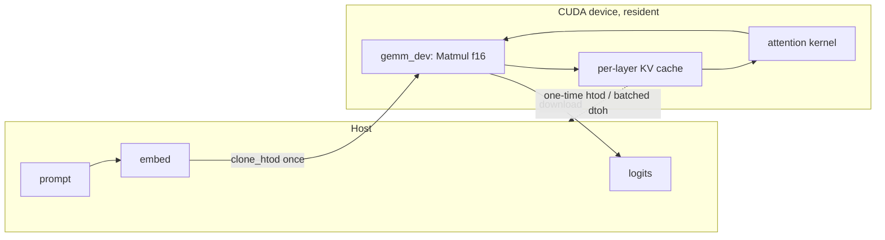

# 04. CUDA Backend

## Summary

`src/backend/cuda.rs` (behind the `cuda` cargo feature) is the third `Backend`
impl, targeting NVIDIA tensor cores via **cuBLASLt** plus a handful of **nvrtc**
compute kernels. Three things matter most: (1) it loads everything *dynamically*
(cudarc 0.19 `dynamic-loading` dlopens the driver/cuBLASLt/nvrtc at run time — no
nvcc or CUDA libs at build time — and the backend fails *gracefully* on a
CUDA-less host); (2) the GEMM path is **`Matmul<f16>` with f32 accumulate**, fed
by an f16 weight cache keyed on the source data pointer, and it drives the whole
**resident fused prefill**; (3) decode is a **resident `forward_step`** — KV cache + activations stay on
device across steps, packed Q4_K/Q6_K weights dot-producted with `__dp4a`, and the
whole per-step kernel sequence captured into a **CUDA graph** and replayed; a
*one-time* host→device KV upload bridges a prior prefill. Measured ~3.0–3.8× behind llama.cpp on prefill,
~1.3–1.5× behind on decode (`PERFORMANCE.md`).

Sibling docs: the CPU oracle every op is parity-checked against is
`02-backend-trait-and-cpu.md`; the portable GPU sibling is `03-gpu-backend-wgpu.md`;
quant block formats fed to `weight_f16` are `05-quantization.md`; the benchmark
methodology lives in `08-testing-benchmarking-parity.md`.

─────────────────────────────────────────────────────────────────────────────

## 1. Dynamic loading & graceful no-CUDA fallback

The `cuda` feature wires cudarc with **`dynamic-loading`** plus `cublaslt`,
`nvrtc`, and `f16` (`Cargo.toml:35-44`), and the `half` crate for the f16 type
(`Cargo.toml:13`). cudarc resolves the CUDA driver lazily on first use and
**panics** (`panic_no_lib_found`) when it is absent, so a naive `CudaContext::new`
would *abort* on a headless/GPU-less host rather than return `Err`
(`src/backend/cuda.rs:25-31`).

`CudaBackend::new` (`src/backend/cuda.rs:309`) therefore gates on the
non-panicking pre-check **first**:

```rust
if !unsafe { cudarc::driver::sys::is_culib_present() } {
    return Err("no CUDA driver library found (need an NVIDIA GPU + driver)".into());
}
```

(`src/backend/cuda.rs:314-316`) — `is_culib_present` only attempts to
`dlopen`/`LoadLibrary` the driver and returns a bool. After that, init proceeds
and any *real* failure (init, cuBLASLt, nvrtc, device-name query) is mapped to an
`Err(String)` (`src/backend/cuda.rs:318-331`), so callers fall back to the CPU
exactly like `GpuBackend::new`. The feature builds fine on a CUDA-less machine
because no CUDA library or `nvcc` is needed at *build* time (`Cargo.toml:29-34`).

Init sequence (`src/backend/cuda.rs:318-342`):

| Step | Call | Note |
| --- | --- | --- |
| Context | `CudaContext::new(0)` | device 0; runs `cuInit` internally |
| Event tracking off | `ctx.disable_event_tracking()` | single-stream backend ⇒ multi-stream sync is pure overhead (2 events/alloc); disabled *before* any alloc (`:594-596`) |
| Stream | `ctx.new_stream()` | a NON-default stream: the legacy NULL stream can't be captured into a CUDA graph, and the resident decode captures its per-step kernels (`:600-602`) |
| cuBLASLt | `CudaBlasLT::new(stream.clone())` | the GEMM handle (`:326-327`) |
| Kernels | `Kernels::compile(&ctx)` | nvrtc-compile `KERNEL_SRC` once (`:328`) |
| Name | `ctx.name()` | for logging/benches (`:329-331`, exposed via `device_name()` `:346`) |

## 2. The `CudaBackend` struct

`pub struct CudaBackend` (`src/backend/cuda.rs:288-303`):

| Field | Type | Role |
| --- | --- | --- |
| `ctx` | `Arc<CudaContext>` | held only to keep the context alive (`#[allow(dead_code)]`) |
| `stream` | `Arc<CudaStream>` | the single non-default (graph-capturable) stream |
| `blas` | `CudaBlasLT` | cuBLASLt handle for the f16 GEMM |
| `kernels` | `Kernels` | compiled nvrtc functions (§4–5) |
| `weights` | `Mutex<HashMap<usize, Arc<CudaSlice<f16>>>>` | f16 weight cache keyed by source pointer (§3) |
| `decode` | `Mutex<Option<DecodeCuda>>` | lazily-built resident decode state (§6) |
| `cpu` | `CpuBackend` | internal oracle; receives every delegated op |
| `device_name` | `String` | cached device name |

Imports of note: `cudarc::cublaslt::{CudaBlasLT, Matmul, MatmulConfig}`,
`cudarc::driver::{CudaContext, CudaFunction, CudaSlice, CudaStream, LaunchConfig,
PushKernelArg}`, `cudarc::nvrtc::compile_ptx`, `half::f16`
(`src/backend/cuda.rs:37-42`).

## 3. cuBLASLt f16 GEMM + the weight cache

This is the **prefill compute path** and the per-step decode GEMV path. The
matmul trait methods are thin shims onto `gemm`:

- `matmul(out, x, w)` → `gemm(out, x, w, 1)` (`src/backend/cuda.rs:658-660`)
- `matmul_batch(out, x, w, rows)` → `gemm(out, x, w, rows)` (`:662-664`)

### 3.1 `weight_f16` — upload-once cache (`src/backend/cuda.rs:354-379`)

`fn weight_f16(&self, w: &QMatrix) -> Arc<CudaSlice<f16>>`. The cache **key is the
source weight's data pointer** — `data.as_ptr() as usize` for both `QMatrix::F32`
and `QMatrix::Quant` (`:355-358`). This is stable across the run because weights
are borrowed from the memory-mapped model (`QMatrix` definition,
`src/tensor.rs:15-29`). On a miss:

1. f32 source: `Cow::Borrowed(data)`; quantized: `dequantize(*ty, data, rows*cols)`
   on the host (`:364-369`; `dequantize` returns a fresh `Vec<f32>`,
   `src/quant.rs:99`).
2. Narrow to f16: `f32_data.iter().map(|&v| f16::from_f32(v)).collect()` (`:370`).
3. Upload once: `stream.clone_htod(&f16_data)` → `Arc<CudaSlice<f16>>`, inserted
   under the pointer key (`:371-378`).

f16 is **half the bytes/VRAM of f32** — on real TinyLlama-1.1B Q4_K_M the cache is
~2.2 GB (`src/backend/cuda.rs:1314`). Mirrors the wgpu backend's pointer-keyed
weight caching (`03-gpu-backend-wgpu.md`).

### 3.2 `gemm` / `gemm_dev`

`gemm` (`src/backend/cuda.rs:384-395`) is the host-facing variant used by the
trait shims: upload `x`, `alloc_zeros` the output, call `gemm_dev`, `synchronize`,
download. `gemm_dev` (`:407-448`) is the **resident** building block (no host
round-trip) that the fused prefill/decode call directly:

```text
c(rows×oc) = x(rows×ic) · Wᵀ        oc = w.rows(),  ic = w.cols()
```

The actual cuBLASLt call is **`Matmul<f16>`, f32 accumulate** (`half::f16`
weights/inputs, f32 result). Because cuBLASLt is column-major, the code computes
the transpose `cᵀ = W · xᵀ` by feeding the row-major `W` and `x` buffers directly
with `transa = true` and the dimensions swapped (`MatmulConfig`,
`src/backend/cuda.rs:422-439`):

| Field | Value | |
| --- | --- | --- |
| `transa` / `transb` / `transc` | `true` / `false` / `false` | row-major-as-transpose trick |
| `m` / `n` / `k` | `oc` / `rows` / `ic` | swapped dims |
| `lda` / `ldb` / `ldc` | `ic` / `ic` / `oc` | leading dims |
| `alpha` / `beta` | `1.0` / `0.0` | `beta=0` ⇒ `C` not read |

Around the GEMM, activations are narrowed and the result widened on-device:
`alloc::<f16>` (uninitialized — fully overwritten, memset skipped) → `dev_cvt_to_f16`
→ `blas.matmul(cfg, w_dev, &x16, &mut c16, None, None)` → `dev_cvt_to_f32`
(`src/backend/cuda.rs:418-447`). The layout derivation is cross-checked against
cudarc's `test_matmul_half` and guarded by the per-op parity tests (§7).

## 4. Activation narrowing — inline-PTX `cvt` kernels

To keep nvrtc free of any `cuda_fp16.h` / toolkit-include dependency, the f32↔f16
conversions are written as **inline PTX over `unsigned short` buffers** inside
`KERNEL_SRC` (`src/backend/cuda.rs:58-76`):

```cuda
asm("cvt.rn.f16.f32 %0, %1;" : "=h"(h) : "f"(in[i]));   // cvt_f32_f16
asm("cvt.f32.f16 %0, %1;"   : "=f"(v) : "h"(in[i]));    // cvt_f16_f32
```

Round-to-nearest narrowing (`cvt.rn`). Launched elementwise via
`dev_cvt_to_f16` / `dev_cvt_to_f32` with `LaunchConfig::for_num_elems(n)`
(`src/backend/cuda.rs:457-470`). The round-trip is exercised by `dev_cvt_roundtrip`
(`:1394-1407`, f16 ~3 decimal digits ⇒ `atol 1e-3, rtol 1e-2`).

## 5. The nvrtc compute kernels

`Kernels` (`src/backend/cuda.rs:446-459`) holds 12 `CudaFunction` handles compiled
once via `compile_ptx(KERNEL_SRC)` + `load_module` (`Kernels::compile`,
`:462-489`). Two are the `cvt` pair (§4); the rest — the elementwise/norm/rope/attention
kernels plus the Q8_K activation quantizer and the packed Q4_K/Q6_K/fused-QKV decode
GEMVs and the KV-append kernel — mirror the matching `CpuBackend` op exactly
(parity-tested, §7) and run resident inside the fused prefill/decode:

| Kernel | Launch shape | What it does on device |
| --- | --- | --- |
| `add_kernel` (`:77-80`) | `for_num_elems` | `out[i] += x[i]` (residual add) |
| `swiglu_kernel` (`:81-84`) | `for_num_elems` | `hb[i] = silu(hb[i]) * hb2[i]` (`silu = v/(1+e^-v)`) |
| `rmsnorm_kernel` (`:87-103`) | one **block per row**, `block=256`, shared `block*4` B | shared-mem sum-of-squares reduction, then `out = x · rsqrt(ms+eps) · w` |
| `rope_kernel` (`:106-128`) | grid `(rows, ceil(n_pairs/64))`, one thread per (row, even/odd pair) | in-place rotary on `q`/`k` at abs pos `pos_base+row`; partial-rotary tail untouched (`n_freqs` guard); `mscale` applied to cos/sin |
| `attention_kernel` (`:157-232`) | one **block per (row, head)**, `block=128` | causal GQA **flash attention**: keys streamed in tiles of `blockDim.x` with an online (running-max) softmax; only a per-tile prob row in shared memory, **no `seq_len`-sized score buffer**, so context isn't bounded by shared memory |

Attention shared-memory layout is `[ sq:head_size | sp:blockDim | acc:head_size | red:blockDim ]`
floats (`src/backend/cuda.rs:170-174`); the launcher sizes
`shared_mem_bytes = (2*head_size + 2*BLOCK) * 4` (`:1040`), with no `seq_len` term. The kernel
uses `kv_off = (h / kv_mul) * head_size` to map a query head to its KV group
(`:144`) — the GQA grouping. Each launcher (`dev_rmsnorm` `:489-508`, `dev_rope`
`:513-551`, `dev_attention` `:557-601`, `dev_add` `:473-478`, `dev_swiglu`
`:481-486`) builds args with `launch_builder(...).arg(...)` and an `unsafe`
`launch`.

## 6. Residency

### 6.1 Fused `forward_prefill` (`src/backend/cuda.rs:812-906`)

Overrides the default per-op prefill **only for the from-scratch case**
(`pos_base == 0` — how `generate` prefills a prompt); a non-zero base delegates to
`crate::model::forward_prefill` (`:819-822`). For `pos_base == 0` the **whole
prompt runs on-device**:

- Seed: dequantize token embeddings into a host buffer, **one** `clone_htod`
  upload to `x` (`:832-837`).
- Resident scratch `xb/xb2/q/hb/hb2` plus **per-layer** `key_dev`/`value_dev`
  (each `n*kv_dim`, since `pos_base==0`) and `inv_freq` (`:843-857`).
- Per layer (`:859-888`): rmsnorm → `gemm_dev` for q/k/v → rope → cooperative
  attention → `wo` GEMM → residual add; then rmsnorm → w1/w3 GEMMs → swiglu → w2
  GEMM → residual add. **No in-loop `synchronize`** — each layer keeps its own K/V
  buffer so nothing blocks.
- KV residency: there is no host KV download. The fused prefill writes K/V straight
  into the resident decode cache (`d.key[layer]`/`d.value[layer]`), so the
  prefill→decode handoff needs no round-trip — it just sets `d.kv_filled = n`
  (`:1531`). (There is no `store_prefill_kv` function.)
- Logits: run the **final RMSNorm of the last position + classifier ON-DEVICE**,
  reusing the decode classifier (`d.rms_final` + packed-DP4A `gemv_decode` against
  `w.wcls`); only the vocab-sized logits come back (`:1533-1555`).

Running the final RMSNorm + classifier on-device (reusing the decode classifier),
downloading only the logits, was the R3.1 prefill refinement; current measured
prefill is ~5,230 tok/s (`PERFORMANCE.md`).

### 6.2 Resident `forward_step` decode (`src/backend/cuda.rs:714-801`)

`DecodeCuda` (`:244-279`) is the CUDA analog of the wgpu `DecodeState`: shape
fields (for staleness), resident activations (`x/xb/xb2/q/k_row/v_row/hb/hb2/
logits/inv`), resident RMSNorm weights uploaded once (`rms_att`/`rms_ffn`/
`rms_final`), the **per-layer KV cache** (`key`/`value`, `seq_len*kv_dim` each),
host `embed` scratch, and a `kv_filled: usize` counter. Built lazily by
`build_decode` (`:606-646`) on first step or when shape goes stale
(`dim/n_layers/vocab/seq_len` mismatch, `:719-730`).

The **one-time host KV upload** bridges a prior prefill: if `kv_filled < pos`, for
every layer the rows `[kv_filled, pos)` of the host K/V are `memcpy_htod`'d into
the resident cache, then `kv_filled = pos` (`:738-756`). After that, each step:

1. dequantize this token's embedding → `memcpy_htod` to resident `x` (`:759-760`).
2. per layer (`:762-792`): rmsnorm → q/k/v GEMVs (`gemm_dev`, batch-1) → rope →
   **append this step's K/V at row `pos`** via `memcpy_dtod` into
   `key[layer]`/`value[layer]` (`:772-776`) → attention over `0..=pos` → `wo` GEMV
   → add; then FFN (rmsnorm → w1/w3 → swiglu → w2 → add).
3. `kv_filled = pos + 1` (`:793`); final rmsnorm + classifier GEMV → `synchronize`
   → download logits to host `state` (`:796-800`).

Only the per-step embedding (and the absolute position int) go up and the logits
come down — everything else stays resident (`:1378-1383`). Decode is batch-1
packed-quant DP4A GEMV, captured into a CUDA graph and replayed each step
(`:1386-1425`); it is bandwidth-/launch-bound (§ Status).



## 7. Parity & benchmark harness (in-file `#[cfg(test)]`)

All tests are `#[ignore]`d (require a CUDA device) and skip cleanly via the
`cuda()` helper, which returns `None` with a note when `CudaBackend::new` errs
(`src/backend/cuda.rs:916-924`) — so the suite passes on a GPU-less host.
Methodology detail lives in `08-testing-benchmarking-parity.md`; here is what each
asserts:

| Test | `path:line` | Asserts |
| --- | --- | --- |
| `cuda_smoke` | `:966` | init + device name + htod/dtoh round-trip (driver/cuBLASLt resolve at run time) |
| `matmul_batch_f32_parity` | `:981` | batched f32 GEMM vs CPU (non-square, catches transpose/m·n·k swap) |
| `matmul_single_f32_parity` | `:995` | the `rows=1` classifier path |
| **`matmul_batch_q8_0_parity`** | `:1011` | **dequant→f16→GEMM vs CPU exact Q8_0 dot** (Q8_0 quant error on top of f16 GEMM rounding) |
| `prefill_coherent_with_cpu` | `:1031` | fused prefill logits track CPU: top token equal + relative L2 < 0.1 |
| `prefill_then_decode_coherent` | `:1089` | the device→host KV handoff is correct (decode after prefill matches all-CPU) |
| `decode_multistep_coherent` | `:1144` | resident `forward_step` KV append across steps, per-step logits match CPU |
| `dev_cvt_roundtrip` / `dev_add_parity` / `dev_swiglu_parity` / `dev_rmsnorm_parity` / `dev_rope_parity` / `dev_attention_parity` | `:1394`/`:1411`/`:1426`/`:1441`/`:1459`/`:1479` | each on-device kernel vs its `CpuBackend` op |

Tolerance: GEMM parity uses `close_tc` (`:945`, `tol = 0.02 + ic·2e-4 + 3%·|w|`,
sized for TF32/f16 mantissa loss that grows with reduction length `ic`); kernel
parity uses `close_approx` (`:1372`, `atol + rtol·|want|`, e.g. add `1e-6/0`).

Benches (compare against `llama-bench -m <gguf> -ngl 99`):

- **`bench_prefill_real_tinyllama`** (`:1317`) — fused CUDA prefill vs CPU on the
  real TinyLlama-1.1B Q4_K_M (22 layers, dim 2048, GQA 32/4), **pp512**; f16
  weight cache ~2.2 GB; reports tok/s and the `cuda Nx cpu` ratio (`:1360-1366`).
- **`bench_decode_real_tinyllama`** (`:1199`) — resident `forward_step` vs CPU,
  **tg128** (128 steps); warms the resident state + weight cache first
  (`backend_warmup`, `:1251`) before timing (`:1227-1247`).
- `bench_prefill_cuda_vs_cpu` (`:1262`) — synthetic-shape prefill comparable to the
  wgpu f32 figure in `PERFORMANCE.md`.

`RUSTY_LLAMA_GGUF` overrides the model path; both real benches skip with a note if
the GGUF can't be opened or isn't a GGUF (`:1204-1214`, `:1323-1333`).

─────────────────────────────────────────────────────────────────────────────

## Status, gaps & notes

- **Measured gaps (`PERFORMANCE.md`).** Real TinyLlama-1.1B Q4_K_M, same
  machine (RTX 5070 Ti): prefill **~5,230 tok/s vs llama.cpp ~19,637
  (~3.0–3.8× behind)**; decode **~275 tok/s vs ~415 (~1.3–1.5× behind)**.
  Correctness held throughout (per-op parity + prefill/decode coherence).
- **cuBLASLt is precisely the dequant→f16 GEMM that llama.cpp routes *around*.**
  Its CUDA backend sends quantized prefill to **MMQ** (int8 tensor cores reading
  *packed* quant weights, never round-tripping through VRAM as f16) and quantized
  decode to **MMVQ** (DP4A GEMV over packed weights). Prefill still dequantizes to f16 once and leans on cuBLASLt — simpler, but it
  forgoes the packed-weight bandwidth win. The residual ~3.0–3.8× prefill is now
  **GEMM/kernel compute efficiency** vs llama.cpp's fused kernels, not overhead
  (`PERFORMANCE.md`).
- **Decode streams packed-quant weights.** Decode is batch-1 GEMV (each weight read
  once, no reuse ⇒ bandwidth-bound). The packed Q4_K/Q6_K DP4A decode GEMV (default-on
  for k-quant, opt-out `RUSTY_LLAMA_CUDA_NO_QGEMV`, `:1232-1236`) streams ~0.56 B/weight
  vs the f16 cache's 2 B, closing most of the old f16-bandwidth gap; the residual
  ~1.3–1.5× is now largely launch/enqueue overhead, which the captured CUDA graph
  (`:1386-1425`) attacks (`PERFORMANCE.md`).
- **Decode also pays a one-time host KV upload** on the first post-prefill step
  (`:738-756`); keeping KV resident across the prefill→decode boundary would drop
  it (lower-ROI per `PERFORMANCE.md:192-194`).
- **Attention is a flash / online-softmax kernel** — keys are streamed in tiles
  with a running-max softmax and only a per-tile prob row in shared memory (no
  `seq_len`-sized score buffer), so context isn't bounded by shared memory
  (`:150-232`).
- **Stale in-code comment:** the `impl Backend` header comment still says "Decode
  via `forward_step` still runs entirely on the CPU" (`src/backend/cuda.rs:1259`),
  which is **false** — decode runs fully on-device (packed-DP4A GEMVs + CUDA graph,
  `:1322-1429`). The module header and `:803` no longer mention TF32. The elementwise/non-GEMM trait methods
  (`rmsnorm`/`rope`/`attention`/`swiglu`/`add`, `:654-707`) still **delegate to the
  CPU** when called individually; the on-device kernels are reached *only* via the
  fused `forward_prefill`/`forward_step` overrides.

**llama.cpp counterpart:** `docs/Research/03-cuda-kernels.md` (MMQ/MMVQ/MMF/cuBLAS
routing-by-batch, `mma.cuh` int8 tensor cores, fused flash attention).
