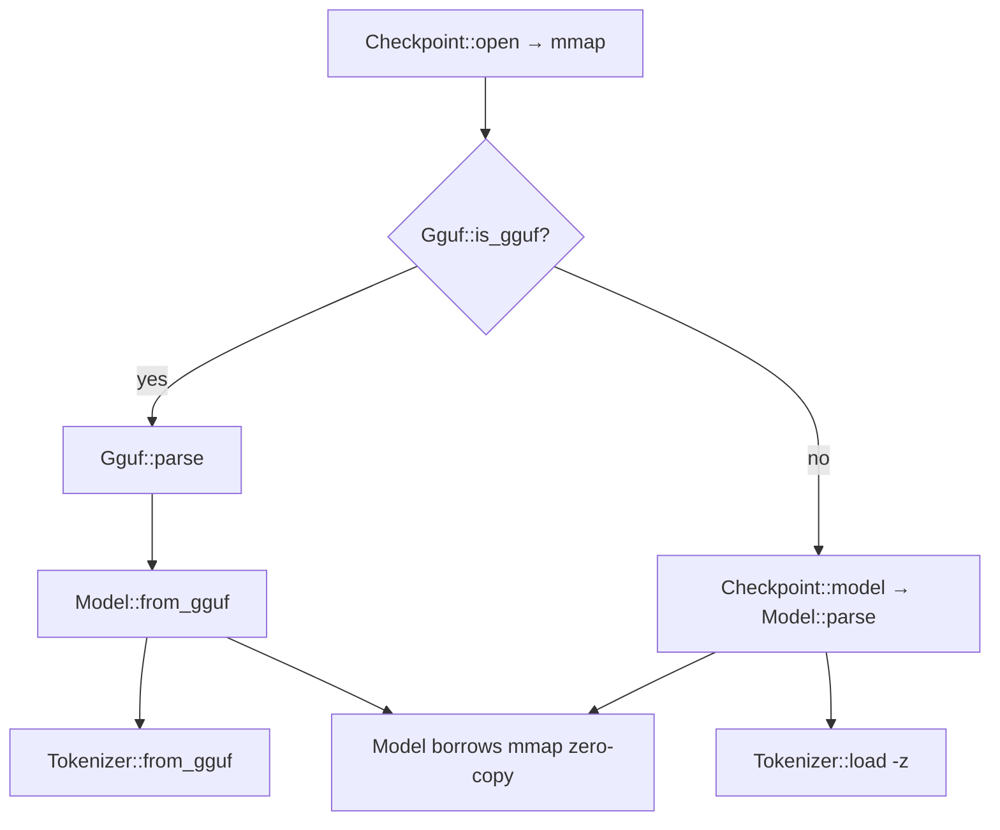

# 06. GGUF Parsing & Model Loading

## Summary

This subsystem turns bytes on disk into a runnable `Model`. Two on-disk formats are supported: **GGUF** (llama.cpp's container, the normal path) and the **legacy Karpathy llama2.c** raw checkpoint. Both come in through a single memory-mapped file (`Checkpoint`, `src/loader.rs`) and the resulting `Model` *borrows* directly from that mapping — quantized matmul weights are kept in their on-disk block form (zero copy), and only the tiny RMSNorm vectors are dequantized to owned f32. The GGUF parser (`src/gguf.rs`) is deliberately dumb and model-agnostic: it validates magic/version, reads a typed key→value metadata map and a tensor-info table, and hands back borrowed `&[u8]` slices per tensor. All transformer meaning (hyper-params, RoPE scaling, tensor wiring, tokenizer dispatch) is layered on top in `Model::from_gguf` (`src/model.rs`).

The three things that matter most: (1) **zero-copy borrowing** — `Gguf<'a>` and `Model<'a>` borrow the mmap for their whole lifetime, so weights are never expanded in RAM; (2) the parser is bounds-checked and version-gated but does **no** tensor-shape validation against an arch expectation; (3) GGUF dispatch resolves `general.architecture` through an `Arch` registry (`src/arch.rs`) — Llama, Qwen2, Phi-3, Gemma2, and Qwen2-MoE (plus Mixtral-style MoE when `expert_count > 0`) — keyed onto `{arch}.*` metadata keys + the shared `blk.N.*` tensor-name table.

> llama.cpp counterpart: `docs/Research/05-gguf-and-model-loading.md`.

─────────────────────────────────────────────────

## 1. The GGUF parser (`src/gguf.rs`)

### 1.1 File layout

The on-disk layout (`src/gguf.rs:5-11`):

```
magic "GGUF" | version u32 | tensor_count u64 | metadata_kv_count u64
metadata key/value pairs
tensor infos (name, dims, type, offset)
padding to general.alignment
tensor data
```

All multi-byte fields are little-endian (the crate is LE-only, asserted at the crate root). Parsing is driven by `Gguf::parse(data: &'a [u8]) -> Result<Self>` (`src/gguf.rs:118`).

### 1.2 Magic & version checks

- Magic is the 4 bytes `b"GGUF"` (`const MAGIC`, `src/gguf.rs:22`); mismatch → `Error::Format("not a GGUF file (bad magic)")` (`src/gguf.rs:121-123`).
- `Gguf::is_gguf(data)` (`src/gguf.rs:113`) is the cheap sniff used by `main.rs` to choose the load path: `data.len() >= 4 && &data[..4] == MAGIC`.
- Version is a `u32`; **only 2 and 3 are accepted** (`src/gguf.rs:124-129`), else `unsupported GGUF version {v}`.
- `tensor_count` and `kv_count` are `u64` read next (`src/gguf.rs:130-131`).

### 1.3 KV metadata section & the value-type enum

Each KV pair is `key: string`, `value_type: u32`, then a value of that type (`src/gguf.rs:134-139`). The typed value is `MetaValue` (`src/gguf.rs:27-41`) — **13 variants**, mapped 1:1 from the GGUF value-type tags by `Reader::value` (`src/gguf.rs:271-300`):

| tag | `MetaValue` | wire form |
|----|-------------|-----------|
| 0  | `U8`  | 1 byte |
| 1  | `I8`  | 1 byte |
| 2  | `U16` | 2 bytes LE |
| 3  | `I16` | 2 bytes LE |
| 4  | `U32` | 4 bytes LE |
| 5  | `I32` | 4 bytes LE |
| 6  | `F32` | `f32::from_bits(u32)` |
| 7  | `Bool` | 1 byte `!= 0` |
| 8  | `String` | `u64` len + UTF-8 bytes |
| 9  | `Array` | `elem_type: u32`, `count: u64`, then `count` values |
| 10 | `U64` | 8 bytes LE |
| 11 | `I64` | 8 bytes LE |
| 12 | `F64` | `f64::from_bits(u64)` |

Unknown tags → `Error::Format("unknown GGUF metadata value type {n}")` (`src/gguf.rs:294-298`). Arrays are recursive — `value(elem_type)` is called per element (`src/gguf.rs:282-290`); the pre-allocation is capped at `count.min(1 << 16)` so a hostile `count` can't force a huge up-front `Vec` reservation (`src/gguf.rs:285`), though the read loop still honours the real `count`. Strings are decoded with `String::from_utf8_lossy` (lossy, never errors — `src/gguf.rs:264-268`).

Metadata lands in `metadata: HashMap<String, MetaValue>` (`src/gguf.rs:104`). `MetaValue` has three coercing accessors used throughout loading: `as_u64` (any non-negative integer / bool, `src/gguf.rs:45-58`), `as_f32` (f32/f64/integer, `src/gguf.rs:61-67`), `as_str` (`src/gguf.rs:70-75`).

### 1.4 Tensor-info table

Per tensor (`src/gguf.rs:143-159`): `name: string`, `n_dims: u32`, `n_dims × u64` dims, `ggml_type: u32` (mapped via `GgmlType::from_u32`), `offset: u64`. Stored as `TensorInfo` (`src/gguf.rs:80-89`):

```rust
pub struct TensorInfo {
    pub name: String,
    pub dims: Vec<u64>,    // ggml order: dims[0] is the fastest-varying axis
    pub ggml_type: GgmlType,
    pub offset: u64,       // byte offset from the start of the tensor-data section
}
```

`TensorInfo::n_elements()` is the product of `dims` (`src/gguf.rs:93-95`). A parallel `index: HashMap<String, usize>` (`src/gguf.rs:107`, populated at `:152`) gives O(1) name lookup; `tensors: Vec<TensorInfo>` preserves file order.

`GgmlType::from_u32` (`src/quant.rs:43-57`) only accepts the 6 supported discriminants — `0=F32, 1=F16, 2=Q4_0, 8=Q8_0, 12=Q4_K, 14=Q6_K`; any other ggml type → `unsupported ggml tensor type {n}`. (Block formats/sizes are doc 05.)

### 1.5 Alignment & the data offset

After the tensor table, tensor data begins at the cursor position rounded up to `general.alignment` (`src/gguf.rs:161-168`):

```rust
let alignment = metadata.get("general.alignment")
    .and_then(MetaValue::as_u64).map(|a| a as usize)
    .unwrap_or(DEFAULT_ALIGNMENT)   // 32
    .max(1);
let data_offset = r.pos.next_multiple_of(alignment);
```

`DEFAULT_ALIGNMENT = 32` (`src/gguf.rs:23`); `.max(1)` guards against a malicious `alignment == 0`. If `data_offset > data.len()` the file is rejected (`tensor data section is missing`, `src/gguf.rs:169-171`).

### 1.6 `Gguf<'a>` public surface & zero-copy backing

```rust
pub struct Gguf<'a> {
    data: &'a [u8],            // the (typically mmap'd) backing bytes
    pub version: u32,
    pub metadata: HashMap<String, MetaValue>,
    pub tensors: Vec<TensorInfo>,
    index: HashMap<String, usize>,
    data_offset: usize,
}
```
(`src/gguf.rs:99-109`). Public accessors:

| method | purpose | cite |
|--------|---------|------|
| `is_gguf(&[u8]) -> bool` | magic sniff | `src/gguf.rs:113` |
| `parse(&'a [u8]) -> Result<Self>` | parse header+meta+table | `src/gguf.rs:118` |
| `meta(&str) -> Option<&MetaValue>` | raw lookup | `src/gguf.rs:184` |
| `meta_u64(&str) -> Result<u64>` | typed, errors if absent/wrong | `src/gguf.rs:189` |
| `meta_f32(&str) -> Result<f32>` | typed | `src/gguf.rs:196` |
| `meta_str(&str) -> Result<&str>` | typed | `src/gguf.rs:203` |
| `tensor(&str) -> Option<&TensorInfo>` | name → info via `index` | `src/gguf.rs:210` |
| `tensor_bytes(&TensorInfo) -> Result<&'a [u8]>` | **zero-copy** tensor slice | `src/gguf.rs:215` |

`tensor_bytes` is the heart of the zero-copy story (`src/gguf.rs:215-228`): it computes `need = ggml_type.bytes_for(n_elements())`, `start = data_offset + info.offset`, range-checks `start + need <= data.len()` (overflow-checked, `tensor '{name}' extends past end of file` otherwise), and returns a borrowed `&'a [u8]` pointing **into the original mmap** — no allocation, no copy. The returned slice carries the file's lifetime `'a`, so the borrow checker enforces "keep the mapping alive as long as the model".

Reading is done by a small bounds-checked LE cursor `Reader<'a>` (`src/gguf.rs:232-301`): every `bytes(n)` is overflow- and length-checked (`unexpected end of GGUF file`), and the `u8/u16/u32/u64/string/value` helpers build on it.

─────────────────────────────────────────────────

## 2. Load path A — GGUF → `Model::from_gguf`

`Model::from_gguf(gguf: &Gguf<'a>) -> Result<Self>` (`src/model.rs:136`) builds a `Model<'a>` borrowing from the GGUF bytes.

### 2.1 Architecture & hyper-parameters

The arch string is read from `general.architecture` (`src/model.rs:137`), and a `key` closure prefixes it onto every model key: `|k| format!("{arch}.{k}")` (`src/model.rs:138`). Hyper-params read (`src/model.rs:140-158`):

| `Config` field | GGUF key (`{arch}.`) | default | cite |
|----------------|----------------------|---------|------|
| `dim` | `embedding_length` | required | `:140` |
| `n_layers` | `block_count` | required | `:141` |
| `n_heads` | `attention.head_count` | required | `:142` |
| `n_kv_heads` | `attention.head_count_kv` | `n_heads` | `:143-145` |
| `hidden_dim` | `feed_forward_length` | required | `:146` |
| `seq_len` | `context_length` | required | `:147` |
| `rope_freq_base` | `rope.freq_base` | `10000.0` | `:148` |
| `rms_eps` | `attention.layer_norm_rms_epsilon` | `1e-5` | `:149-151` |
| `rope_dim` | `rope.dimension_count` | `head_size` (full rotary) | `:156-158` |

`rope_dim > head_size` is rejected (`src/model.rs:159-163`) — partial rotary (smaller value) is allowed and leaves trailing head dims unrotated (see doc 01). `vocab_size` is taken from the **second (row) dimension of `token_embd.weight`** (`dims[1]`, `src/model.rs:169-176`), not a metadata key. `shared_weights` is inferred: true iff there is no `output.weight` tensor (`src/model.rs:178`). The assembled `Config` is `validate()`d (`src/model.rs:194`; `src/config.rs:268`) — non-zero dims, `dim % n_heads == 0`, `n_heads % n_kv_heads == 0`, even `head_size`, finite-positive `rope_freq_base`/`rms_eps`.

### 2.2 Tensor wiring (Llama naming) & weight borrowing

Two closures drive the per-layer loads (`src/model.rs:197-209`):
- `concat(suffix)` — dequantizes `blk.{i}.{suffix}` for every layer and concatenates into an **owned** `Vec<f32>` (used only for the small RMSNorm vectors).
- `layers(suffix)` — maps each `blk.{i}.{suffix}` through `qmatrix_from_gguf`, producing **borrowed** (possibly still-quantized) `QMatrix<'a>`.

The Llama tensor names consumed (`src/model.rs:211-234`):

| weight field | GGUF tensor | borrowed? |
|--------------|-------------|-----------|
| `token_embedding_table` | `token_embd.weight` | yes (QMatrix) |
| `wcls` | `output.weight`, or `token_embd.weight` if shared | yes |
| `rms_att_weight` | `blk.{i}.attn_norm.weight` | owned f32 |
| `rms_ffn_weight` | `blk.{i}.ffn_norm.weight` | owned f32 |
| `rms_final_weight` | `output_norm.weight` | owned f32 |
| `wq/wk/wv/wo` | `blk.{i}.attn_{q,k,v,output}.weight` | yes |
| `w1/w2/w3` | `blk.{i}.ffn_{gate,down,up}.weight` | yes |

### 2.3 `qmatrix_from_gguf` — zero-copy tensor borrowing

`qmatrix_from_gguf<'a>(gguf, name) -> Result<QMatrix<'a>>` (`src/model.rs:292-312`) is where the on-disk bytes become a matmul-ready matrix without copying:

1. Look up `TensorInfo`; require exactly 2 dims, read as `(cols, rows) = (dims[0], dims[1])` — ggml's fastest-varying axis is the input (column) dim (`src/model.rs:296-304`).
2. `bytes = gguf.tensor_bytes(info)` — the borrowed slice (`src/model.rs:305`).
3. **F32 fast path**: if `ggml_type == F32` *and* the slice is 4-byte aligned, reinterpret it as `&[f32]` via `f32_slice` and wrap in `QMatrix::f32(Cow::Borrowed(..))` — true zero-copy f32 view (`src/model.rs:306-309`).
4. **Fallback**: otherwise wrap the raw bytes in `QMatrix::quant(ggml_type, Cow::Borrowed(bytes), rows, cols)` (`src/model.rs:311`). For a genuinely quantized type this is the normal case (kept compressed, dequantized per-row in the matmul). For an F32 tensor that happened to be **misaligned**, this is the "block-size-1 quantized view fallback" — `GgmlType::F32` has `block_size == 1`, so `QMatrix::quant` accepts it and dequant becomes a per-element copy: correct, just slower than the aligned view.

`f32_slice(bytes, elem_off, len)` (`src/model.rs:722-747`) does the unsafe reinterpret safely: it checks bounds (`checkpoint truncated …`) and pointer alignment (`is_multiple_of(align_of::<f32>())`, returning an error rather than UB if unaligned — the misalignment that triggers the fallback above), then `slice::from_raw_parts` (sound because every bit pattern is a valid f32 and the crate is LE-only).

`deq_tensor(gguf, name) -> Result<Vec<f32>>` (`src/model.rs:315-320`) is the eager counterpart for the norm vectors: look up the info, `dequantize(ty, tensor_bytes, n_elements)` into a fresh owned `Vec<f32>`. `f32_layers(big, n_layers, rows, cols)` (`src/model.rs:281-286`) slices one contiguous f32 buffer into per-layer borrowed `QMatrix::f32` views (used by the legacy path, §3).

`QMatrix` itself (`src/tensor.rs:15-29`) is the `enum { F32 { Cow<[f32]>, rows, cols }, Quant { ty, Cow<[u8]>, rows, cols } }`; `QMatrix::f32`/`quant` validate length/block alignment at construction (`src/tensor.rs:33-65`) so `dequant_row` can't fail later. Forward-pass consumption is doc 01; block formats are doc 05.

### 2.4 RoPE scaling keys — `read_rope_scaling`

`read_rope_scaling(gguf, arch) -> Result<RopeScaling>` (`src/model.rs:245-277`) reads the `{arch}.rope.scaling.*` family, mirroring the keys llama.cpp writes. If `…scaling.type` is absent → `RopeScaling::None` (`src/model.rs:247-250`). Dispatch on the type string (`src/model.rs:255-276`):

| `…scaling.type` | `RopeScaling` variant | keys read (default) |
|-----------------|------------------------|---------------------|
| `none` | `None` | — |
| `linear` | `Linear { factor }` | `factor` (1.0) |
| `llama3` | `Llama3 { factor, low_freq_factor, high_freq_factor, orig_ctx }` | `factor` (1.0), `low_freq_factor` (1.0), `high_freq_factor` (4.0), `original_context_length` (0) |
| `yarn` | `Yarn { factor, orig_ctx, attn_factor, beta_fast=32.0, beta_slow=1.0 }` | `factor` (1.0), `original_context_length` (0), `attn_factor` (1.0) |
| other | — | `Error::Format("unsupported rope.scaling.type …")` |

`factor` (`src/model.rs:251`) and `original_context_length` (`src/model.rs:252-254`) are read once up front. YaRN `beta_fast`/`beta_slow` have no standard GGUF keys, so llama.cpp's defaults (**32 / 1**) are hard-coded (`src/model.rs:268-269`). The chosen `RopeScaling` is stored in `Config` and folded into the precomputed `RopeTable` at load (`config.rope_table()`, `src/config.rs:150`; math in doc 01).

### 2.5 Tokenizer & arch metadata at load

The arch string drives `Arch::from_name` (`src/arch.rs:134`), which selects an `Arch` (Llama / Qwen2 / Phi-3 / Gemma2 / Qwen2-MoE, unknown ⇒ Llama) whose predicates and shared tensor-name table govern wiring; `from_gguf` works for each of these families and anything sharing Llama naming. The tokenizer is loaded separately by `Tokenizer::from_gguf(gguf)` (called from `main.rs:66`), dispatching on `tokenizer.ggml.model` (`src/tokenizer.rs:55-60`): `"llama"` → SentencePiece (`Spm`), `"gpt2"` → byte-level BPE (`Bpe`), default `"llama"` when absent. Special tokens are read from the `tokenizer.ggml.token_type` array (`CONTROL = 3`, `USER_DEFINED = 4`; `src/tokenizer.rs:97-99`), with vocab/scores/merges/bos/eos from the other `tokenizer.ggml.*` keys. Details of what's done with this metadata are doc 07; what the hyper-params drive is doc 01.

─────────────────────────────────────────────────

## 3. Load path B — legacy llama2.c via `Checkpoint` + `Config::read_header`

The Karpathy llama2.c "export v0" raw checkpoint has no magic and no metadata — just a 7-`int32` header followed by tightly-packed f32 weights.

### 3.1 `Config::read_header`

`Config::read_header(bytes) -> Result<Config>` (`src/config.rs:226`) reads 7 little-endian `int32`s (`HEADER_BYTES = 7*4 = 28`, `src/config.rs:113`): `dim, hidden_dim, n_layers, n_heads, n_kv_heads, vocab_raw, seq_len` (`src/config.rs:238-244`). The format **smuggles `shared_weights` into the sign of `vocab_size`**: `shared_weights = vocab_raw > 0`, and `vocab_size = vocab_raw.unsigned_abs()` (`src/config.rs:249, 257`). The remaining `Config` fields (`rope_freq_base`, `rms_eps`, `rope_dim`, `rope_scaling`) are **not in the file** — they fall back to `Config::default()` (Llama-2 defaults: 10000.0 / 1e-5 / full-rotary / none; `src/config.rs:261`, defaults at `src/config.rs:92-108`). The header is `validate()`d before returning (`src/config.rs:263`).

### 3.2 `Model::parse` weight layout

`Model::parse(bytes: &'a [u8]) -> Result<Self>` (`src/model.rs:64`) reads the header then walks the weights with a `take!` macro that slices `f32`s via `f32_slice` and advances a running element offset starting just past the header (`src/model.rs:71-80`). Order (all f32, borrowed): `token_embedding_table`, `rms_att_weight`, `wq, wk, wv, wo`, `rms_ffn_weight`, `w1, w2, w3`, `rms_final_weight`, then **two vestigial RoPE frequency tables are skipped** (`seq_len * head_size/2` each — llama2.c wrote precomputed `freq_cis_real`/`freq_cis_imag`; rusty_llama recomputes RoPE, so they're stepped over, `src/model.rs:93-95`). `wcls` aliases the embedding table when `shared_weights`, else takes a final block (`src/model.rs:96-100`). Matmul weights become `QMatrix::f32(Cow::Borrowed(..))` / `f32_layers(..)` (`src/model.rs:106-121`) — every weight borrows the mmap, nothing is copied.

### 3.3 `Checkpoint` (`src/loader.rs`)

`Checkpoint { mmap: Mmap }` (`src/loader.rs:16-18`) is the mmap holder for both paths. `Checkpoint::open(path)` opens the file and `unsafe { Mmap::map(&file) }` (`src/loader.rs:22-29`); `bytes()` exposes the raw slice (`src/loader.rs:32`); `model()` parses it as a llama2.c checkpoint via `Model::parse` (`src/loader.rs:37-39`). The mmap must outlive the `Model` it backs (lifetimes enforce this).

### 3.4 Dispatch in `main.rs`

`main.rs` opens one `Checkpoint`, then branches on `Gguf::is_gguf(checkpoint.bytes())` (`src/main.rs:63`): GGUF → `Gguf::parse` + `Model::from_gguf` + `Tokenizer::from_gguf` (the file carries its own tokenizer); otherwise → `checkpoint.model()` + `Tokenizer::load(args.tokenizer, …)` (llama2.c needs an external `-z` tokenizer) (`src/main.rs:59-73`).



─────────────────────────────────────────────────

## 4. Synthetic GGUF builder (`src/dummy.rs`)

`src/dummy.rs` writes valid GGUF byte streams in memory so tests exercise the full load→forward→sample pipeline without downloading weights. Public entry points:

| fn | tokenizer | matmul type | cite |
|----|-----------|-------------|------|
| `synthetic_gguf(config)` | `llama` (SPM, dummy) | F32 | `src/dummy.rs:222` |
| `synthetic_gguf_typed(config, ty)` | `llama` | `ty` (e.g. Q8_0); norms stay F32 | `src/dummy.rs:231` |
| `synthetic_gguf_gpt2(config)` | `gpt2` (256 byte tokens, no merges) | F32 | `src/dummy.rs:237` |
| `synthetic_gguf_gpt2_special(config, specials)` | `gpt2` + `token_type` array | F32 | `src/dummy.rs:246` |

All four delegate to `build_gguf(config, matmul_type, tok, specials)` (`src/dummy.rs:250`). It:

- Builds the tensor name/dims list in file order — `token_embd.weight`, `output_norm.weight`, optional `output.weight` (only when `!shared_weights`), then per-layer `attn_norm/attn_q/attn_k/attn_v/attn_output/ffn_norm/ffn_gate/ffn_down/ffn_up` (`src/dummy.rs:270-291`), with ggml dim order (input axis first) — exactly the names/shapes `from_gguf` expects.
- 2-D matmul tensors get `matmul_type`; 1-D norm vectors stay `F32` (`tensor_type`, `src/dummy.rs:259-265`).
- Fills each tensor with **deterministic xorshift pseudo-random** small f32s in `(−0.1, 0.1)` scaled noise (`src/dummy.rs:296-307`), encoded as raw LE f32 or via `quantize_q8_0` for `Q8_0` (`src/dummy.rs:308-312`); any other quant type `panic!`s ("does not support … yet"). Each tensor's data is padded to `GGUF_ALIGNMENT = 32` and its offset recorded (`src/dummy.rs:313-316`).
- Emits metadata via a tiny LE `GgufWriter` (`src/dummy.rs:104-176`): `general.architecture = "llama"`, `general.alignment = 32`, the `llama.*` hyper-param keys, `llama.rope.freq_base`, `llama.rope.dimension_count = rotary_dim()`, `emit_rope_scaling` (`src/dummy.rs:179-211`, mirrors the `…rope.scaling.*` keys `read_rope_scaling` consumes), then the `tokenizer.ggml.*` keys (model/tokens/scores or merges/token_type, bos=1/eos=2) (`src/dummy.rs:319-365`).
- Assembles `header | metadata | tensor-infos | pad-to-32 | data` and writes **version 3** (`src/dummy.rs:379-390`).

`synthetic_checkpoint(config)` (`src/dummy.rs:16`) is the sibling builder for the **legacy** llama2.c format (7-int32 header + packed f32, honouring `shared_weights`), used by the `Model::parse` tests.

### 4.1 Test coverage that exercises this subsystem

In `tests/gguf.rs`: `parses_metadata_and_tensor_table` asserts version 3, arch, hyper-param keys, tensor dims, and shared-weights → no `output.weight` (`tests/gguf.rs:28-46`); `from_gguf_reads_rope_base_and_eps` proves non-default `rope_freq_base`/`rms_eps` are read not defaulted (`tests/gguf.rs:102-114`); `from_gguf_accepts_rope_scaling` checks `Linear{factor:4}` round-trips into the config and divides the rope frequencies (`tests/gguf.rs:167-197`); `from_gguf_weights_match_dequantized_tensors` verifies borrowed-matrix shapes and that `dequant_row` matches the raw dequantized tensor, incl. shared `wcls` aliasing (`tests/gguf.rs:200-236`); plus `gpt2_*` tokenizer round-trips and `q8_0_forward_approximates_f32`. (Running tests is doc 08.)

─────────────────────────────────────────────────

## Status, gaps & notes

- **Single-file only — no sharding.** `Gguf::parse` reads exactly one byte slice; there is no split/shard reconciliation (llama.cpp's multi-part `…-00001-of-0000N.gguf` index). A sharded model cannot be loaded.
- **No tensor validation against an arch expectation.** The parser bounds-checks offsets/lengths (`tensor_bytes`, `src/gguf.rs:215-228`) but does not validate that the *set* of tensors or their shapes match the architecture; a missing tensor surfaces only as a per-name `GGUF missing tensor '…'` error inside `from_gguf` (`src/model.rs:295`).
- **No async / pinned-memory upload.** Weights are CPU mmap borrows; GPU/CUDA backends upload separately. There is no streaming, prefetch (`MADV_*`), or `mlock` — `Checkpoint::open` is a plain `Mmap::map` (`src/loader.rs:27`).
- **Multi-arch dispatch via an `Arch` registry.** `from_gguf` resolves `general.architecture` through `Arch::from_name` (`src/arch.rs:134`) to one of Llama / Qwen2 / Phi-3 / Gemma2 / Qwen2-MoE (unknown names fall back permissively to Llama), and reads per-arch behaviour through `Arch` predicates. Supported beyond dense Llama: Qwen2 QKV bias, Phi-3 fused QKV / gate+up splits, Gemma2 sandwich norms + softcapping, and MoE/expert tensors (Mixtral when `expert_count > 0`, plus Qwen2-MoE shared experts). Only **6** `ggml_type`s parse (`src/quant.rs:43-57`); BF16 and the many other k-quants are rejected (F16 is accepted: id 1 dequantizes to f32 on the host at load).
- **Versions 2 and 3 only** (`src/gguf.rs:124-129`); v1 and future versions are refused. Metadata array pre-alloc is capped at 65536 (`src/gguf.rs:285`) — defensive, not a hard limit on real count.
- **F32 misalignment fallback is silently slower.** A misaligned in-file F32 matmul tensor falls back to the block-size-1 "quantized" copy path (`src/model.rs:306-311`); correct but per-element. Real GGUFs are 32-aligned so this rarely triggers.

> llama.cpp counterpart for comparison: `docs/Research/05-gguf-and-model-loading.md` (container parser `ggml/src/gguf.cpp`, multi-shard loader `src/llama-model-loader.cpp`, arch registry).
