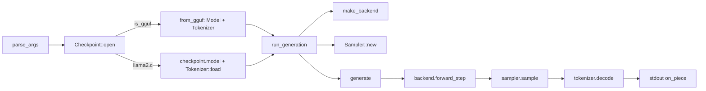

# 07. Tokenizer & Sampler

## Summary

`rusty_llama` ships two tokenizers behind one `Tokenizer` enum (`src/tokenizer.rs`) and one `Sampler` (`src/sampler.rs`), wired together by the CLI in `src/main.rs`. The tokenizers are **SPM** (SentencePiece-style, llama2.c `tokenizer.bin` + `llama`-arch GGUF) and **byte-level BPE** (`gpt2`-arch GGUF: Llama-3, Qwen2). Selection is automatic from GGUF metadata (`tokenizer.ggml.model`). The three things that matter most: (1) SPM uses greedy *highest-score* adjacent merges with `<0xXX>` byte fallback; BPE uses *rank-ordered* merges over a byte→printable-unicode map and a `fancy-regex` pre-tokenizer chosen per model; (2) both honour control/user-defined "special" tokens verbatim; (3) the `Sampler` is deliberately minimal — exactly four behaviours (greedy, temperature, multinomial, top-p) reproducing llama2.c's xorshift RNG bit-for-bit.

llama.cpp counterpart: `docs/Research/07-tokenization-and-sampling.md`.

─────────────────────────────────────────────────────────────────────

## 1. The `Tokenizer` enum and selection

```rust
pub enum Tokenizer {
    Spm(Spm),        // SentencePiece-style (llama2.c / `llama` GGUF)
    Bpe(Box<Bpe>),   // GPT-2 byte-level BPE (`gpt2` GGUF). Boxed — much larger than Spm.
}
```
`src/tokenizer.rs:26-31`. `Bpe` is boxed because it carries the full merge-rank map and a 256-entry byte encoder; keeping the enum small avoids fat `Spm` values.

The enum is a thin dispatcher (`src/tokenizer.rs:33-90`):

| method | behaviour | line |
|---|---|---|
| `from_vocab(vocab, scores)` | build SPM directly from pieces+scores | `35-37` |
| `from_bpe(tokens, merges, bos, eos)` | build BPE (GPT-2 pre-tokenizer) | `40-47` |
| `load(path, vocab_size)` | load legacy SPM `tokenizer.bin` | `50-52` |
| `from_gguf(gguf)` | dispatch on `tokenizer.ggml.model` | `56-65` |
| `encode(text, bos, eos) -> Vec<usize>` | forward to variant | `68-73` |
| `decode(prev_token, token) -> Vec<u8>` | SPM needs `prev`; BPE ignores it | `76-81` |
| `vocab_size() -> usize` | forward to variant | `84-89` |

### GGUF dispatch (`from_gguf`, `src/tokenizer.rs:56-65`)

```rust
let model = gguf.meta_str("tokenizer.ggml.model").unwrap_or("llama");
match model {
    "llama" => Ok(Tokenizer::Spm(Spm::from_gguf(gguf)?)),
    "gpt2"  => Ok(Tokenizer::Bpe(Box::new(Bpe::from_gguf(gguf)?))),
    other   => Err(Error::Format(format!(
        "unsupported GGUF tokenizer model '{other}' (have 'llama'/SPM, 'gpt2'/BPE)"))),
}
```
Missing metadata defaults to `"llama"` (SPM). Only `llama` and `gpt2` are supported — `bert`/WPM, T5/UGM, RWKV all error out (see Status).

### Legacy `tokenizer.bin` path (SPM)

`Tokenizer::load` → `Spm::load` (`src/tokenizer.rs:226-267`). The file layout (header doc `src/tokenizer.rs:11-15`):

```text
int32  max_token_length
repeat vocab_size times: float32 score | int32 len | u8[len] piece
```
`vocab_size` is *not* in the file — it is passed in (taken from the checkpoint `Config`, see §5). Reads are bounds-checked; truncation yields `Error::Format("tokenizer.bin truncated")` (`src/tokenizer.rs:233,242,256`). The decoded pieces are raw bytes here (no `▁` normalization — that marker only appears in the GGUF path).

─────────────────────────────────────────────────────────────────────

## 2. Special (control / user-defined) tokens

Both tokenizers share `SpecialTokens` (`src/tokenizer.rs:112-188`), which mirrors HuggingFace `AddedVocabulary`: matched verbatim on encode, emitted as literal text on decode.

- Built from GGUF `tokenizer.ggml.token_type`, collecting ids whose type is `TOKEN_TYPE_CONTROL = 3` or `TOKEN_TYPE_USER_DEFINED = 4` (`src/tokenizer.rs:97,99,134-152`). For SPM the *raw* (un-normalized) vocab string is the match text; absent metadata → empty table.
- Entries are sorted **descending by text length** (`new`, `src/tokenizer.rs:123-127`) so overlapping tokens match longest-first.
- `split(text, f)` (`src/tokenizer.rs:161-187`) walks the input, calling `f` with `Segment::Gap(&str)` for ordinary spans and `Segment::Special(id)` for verbatim hits. With no specials it is a single `Gap` over the whole text. `contains(id)` (`155-157`) gives O(1) decode-time lookup via a `HashSet<usize>`.

Test `special_tokens_split_longest_first` (`src/tokenizer.rs:884-899`) pins the longest-match rule: `x<|ab|>y<|a|>` → `["x", "#11", "y", "#10"]`.

─────────────────────────────────────────────────────────────────────

## 3. SPM tokenizer (`Spm`)

```rust
pub struct Spm {
    vocab: Vec<Vec<u8>>,            // piece bytes by id
    scores: Vec<f32>,              // merge score by id
    lookup: HashMap<Vec<u8>, usize>, // piece bytes → id
    max_token_length: usize,       // #[allow(dead_code)]
    specials: SpecialTokens,
}
```
`src/tokenizer.rs:195-204`.

**Build from GGUF** (`from_gguf`, `src/tokenizer.rs:273-297`): reads `tokenizer.ggml.tokens`, keeps `raw` strings for special matching, and converts each to bytes via `normalize_spm_piece`. Scores come from `tokenizer.ggml.scores` (default `0.0` if absent). Specials from `token_type`.

### `▁` → space normalization
`normalize_spm_piece` (`src/tokenizer.rs:403-405`): replaces SentencePiece's whitespace marker `▁` (U+2581) with an ASCII space, so the GGUF path reuses the same encode/decode as `tokenizer.bin`. Test `spm_marker_becomes_space` (`805-808`).

### Encode (`src/tokenizer.rs:304-376`)
`encode(text, bos, eos)`:
1. If `bos`, push id **1** (`src/tokenizer.rs:306-308`).
2. `specials.split` each ordinary span through `encode_piece`; the **dummy leading space is added only to the first ordinary span** (`first` flag, `309-320`). Special hits push their id verbatim.
3. If `eos`, push id **2** (`321-323`).

`encode_piece(text, add_dummy_space, out)` (`329-376`) — SentencePiece defaults:
1. Optional dummy leading space: look up `b" "` and prepend it (`334-338`).
2. Seed symbols per Unicode char; if the char's bytes aren't a known piece, **byte fallback** emits each byte at vocab id `b + 3` (or id `0`/unk if out of range) (`341-351`). The `+3` offset matches llama2.c: ids 0–2 are unk/BOS/EOS, byte tokens start at 3.
3. **Greedy highest-score adjacent merge loop** (`354-374`): scan all adjacent pairs, concatenate their piece bytes, look up the merged id, and pick the **highest `scores[id]`**; replace the pair with that id; repeat until no mergeable pair remains. Merges never cross span boundaries.

Test `spm_encode_merges_into_single_token` (`778-782`): `"hello"` with BOS → `[1, 11]` (the ` hello` piece wins on score `12.0`).

### Decode (`src/tokenizer.rs:379-394`)
`decode(prev_token, token)`:
- Special tokens → their literal vocab bytes (no stripping) (`382-384`).
- Strip a single leading space when `prev_token == 1` (the BOS), reproducing SentencePiece's space-after-BOS rule (`387-389`).
- `parse_byte_token` (`408-416`) expands a 6-byte `<0xXX>` piece into the raw byte it names; otherwise the piece bytes are emitted as-is (`390-393`).

Tests: `spm_decode_strips_space_after_bos` (`784-789`), `spm_byte_token_decodes_to_raw_byte` (`810-816`), round-trip `spm_roundtrip_via_decode` (`791-802`), special round-trip (`901-925`).

─────────────────────────────────────────────────────────────────────

## 4. Byte-level BPE tokenizer (`Bpe`)

```rust
pub struct Bpe {
    id_to_bytes: Vec<Vec<u8>>,                       // id → raw bytes
    token_to_id: HashMap<String, usize>,             // encoded string → id
    merge_ranks: HashMap<(String, String), usize>,   // (l,r) → rank (lower = earlier)
    byte_encoder: [char; 256],                       // byte → printable unicode
    pre: PreTokenizer,                               // splitting regex
    specials: SpecialTokens,
    bos: Option<usize>,
    eos: Option<usize>,
}
```
`src/tokenizer.rs:431-446`.

### Byte ↔ printable-unicode map
`bytes_to_unicode() -> [char; 256]` (`src/tokenizer.rs:646-665`): bytes in `0x21..=0x7E`, `0xA1..=0xAC`, `0xAE..=0xFF` map to themselves; every other byte maps to `U+0100 + next` so BPE never sees raw control bytes. This is GPT-2's reversible mapping (e.g. space `0x20` → `Ġ` / U+0120). The inverse `byte_decoder` (`HashMap<char,u8>`) is built in `build` (`471-475`). Test `byte_unicode_map_is_a_bijection` (`818-827`) asserts injectivity, `' ' → 'Ġ'`, and ASCII identity.

### Build (`build` / `from_gguf`, `src/tokenizer.rs:462-544`)
`from_gguf`: reads `tokenizer.ggml.tokens`, `tokenizer.ggml.merges` (each a `"left right"` string, `split_once(' ')`, `519-527`), `bos_token_id`/`eos_token_id` (`529-536`), and `tokenizer.ggml.pre` (default `"gpt-2"`, `540`). `build` decodes each token string into raw bytes via `decode_token_bytes` (`628-640`) — special/added tokens that aren't byte-encoded are stored as literal UTF-8 — and assigns each merge its index as its **rank** (`486-490`).

### Pre-tokenization (`fancy-regex`)
The `regex` crate lacks the lookahead these patterns need (`\s+(?!\S)`), so `PreTokenizer` compiles them with `fancy-regex` (`src/tokenizer.rs:703-713`). `for_each_chunk` (`720-733`) iterates matches, emitting any gap verbatim so no bytes are dropped. `pre_pattern` (`692-698`) selects the regex by the GGUF `pre` name:

| `pre` name | constant | distinguishing rule |
|---|---|---|
| (default / unknown) `gpt-2` | `PRE_GPT2` (`676-677`) | lowercase-only contractions; digit run kept whole |
| `llama-bpe` / `llama3` / `llama-v3` / `llama-bpe-v3` | `PRE_LLAMA3` (`682`) | case-insensitive contractions; digits in groups of ≤3; trailing-newline swallowing |
| `qwen2` / `qwen` | `PRE_QWEN2` (`686`) | as Llama-3 but digits split one-at-a-time (`\p{N}`) |

Tests pin the discriminators: GPT-2 `"1234567"→["1234567"]`, Llama-3 `→["123","456","7"]`, Qwen2 `→["1","2",…]` (`pretokenize_digit_runs_differ_by_pre`, `937-947`); uppercase contraction `IT'S` splits under GPT-2 but stays `["IT","'S"]` under Llama-3/Qwen2 (`949-956`). Public `pretokenize(pre, text)` (`749-751`) exists for golden testing (recompiles the regex per call — not for hot paths).

### Encode (`src/tokenizer.rs:550-611`)
`encode(text, bos, eos)`: extend with `self.bos`/`self.eos` (`Option`, only if present), and pre-tokenize each ordinary span into chunks, BPE-merging each chunk:

`encode_chunk` (`568-611`):
1. Map each input **byte** to one `byte_encoder` symbol string (`570-573`).
2. **Lowest-rank adjacent merge loop** (`579-597`): find the adjacent pair with the smallest `merge_ranks` value, concatenate, repeat until none merge. (Note: contrast SPM's *highest-score* rule — BPE merges by *earliest rank*.)
3. Map merged symbols to ids; if a symbol isn't a known token, fall back to its single-char (single-byte) tokens (`599-610`).

`decode(token)` (`614-619`): returns `id_to_bytes[token]` (caller concatenates); `prev_token` is ignored for BPE. Tests: `bpe_merges_and_roundtrips` (`847-860`), `bpe_byte_level_roundtrip_without_merges` (`862-874`, arbitrary UTF-8 survives via per-byte tokens), `bpe_bos_eos` (`876-882`).

─────────────────────────────────────────────────────────────────────

## 5. The `Sampler` (`src/sampler.rs`)

```rust
pub struct Sampler {
    temperature: f32,
    topp: f32,
    rng_state: u64,
    probindex: Vec<(f32, usize)>,  // scratch reused by top-p: (probability, token_id)
}
```
`src/sampler.rs:11-17`. `new(vocab_size, temperature, topp, seed)` (`26-34`) preallocates `probindex` and clamps the xorshift seed (`rng_state = if seed == 0 { 1 } else { seed }`, since xorshift cannot start at zero).

### `sample` dispatch (`src/sampler.rs:37-51`)
```rust
if self.temperature == 0.0 { return argmax(logits); }       // greedy
for l in logits.iter_mut() { *l /= self.temperature; }       // temp scale (in place)
softmax(logits);                                             // crate::math::softmax (src/math.rs:7)
let coin = self.random_f32();
if self.topp <= 0.0 || self.topp >= 1.0 { sample_mult(logits, coin) }  // plain multinomial
else { self.sample_topp(logits, coin) }                                // nucleus
```
`logits` is mutated in place (temperature divide then `softmax` over `crate::math::softmax`, `src/math.rs:7`). The four behaviours:

| mode | trigger | function |
|---|---|---|
| greedy | `temperature == 0` | `argmax` (`110-116`) |
| temperature + multinomial | `topp <= 0 \|\| topp >= 1` | `sample_mult` (`119-128`) |
| temperature + nucleus | `0 < topp < 1` | `sample_topp` (`69-106`) |
| — (RNG seam) | seeded reproducibility | `random_u32`/`random_f32` |

### xorshift RNG (`src/sampler.rs:54-66`) — llama2.c-identical
```rust
fn random_u32(&mut self) -> u32 {
    let mut s = self.rng_state;
    s ^= s >> 12; s ^= s << 25; s ^= s >> 27;
    self.rng_state = s;
    (s.wrapping_mul(0x2545F491_4F6CDD1D) >> 32) as u32   // top 32 bits
}
fn random_f32(&mut self) -> f32 { (self.random_u32() >> 8) as f32 / 16_777_216.0 }  // [0,1)
```
Same multiplier and bit-shifts as llama2.c, so a given seed reproduces the reference draws (test `same_seed_is_reproducible`, `141-149`).

### `sample_mult` — inverse-CDF (`src/sampler.rs:119-128`)
Walk the normalized probabilities accumulating `cdf`; return the first `i` where `coin < cdf`; fall back to the last index on rounding shortfall.

### `sample_topp` — nucleus (`src/sampler.rs:69-106`)
1. **Pre-filter**: `cutoff = (1.0 - topp) / (n - 1).max(1)`; keep only tokens with `p >= cutoff` into `probindex` (`72-78`). This cheaply drops tokens that can never enter the nucleus (llama2.c's optimization). If everything is filtered, fall back to `argmax` (`79-81`).
2. **Sort descending** by probability (`82-83`).
3. **Truncate** to the smallest prefix whose cumulative mass exceeds `topp`; `last` indexes that prefix (`86-94`).
4. **Sample within the truncated set**: `target = coin * cumulative`; inverse-CDF over `probindex[..=last]`; return `probindex[last].1` on shortfall (`97-105`).

Tests: `greedy_picks_argmax` (`134-139`), `topp_stays_in_range` (`151-157`).

─────────────────────────────────────────────────────────────────────

## 6. CLI wiring (`src/main.rs`)

### Flags & defaults (`parse_args`, `src/main.rs:153-202`; `USAGE` `22-33`)

| flag | field | default | line |
|---|---|---|---|
| `<checkpoint.bin>` (positional) | `checkpoint` | required | `155-164` |
| `-z <path>` | `tokenizer` | `tokenizer.bin` | `168,186` |
| `-t <float>` | `temperature` | `1.0` | `169,187` |
| `-p <float>` | `topp` | `0.9` | `170,188` |
| `-s <int>` | `seed` | wall-clock nanos (`default_seed`, `204-209`) | `171,189` |
| `-n <int>` | `steps` | `256` | `172,190` |
| `-i <text>` | `prompt` | `""` | `173,191` |
| `--backend <b>` | `backend` | `cpu` (`gpu`/`cuda` need cargo feature) | `174,192` |
| `-h` / `--help` | — | prints `USAGE`, exits 0 | `156-159,193-196` |

Parsing is a simple two-step `flag value` walk (`i += 2`); a missing value or unknown flag is a hard error with usage (`181-198`).

### Model + tokenizer selection (`run`, `src/main.rs:56-75`)
`Checkpoint::open` mmaps the file; `Gguf::is_gguf(bytes)` branches:
- **GGUF** → `Model::from_gguf` + `Tokenizer::from_gguf` (tokenizer embedded; `-z` ignored) (`63-68`).
- **llama2.c** → `checkpoint.model()` + `Tokenizer::load(args.tokenizer, model.config.vocab_size)` — note `vocab_size` comes from the checkpoint `Config` since `tokenizer.bin` omits it (`69-74`).

### Generation pipeline (`run_generation`, `src/main.rs:77-110`)
```rust
let backend = make_backend(&args.backend)?;                       // cpu | gpu[feat] | cuda[feat]
let mut state = RunState::new(&model.config);
let mut sampler = Sampler::new(model.config.vocab_size,
                               args.temperature, args.topp, args.seed);
generate(model, &mut state, backend.as_ref(), tokenizer, &mut sampler,
         &args.prompt, args.steps, |bytes| { out.write_all(bytes); out.flush(); });
```
`make_backend` (`116-151`) returns a clear error if `gpu`/`cuda` is requested without its cargo feature (no silent CPU fallback). Tokens stream to stdout via the `on_piece` closure; a tok/s line is printed to stderr afterward (`105-108`).

### How `generate` consumes them (`src/model.rs:596-652`)
- `tokenizer.encode(prompt, true, false)` prepends BOS, no EOS (`606`).
- Steps clamp to `config.seq_len` (`607`); prompts ≥2 tokens fast-path through batched prefill (`613-624`).
- Per step: `backend.forward_step`; while ingesting the prompt, the next token is **forced** from `prompt_tokens`; otherwise `sampler.sample(state.logits_mut())` (`630-639`).
- Token id **1 (BOS) doubles as end-of-sequence** and breaks the loop (`642-644`); each emitted token is decoded with its predecessor for SPM's space-strip rule (`646`).



─────────────────────────────────────────────────────────────────────

## Status, gaps & notes

- **Sampler is intentionally minimal — 4 behaviours vs llama.cpp's ~18.** Only greedy (`temp==0`), temperature scaling, plain multinomial, and top-p (nucleus) exist (`src/sampler.rs:37-51`). **No top-k, no min-p, no typical/tail-free, no repetition/frequency/presence penalties, no DRY, no Mirostat v1/v2, no logit-bias, no grammar/GBNF-constrained sampling.** There is no sampler *chain* — a single struct with fixed order (temp → softmax → top-p).
- **Two tokenizer families only.** SPM and GPT-2 byte-level BPE (`from_gguf`, `src/tokenizer.rs:56-65`). **No WPM (BERT), no UGM (T5/Unigram), no RWKV** tokenizers; an unknown `tokenizer.ggml.model` is a hard `Error::Format`. SPM byte fallback assumes the llama2.c `b + 3` id layout (`src/tokenizer.rs:348`).
- **Pre-tokenizer coverage is GPT-2 / Llama-3 / Qwen2.** `pre_pattern` (`src/tokenizer.rs:692-698`) recognizes those names; anything else silently falls back to the GPT-2 regex (matching llama.cpp's default behaviour, but other models' exact splits — DeepSeek, Falcon, StarCoder, etc. — are not reproduced).
- **Perf notes.** `Spm::encode_piece` is the naïve O(n²·merges) llama2.c loop (re-scans all adjacent pairs each iteration, clones `Vec<u8>` per candidate, `src/tokenizer.rs:354-374`); `Bpe::encode_chunk` is likewise a per-pair scan with `String` clones (`582-585`). Fine for prompt-length inputs, not optimized for bulk tokenization. `pretokenize()` recompiles its regex per call by design.
- **`Spm.max_token_length` is parsed but unused** (`#[allow(dead_code)]`, `src/tokenizer.rs:199-200`) — retained for `tokenizer.bin` format fidelity; encode does not use it to bound merge length.
- **Decode robustness:** BPE `decode` returns empty bytes for an out-of-range id (`src/tokenizer.rs:614-619`) rather than erroring.

llama.cpp counterpart: `docs/Research/07-tokenization-and-sampling.md` (compare its `llama_sampler` chain and the full WPM/UGM/RWKV vocab set).
