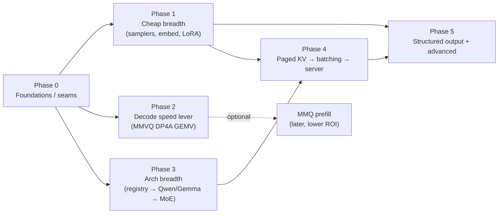

# 10. Evolution Plan: rusty_llama → llama.cpp-class

> Forward-looking execution plan. The capture it builds on is `00`–`08`; the
> strategy it operationalizes is `09-status-and-roadmap.md` (internal) and
> `../Research/09-rusty-llama-gap-analysis.md` (external). Snapshot baseline:
> `main` @ `e2a7d5d`, 2026-06-18.

## North star & guardrails

**Goal.** Adopt llama.cpp's *architecture and proven techniques* where the ROI is
high, and add the *user-visible breadth* that makes the engine genuinely useful —
while staying legible (the "llama.cpp, the Rust way" ethos).

**Explicit non-goals** (the captured lesson: full parity is a treadmill).
- ❌ Matching llama.cpp's raw throughput on every shape/arch.
- ❌ All 132 architectures, all ~30 quant formats, multimodal, distributed/RPC,
  training. These are `../Research/09` Tier-4 — deferred or never.
- ❌ A second convention beside an existing one: every change is a clean cutover
  (no compat shims), preserving the CPU-oracle parity discipline (`08`).

**Standing invariants every milestone must hold** (from `HANDOFF.md` conventions):
- Per-op parity vs `CpuBackend` (the oracle) + an e2e coherence check.
- `cargo test` + `cargo clippy --all-targets` clean **with and without** each
  feature (`gpu`, `cuda`).
- Feature-branch + PR per milestone; re-bench vs `llama-bench` honestly.
- New optional capability ⇒ behind a cargo feature or a runtime flag, base build
  stays dependency-light.

─────────────────────────────────────────────────────────────────────────────

## Strategic shape

Three tracks, interleaved by ROI rather than run end-to-end. Recommended order is
**breadth-first** (cheap, user-visible) → **the one decode speed lever** (bounded,
proven) → **capability jumps** (large). This matches both gap analyses.

`Phase 0` unblocks everything; `Phase 1`/`2`/`3` are independent and can run in
parallel; `Phase 4` (server) depends on the paged-KV refactor and the Phase-1
sampler/template work; `Phase 5` is the long tail.

─────────────────────────────────────────────────────────────────────────────

## Phase 0 — Foundations & enabling seams

**Detailed plan → [`plans/phase-0-foundations.md`](plans/phase-0-foundations.md)**

Small, low-risk refactors that make every later phase a clean cutover instead of
a rewrite. **Do these first; they pay for themselves immediately.**

| # | Work | Files | Why | Size |
|---|---|---|---|---|
| 0.1 | **Sampler → composable chain.** Replace the monolithic `Sampler` (`src/sampler.rs`: temp→top-p→argmax) with a `Vec<Box<dyn SamplerStage>>` applied in order over a `TokenDataArray`-style `{logit, id}` buffer, mirroring llama.cpp's `llama_sampler_i` (`apply`/`accept`/`reset`). Keep the xorshift RNG + the exact current default chain (temp→top-p) as the seed config so output is unchanged. | `src/sampler.rs`, `src/main.rs` | Unblocks Phase 1 samplers + Phase 5 grammar with no later churn | S |
| 0.2 | **Arch-registry seam.** Extract the name-prefix dispatch in `Model::from_gguf` into an `Arch` enum + a per-arch tensor-name map + a per-arch graph-builder selector, mirroring `llama-arch.cpp`/`llama-model.cpp` (`../Research/05`). Llama stays the only arch — this is pure structure, no behavior change. | `src/model.rs`, `src/config.rs` (maybe new `src/arch.rs`) | Unblocks Phase 3 without touching the forward loop later | S–M |
| 0.3 | **`llama-bench` protocol parity.** Make the in-crate benches (`bench_*_real_tinyllama`, `08`) mirror `llama-bench` exactly (pp512/tg128, warmup, `-r` repetitions, `-d` depth), and document the run recipe. | `src/backend/cuda.rs`, `src/backend/gpu.rs`, `08` | Honest, apples-to-apples scoreboard for every later win | S |
| 0.4 | **KV/attention seam prep.** Document and isolate the single-sequence assumption in `Backend::attention` (one q, one seq's `key_cache`/`value_cache`) and `RunState` so Phase 4 can add a sequence dimension behind a flag without a trait-wide break. No code change beyond annotations + a thin indirection. | `src/backend/mod.rs`, `src/model.rs` | De-risks the largest later refactor | S |

**Acceptance:** byte-identical greedy output before/after (0.1, 0.2); bench
numbers reproducible within noise (0.3); all features build+test clean.

─────────────────────────────────────────────────────────────────────────────

## Phase 1 — Cheap breadth (highest ROI)

**Detailed plan → [`plans/phase-1-breadth.md`](plans/phase-1-breadth.md)**

User-visible capability, low effort, no new perf risk. (`../Research/07`, `08`.)

| # | Work | Files | llama.cpp lesson | Size |
|---|---|---|---|---|
| 1.1 | **Core samplers on the chain:** top-k, min-p, repetition/frequency/presence penalties (with an `n_prev` window), and `temp-ext`/typical as stretch. Wire CLI flags (`--top-k`, `--min-p`, `--repeat-penalty`, …). | `src/sampler.rs`, `src/main.rs` | Default chain order + semantics from `../Research/07` | S–M |
| 1.2 | **Embeddings / pooling mode.** A `--embedding` path that runs the forward pass and returns a pooled (mean/last/cls) + normalized hidden state instead of sampling. | `src/model.rs`, `src/main.rs` | `../Research/08` pooling types | S |
| 1.3 | **LoRA + control vectors.** Load adapter GGUFs; LoRA = `out += scale·B·(A·x)` folded into `Backend::matmul` consumers; control vectors = per-layer `+= dir`. Per-request scale. | `src/model.rs`, `src/backend/*`, new `src/adapter.rs` | `../Research/08` adapter design | M |
| 1.4 | **Built-in chat templates.** A handful of hardcoded templates (chatml, llama-3, qwen2) selected from `tokenizer.chat_template`/arch, so the engine is usable as a chat backend without full Jinja. | new `src/chat.rs`, `src/main.rs` | `llama-chat.cpp` built-ins (`../Research/08`) | M |

**Acceptance:** each sampler has a parity/behavior test (not a default-string
test); embeddings validated against a known pooled vector; LoRA output matches a
reference merge within tolerance; templates round-trip known prompts.

─────────────────────────────────────────────────────────────────────────────

## Phase 2 — The decode speed lever (bounded, proven ceiling)

**Detailed plan → [`plans/phase-2-decode-gemv.md`](plans/phase-2-decode-gemv.md)**

The **only** change that closes the ~3.4× decode gap, which is pure weight
bandwidth (`04`, `09`, `../Research/03`). Everything else about decode is already
resident.

**2.1 — MMVQ-style packed-weight DP4A decode GEMV (CUDA).**
- Port llama.cpp's `mmvq` design (`../Research/03`): quantize the activation to
  `q8_1` once per step on-device; a warp-cooperative, **coalesced** GEMV that
  reads weights **packed** (Q4_K 144 B / Q6_K 210 B blocks stay in VRAM) and
  unpacks in-register, dotting via `__dp4a`. Specialize for **Blackwell sm_120,
  batch-1, Q4_K/Q6_K** only — skip llama.cpp's per-arch tables.
- Reuse the existing CPU integer-dot oracles (`vec_dot_q4_k`/`vec_dot_q6_k`,
  `05`) for bit-level parity of the new kernel.
- **Heed the closed-PR-#23 lesson:** the naive one-block-per-row version lost
  ~1.6× to f16. Gate adoption on a microbench (like the wgpu Stage-2 gate, `03`):
  ship only if it beats the f16 GEMV on the real model; keep behind a flag +
  parity tests regardless (kill-criterion discipline).
- Files: `src/backend/cuda.rs` (`forward_step` GEMV path, new nvrtc kernel +
  a `quantize_q8_1` device kernel).

**2.2 — KV resident across prefill→decode (minor).** Drop the one-time host KV
upload in `DecodeCuda` (`cuda.rs`, `kv_filled`) by handing the prefill's resident
device KV straight to decode. Small, safe latency win (`HANDOFF.md`).

**Acceptance:** new GEMV bit-exact vs CPU oracle; real-TinyLlama tg128 measured
vs the f16 path and vs `llama-bench`; adopt only on a win, else park behind tests.
**Effort:** L (real kernel craft) — but bounded and de-risked by the capture.

─────────────────────────────────────────────────────────────────────────────

## Phase 3 — Architecture breadth

**Phase 3.1 detailed plan (shipped) → [`plans/phase-3-archs.md`](plans/phase-3-archs.md).** 3.2/3.3 stay master-plan sketches, deepened just-in-time once their prerequisites land (see [`plans/README.md`](plans/README.md)).

Built on the Phase-0.2 registry. Tiered by distance from Llama (`../Research/05`).

| # | Work | Notes | Size |
|---|---|---|---|
| 3.1 | **Near-Llama archs: Qwen2, Phi-3, Gemma 2.** ✅ **SHIPPED** | Hparam/norm/activation/rope variants off the shared block: Qwen2 QKV bias, Phi-3 fused QKV+gate/up split at load, Gemma2 GeGLU/√dim-embed/explicit-head_dim/sandwich-norms/logit-softcap; cross-cutting NeoX-rope handled by a load-time Q/K permute (one rope kernel). Greedy-validated vs `llama-cli`. Detail: [`plans/phase-3-archs.md`](plans/phase-3-archs.md). | M each |
| 3.2 | **MoE (Mixtral / Qwen-MoE).** | Needs expert routing — a `MUL_MAT_ID`-equivalent: a new `Backend` op (gather top-k experts + weighted matmul) implemented on CPU first (oracle), then CUDA. | L |
| 3.3 | **Recurrent (Mamba/RWKV).** | New state model (not a KV cache) + new ops; large, separable. Defer unless demanded. | XL |

**Acceptance:** each arch loads a real GGUF and its greedy output matches
llama.cpp's first-N tokens; CPU path is the oracle for any new op before GPU/CUDA.

─────────────────────────────────────────────────────────────────────────────

## Phase 4 — Paged KV → continuous batching → server

The largest jump and the biggest "product" payoff. Strictly sequenced; depends on
Phase 0.4 and Phase 1 (samplers/templates). (`../Research/06`, `08`.)

| # | Work | Files | Size |
|---|---|---|---|
| 4.1 | **Paged, multi-sequence KV cache.** Add a `seq_id` dimension + a cell/slot allocator (positions, per-seq bitset) replacing the flat `(n_layers, seq_len, kv_dim)` buffer; teach `Backend::attention` a per-sequence causal mask. Keep the single-seq path as the 1-seq special case. | `src/model.rs`, `src/backend/*` | L |
| 4.2 | **Continuous batching.** Pack tokens from multiple sequences into one `forward`/`forward_prefill`; per-stream masking. | `src/model.rs`, backends | L |
| 4.3 | **Minimal OpenAI-compatible server.** `/v1/chat/completions` + `/completions` + `/health`, streaming, slots over the batching core. New `server` feature/bin; pick a tiny HTTP dep. | new `src/bin/server.rs` | L–XL |

**Acceptance:** concurrent sequences produce per-seq-identical output vs running
them singly; server passes a basic OpenAI-client smoke test + load test.

─────────────────────────────────────────────────────────────────────────────

## Phase 5 — Structured output & advanced (long tail)

Pick opportunistically once the above lands.

- **GBNF grammar + JSON-schema → grammar** as a `SamplerStage` (depends on
  Phase 0.1). Per-step token-mask. (`../Research/07`.)
- **Flash attention** (online-softmax) in the CUDA attention kernel — decode
  latency + long-context. (`../Research/03`.)
- **Speculative / prompt-lookup (n-gram) decode** — n-gram needs no draft model;
  fits the resident decode. (`../Research/06`.)
- **MMQ-style int8 tensor-core prefill** — beats the cuBLASLt wall but harder
  than Phase 2; only if prefill becomes the bottleneck. (`../Research/03`.)
- **Quant breadth** (Q5_K/Q2_K/Q3_K, then IQ*) — add only when a target model
  needs it. (`04`, `../Research/04`.)

─────────────────────────────────────────────────────────────────────────────

## Cross-cutting discipline

- **Parity oracle stays sacred.** Every new op gets a CPU implementation first;
  GPU/CUDA/kernels are validated against it (`08`). No exceptions.
- **Feature-gate everything optional.** `gpu`, `cuda`, future `server`; base build
  stays at three deps. clippy/test clean in every feature combo.
- **Kill-criteria for speed work.** Like the Stage-2 int8 and PR-#23 decisions:
  measure on the real model, adopt only on a win, keep proven-but-unwired code
  behind tests.
- **Docs as you go.** Update `09-status-and-roadmap.md` (burndown) and the
  relevant `01`–`08` capture doc when a subsystem changes; keep the capture true.

─────────────────────────────────────────────────────────────────────────────

## Risk register

| Risk | Likelihood | Mitigation |
|---|---|---|
| Scope creep toward full parity (treadmill) | High | ROI gates + the explicit non-goals above; revisit this doc each phase |
| Phase 2 kernel underperforms f16 (as PR #23 did) | Medium | Microbench gate + kill-criterion; bounded sm_120/Q4_K-Q6_K scope; parity oracle reuse |
| Phase 4 paged-KV refactor destabilizes all backends | Medium | Phase 0.4 seam first; keep 1-seq as a special case; land behind a flag with parity at each step |
| New ops drift from CPU oracle | Medium | Oracle-first rule; bit-exact integer-dot tests where possible |
| Maintainer legibility erodes as features pile up | Medium | Feature flags, clean cutovers, capture-doc upkeep |

─────────────────────────────────────────────────────────────────────────────

## Decision points (your call)

- **D1 — Emphasis order.** Recommended: Phase 1 (breadth) → Phase 2 (decode lever)
  → Phase 3/4. Alternatives: speed-first (Phase 2 then 5/MMQ) or serving-first
  (Phase 0.4→4). *Recommended: breadth-first.*
- **D2 — Arch ambition.** Near-Llama only (3.1) / + MoE (3.2) / + recurrent (3.3).
  *Recommended: 3.1 now, 3.2 if a MoE model is a target, 3.3 deferred.*
- **D3 — Server scope.** Minimal completions (4.3 core) vs full OpenAI + slots +
  prompt-cache reuse. *Recommended: minimal first.*
- **D4 — Prefill speed (MMQ) & quant breadth.** Defer both until decode (Phase 2)
  lands and a concrete need appears. *Recommended: defer.*

**Suggested first concrete step:** Phase 0 in full (it's all S-sized and unblocks
everything), then Phase 1.1 (samplers) as the first user-visible win.
