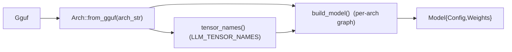
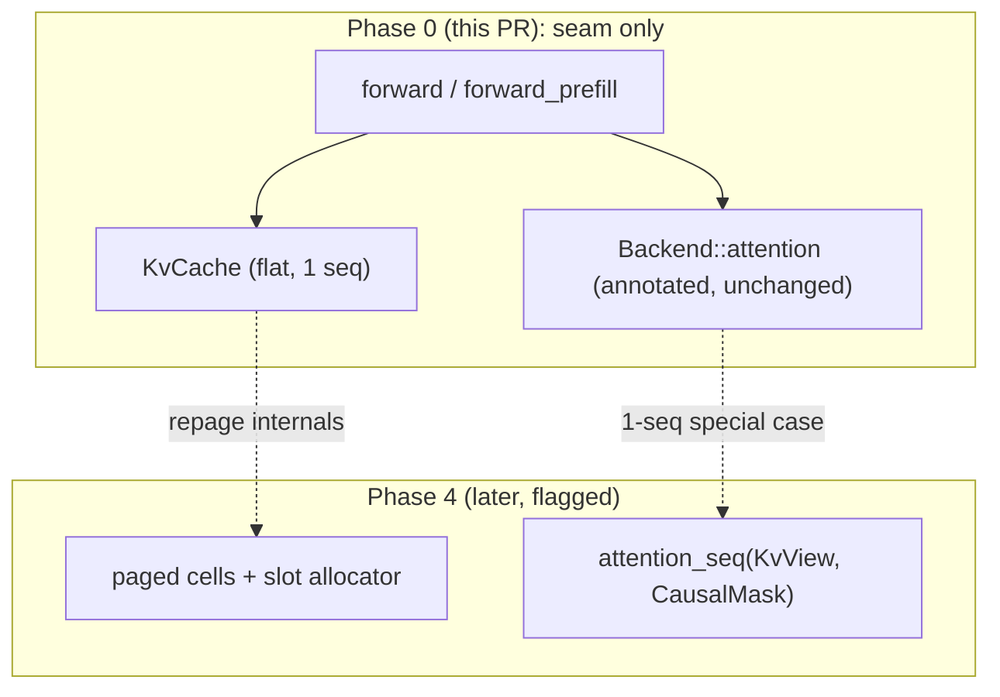

# Phase 0 — Foundations & enabling seams (detailed plan)

**Summary.** Phase 0 is four small, low-risk refactors that turn every later phase
into a clean cutover instead of a rewrite (master plan:
[`../10-evolution-plan.md`](../10-evolution-plan.md) §"Phase 0"). 0.1 replaces the
monolithic `Sampler` with a composable `SamplerChain` of `SamplerStage`s
(unblocks Phase 1 samplers + Phase 5 grammar); 0.2 extracts the arch dispatch in
`Model::from_gguf` into an `Arch` registry seam (unblocks Phase 3); 0.3 makes the
in-crate benches mirror `llama-bench`'s protocol so every later speed claim is
apples-to-apples; 0.4 isolates the single-sequence KV/attention assumption behind
a `KvCache` indirection + annotations (de-risks the Phase 4 paged-KV refactor).
**Dependencies:** none — Phase 0 is the root of the DAG. **Definition of done:**
byte-identical greedy output before/after (0.1, 0.2); bench numbers reproducible
within noise (0.3); seam in place with zero behavior change (0.4); `cargo test` +
`cargo clippy --all-targets` clean with and without `gpu`/`cuda`. Sibling phase
docs: [`phase-1-...`], [`phase-2-...`], [`phase-3-...`], [`phase-4-...`] (under
this directory). The discipline below follows `HANDOFF.md` (oracle parity,
feature-gating, clean cutover — no compat shims).

─────────────────────────────────────────────────────────────────────────────

## 0.1 Sampler chain

### Design

Today `src/sampler.rs` is **four behaviors fused into one struct** (`Sampler`,
`src/sampler.rs:11-17`): `sample()` (`:37-51`) short-circuits to `argmax` when
`temperature == 0`, else divides logits by `t`, `softmax`es in place
(`crate::math::softmax`, `src/math.rs:7-21`), draws one `coin = random_f32()`
(`:64-66`, fed by the llama2.c xorshift `random_u32`, `:54-61`), then dispatches
to `sample_mult` (`:119-128`) or `sample_topp` (`:69-106`). This is exactly
llama.cpp's `cur_p` contract already (mutating a flat logit buffer), just not
composable — see `../../Research/07-tokenization-and-sampling.md` §"Relevance"
(L207).

Port llama.cpp's `llama_sampler_i` vtable + `llama_token_data_array`
(`../../Research/07-tokenization-and-sampling.md` §2.1–2.3, L84-111) as:

```rust
/// One candidate token: id + (current) logit + (filled) probability.
/// Mirrors llama.cpp `llama_token_data`.
pub struct TokenData { pub id: u32, pub logit: f32, pub p: f32 }

/// The unit of work every stage mutates in place. `size` is the live prefix
/// (`data[..size]`) so a filter truncates by shrinking `size`, never by
/// reallocating; `selected` is an INDEX into `data` (not a token id);
/// `sorted` caches a descending-by-logit sort. Mirrors `llama_token_data_array`.
pub struct TokenDataArray {
    pub data: Vec<TokenData>,
    pub size: usize,
    pub selected: Option<usize>,
    pub sorted: bool,
}

/// A composable sampler step. `apply` is the only required hook; `accept`
/// lets stateful stages (Phase-1 penalties, Phase-5 grammar) observe the
/// chosen token; `reset` clears per-sequence state. Mirrors `llama_sampler_i`.
pub trait SamplerStage: Send {
    fn apply(&mut self, cur: &mut TokenDataArray);
    fn accept(&mut self, _token: u32) {}
    fn reset(&mut self) {}
    fn name(&self) -> &'static str;
}

/// Ordered chain of stages ending in a selector that sets `cur.selected`.
pub struct SamplerChain {
    stages: Vec<Box<dyn SamplerStage>>,
    cur: TokenDataArray, // reused scratch, capacity == vocab_size
}
```

`SamplerChain::sample` reproduces `llama_sampler_sample`: refill `cur` from the
logits (id = index, logit = value, `size = vocab`, `selected = None`,
`sorted = false`), run each `apply` in order, read `id = cur.data[selected].id`,
then run each `accept(id)`, and return `id`. The xorshift RNG lives on the
**selector** stage (llama.cpp's `dist`/`greedy` carry their own seed), not the
chain.

The three Phase-0 stages (the only ones needed to reproduce today's default):

| Stage | `apply` behavior | maps to legacy |
|---|---|---|
| `Temp { t: f32 }` | `for c in data[..size]: c.logit /= t` | `*l /= temperature` (`:41-43`) |
| `TopP { p: f32 }` | softmax→`c.p` (stable, == `math::softmax`); pre-filter `c.p >= (1-p)/(n-1).max(1)`; sort live prefix desc by `p`; set `size` to smallest prefix whose cumulative `> p`; `sorted = true`; **empty nucleus ⇒ collapse to argmax** | `sample_topp` (`:69-106`) |
| `Dist { rng: u64 }` *(selector)* | softmax→`p` if not already filled; `coin = random_f32()`; `cumulative = Σ p[..size]`; `target = if sorted { coin*cumulative } else { coin }`; inverse-CDF over `data[..size]`; fallback to last live index; set `selected` | `sample_mult` (`:119-128`) / `sample_topp` tail (`:96-105`) |
| `Greedy` *(selector)* | `selected = argmax(logit over data[..size])` | `argmax` (`:110-116`) |

**Default-chain builder (the byte-identical seed config).** A constructor with
the *exact same signature* as today's `Sampler::new` (`:26-34`) builds the chain
by mirroring `sample()`'s branch structure:

```rust
impl SamplerChain {
    pub fn new(vocab_size: usize, temperature: f32, topp: f32, seed: u64) -> Self {
        let rng = if seed == 0 { 1 } else { seed };          // :30-31 verbatim
        let stages: Vec<Box<dyn SamplerStage>> = if temperature == 0.0 {
            vec![Box::new(Greedy)]                            // :38-39
        } else if topp <= 0.0 || topp >= 1.0 {
            vec![Box::new(Temp{t:temperature}), Box::new(Dist{rng})]   // :46-47
        } else {
            vec![Box::new(Temp{t:temperature}),
                 Box::new(TopP{p:topp}), Box::new(Dist{rng})] // :48-49
        };
        Self { stages, cur: TokenDataArray::with_capacity(vocab_size) }
    }
    pub fn sample(&mut self, logits: &[f32]) -> usize { /* refill→apply→select→accept */ }
}
```

### Milestones (PR-sequenced)

1. **PR 0.1a — types + chain, no wiring.** Add `TokenData`/`TokenDataArray`/
   `SamplerStage`/`SamplerChain` + `Temp`/`TopP`/`Dist`/`Greedy` and the legacy
   builder, behind the existing `sampler` module. Keep old `Sampler` temporarily
   *un-exported-changed* so the crate still builds; unit-test stages in isolation.
2. **PR 0.1b — cutover.** Replace `Sampler` with `SamplerChain` everywhere:
   `pub use sampler::Sampler` → `SamplerChain` (`src/lib.rs:48`); `generate` /
   `generate_prefilled` param `&mut Sampler` → `&mut SamplerChain`
   (`src/model.rs:601,665`) and `sampler.sample(state.logits_mut())` →
   `sampler.sample(state.logits())` (`src/model.rs:638,692,705`); `main.rs`
   `Sampler::new(...)` → `SamplerChain::new(...)` (`src/main.rs:80-85`). Delete
   the old `Sampler` struct, `sample_topp`, `sample_mult`, `argmax` free fns
   (folded into stages). No CLI flag changes (Phase 1 adds `--top-k`, etc.).

### Behavior preservation / migration

- **Greedy is byte-identical by construction.** `temperature == 0` ⇒ chain is
  `[Greedy]`, and `Greedy` reuses the *exact* `argmax` semantics — Rust
  `max_by(partial_cmp ... unwrap_or(Equal))` returns the **last** index among
  equal maxima and treats NaN as Equal (`src/sampler.rs:110-116`). Reproduce that
  tie/NaN rule verbatim or greedy streams diverge.
- **Stochastic default (`-t 1.0 -p 0.9`) is the `sample_topp` path**, never
  `sample_mult` (mult only fires when `topp<=0||>=1`). `Dist` uses
  `target = coin*cumulative` over the sorted/truncated prefix iff `sorted`
  (matching `:96-97`), else `target = coin` over the full softmax (matching
  `sample_mult`'s `coin < cdf`, `:122-123`). Exactly **one** `random_f32()` draw
  per token, same xorshift state evolution — same seed ⇒ same draws.
- **Public API churn is the clean cutover** mandated by the master plan
  (no shims): the type is renamed (`Sampler`→`SamplerChain`) rather than aliased.

### Test plan

- **Byte-identical greedy e2e (strong claim).** New test: greedy generate a
  fixed prompt with `SamplerChain::new(v, 0.0, 0.9, seed)` and assert the token
  stream equals a golden vector captured from the pre-cutover `Sampler` (literal
  in the test, so it survives deletion of the old code). Extends the existing
  `greedy_picks_argmax` (`:134-139`).
- **Seed-reproducible stochastic.** Port `same_seed_is_reproducible` (`:142-149`)
  to the chain; add a golden stochastic stream (seed fixed, `-t 1 -p 0.9`)
  recorded from legacy `Sampler` in PR 0.1a and asserted in 0.1b.
- **Per-stage units** (assert behavior, not defaults): `Temp` scales then a
  selector picks the right argmax; `TopP` truncates `size` to the nucleus and
  collapses to argmax on an all-below-cutoff (degenerate) distribution; `Dist`
  inverse-CDF picks the bucket for a pinned `coin`; `accept`/`reset` are no-ops
  that don't perturb stateless stages (guards the Phase-1 penalty hook).
- **Edge cases:** vocab of 1; all-equal logits (ties → last index); a `-inf`
  logit in the nucleus; NaN logit (must not be selected by `Greedy`).

**Effort: S.** **Risks:** boundary float drift between `coin*cumulative` and
`coin` if the two legacy branches are merged carelessly (keep them distinct via
`sorted`); forgetting the empty-nucleus argmax fallback (`:79-81`); the `max_by`
last-of-ties subtlety.

─────────────────────────────────────────────────────────────────────────────

## 0.2 Arch-registry seam

### Design

`Model::from_gguf` (`src/model.rs:136-236`) reads `general.architecture`
(`:137`) purely as a `{arch}.*` **key prefix** (`:138-166`) and then hardcodes
Llama tensor names: `token_embd.weight` (`:170,211`), `output.weight` (`:178,215`),
`output_norm.weight` (`:226`), and the per-layer `blk.{i}.{attn_norm,attn_q,
attn_k,attn_v,attn_output,ffn_norm,ffn_gate,ffn_down,ffn_up}.weight`
(`:200,224-233`). There is no `Arch` enum, no per-arch name table, no graph
selector — it works for any Llama-named GGUF but Phase 3 would have to surgically
re-thread the loader. Mirror llama.cpp's three-table registry
(`../../Research/05-gguf-and-model-loading.md` §4, L86-96; relevance L135):
`LLM_ARCH_NAMES` (string↔enum), `LLM_KV_NAMES` (`%s.key`), `LLM_TENSOR_NAMES`
(tensor templates), with graph wiring kept **imperative per-arch**.

New `src/arch.rs`:

```rust
/// Supported architectures. Llama is the only entry in Phase 0; Phase 3 adds
/// Qwen2/Gemma/Phi arms. Mirrors `enum llm_arch`.
pub enum Arch { Llama }

/// Canonical GGUF tensor-name templates for one arch (`{i}` = block index).
/// Mirrors `LLM_TENSOR_NAMES`. `'static` strs — zero allocation at load except
/// the per-block `format!`, exactly as today.
pub struct TensorNames {
    pub token_embd:  &'static str, // "token_embd.weight"
    pub output:      &'static str, // "output.weight"
    pub output_norm: &'static str, // "output_norm.weight"
    pub attn_norm:   &'static str, // "blk.{i}.attn_norm.weight"
    pub attn_q: &'static str, pub attn_k: &'static str,
    pub attn_v: &'static str, pub attn_output: &'static str,
    pub ffn_norm: &'static str, pub ffn_gate: &'static str,
    pub ffn_up:   &'static str, pub ffn_down: &'static str,
}

impl Arch {
    /// Linear lookup of `general.architecture`. Phase-0 policy: every recognized
    /// Llama-family string AND (today's permissive behavior) any unknown string
    /// resolves to `Arch::Llama`, so no currently-loadable file regresses.
    pub fn from_gguf(arch: &str) -> Self { Arch::Llama }
    pub fn tensor_names(&self) -> &'static TensorNames { match self { Arch::Llama => &LLAMA_NAMES } }
    /// Per-arch graph builder selector. The body is today's `from_gguf` code,
    /// reading names through `tensor_names()`. Phase 3 adds match arms.
    pub fn build_model<'a>(&self, gguf: &Gguf<'a>) -> Result<Model<'a>> { /* moved here */ }
}
```

`Model::from_gguf` collapses to the seam:

```rust
pub fn from_gguf(gguf: &Gguf<'a>) -> Result<Self> {
    let arch = Arch::from_gguf(gguf.meta_str("general.architecture")?);
    arch.build_model(gguf)
}
```

`build_model` is the verbatim move of `:140-235`, with the two name closures
(`concat`/`layers`, `:197-209`) and the four scalar tensor lookups rewritten to
read from `arch.tensor_names()` (e.g. `n.attn_q` instead of the literal
`"attn_q.weight"`). The `{arch}.*` hparam keys (`:138-166`) stay keyed off the
raw arch string (llama.cpp's `LLM_KV` formats the arch name in identically) —
Llama and its kin all use the same `<arch>.block_count` shape, so this is byte-
for-byte unchanged. `Config` (`src/config.rs:62-90`) and `RopeScaling`
(`:11-39`) are untouched in Phase 0; Phase 3 will hang per-arch knobs (QK-norm,
attn/ffn scaling, tied embeddings) off this seam.



### Milestones (PR-sequenced)

1. **PR 0.2a — extract.** Add `src/arch.rs` with `Arch`, `TensorNames`,
   `LLAMA_NAMES`, and move the `from_gguf` body into `Arch::build_model`
   unchanged except routing names through `tensor_names()`. `Model::from_gguf`
   becomes the two-line seam. `pub mod arch;` in `src/lib.rs:23-33`. No new arch.

### Behavior preservation / migration

- **Zero behavior change.** The tensor-name strings and the `{arch}.*` key
  reads are identical; only their *source* moves from inline literals to a
  table. The same bytes are borrowed from the same offsets ⇒ identical
  `QMatrix`es ⇒ identical forward output.
- **Stay permissive in Phase 0.** Today an unknown arch string still loads if its
  tensors are Llama-named; `Arch::from_gguf` preserves that by resolving
  everything to `Arch::Llama`. Tightening to reject genuinely-unknown archs is a
  Phase-3 decision (when a second `TensorNames` exists), recorded as an open
  question below — not a Phase-0 behavior change.

### Test plan

- **Byte-identical load+output.** Reuse the synthetic-GGUF fixtures
  (`src/dummy.rs`) and the real TinyLlama path: assert post-refactor logits and a
  ≥12-token greedy stream equal a golden captured pre-refactor (the
  `tests/gguf.rs` finite/deterministic forward + `Q8_0 ≈ F32` suite,
  `docs/Architecture/08-...` §2, must pass unchanged).
- **Name-table unit:** `LLAMA_NAMES.attn_q == "attn_q.weight"` etc. and a
  `blk(template, i)` formatter producing `blk.3.attn_q.weight` — guards a typo in
  the extracted table.
- **Seam smoke:** `Arch::from_gguf("llama")`, `"qwen2"`, `"mistral"`, an unknown
  string all resolve to `Arch::Llama` (documents the permissive policy).

**Effort: S–M.** **Risks:** a transcription error when moving ~100 lines (caught
by the byte-identical golden); accidentally changing borrow lifetimes during the
move (`Model<'a>` borrows `gguf` — keep `build_model<'a>(&Gguf<'a>)`).

─────────────────────────────────────────────────────────────────────────────

## 0.3 llama-bench protocol parity

### Design

The in-crate real-model benches are single timed runs: `bench_decode_real_tinyllama`
(`src/backend/cuda.rs:1203`) warms up with one step (`backend_warmup`, `:1255-1257`),
then times **one** 128-step decode (`:1222,1236-1238`);
`bench_prefill_real_tinyllama` (`:1321`) prefills `512.min(seq_len)` tokens
(`:1341`), warms up once (`:1354`), times **one** pass (`:1355-1357`). The wgpu
siblings (`bench_prefill_gpu_vs_cpu` `src/backend/gpu.rs:2767`,
`bench_decode_gpu_vs_cpu` `:2817`, `bench_decode_quant_vs_f32` `:2865`;
`docs/Architecture/08-...` §5) are the same shape. They print one `tok/s` with no
repetitions, no stddev, and no depth — so a real-model number is hard to compare
honestly to `llama-bench`.

`llama-bench`'s exact protocol (`../../Research/08-capabilities-and-tooling.md`
§6.1, L111-118; relevance L165):

| Knob | `llama-bench` default | meaning |
|---|---|---|
| `pp N` | `-p 512` ⇒ **pp512** | process an `N`-token prompt → prefill t/s |
| `tg N` | `-n 128` ⇒ **tg128** | generate `N` tokens → decode t/s |
| `-r` | **5** | repetitions; report **average ± stddev** |
| warmup | one run, unless `--no-warmup` | exclude cold-cache effects |
| `-d N` | 0 | prefill KV with `N` tokens first; reported `pp512 @ dN` |
| excluded | tokenize + sampling | times only the compute (`llama_decode`) |

Bring the benches to this protocol (measurement hygiene only — no kernel change):

1. **Repetitions + stats.** A small helper `bench_stat(reps, warmups, || …) ->
   (mean_tps, stddev_tps)` that runs `warmups` (default 1) untimed iterations then
   `reps` (default 5, `RUSTY_LLAMA_BENCH_R` override) timed ones; print
   `pp512: <mean> ± <stddev> t/s (r=5)` / `tg128: …`.
2. **Fix the token counts to the protocol.** Prefill bench = pp512 (already
   `512.min(seq_len)`); decode bench = tg128 (already 128). Keep the synthetic
   token generators (`(i*7+1)%vocab`, `(pos*13+1)%vocab`) — tokenization/sampling
   are correctly excluded already since these feed token ids straight in.
3. **Optional depth.** `-d` analogue `RUSTY_LLAMA_BENCH_DEPTH=N`: `forward_prefill`
   `N` tokens to populate KV, then time the pp/tg run "at depth N"; label
   `tg128 @ d{N}`. Mirrors llama.cpp's `pp512 @ d512`.
4. **Documented recipe.** Extend `docs/Architecture/08-...` §4 run matrix and
   `PERFORMANCE.md` with the canonical invocation and the `llama-bench` command it
   is measured against (`llama-bench -m <gguf> -ngl 99 -p 512 -n 128 -r 5`).

### Milestones (PR-sequenced)

1. **PR 0.3a — stats harness.** Add `bench_stat` + env overrides; convert the
   four real/quant benches to print mean ± stddev over `-r` reps with a warmup.
2. **PR 0.3b — depth + docs.** Add the `-d` depth knob and write the run recipe
   into `08` + `PERFORMANCE.md` (the apples-to-apples `llama-bench` line).

### Behavior preservation / migration

These are `#[ignore]` timing tests (`cuda.rs:1202`, gated by `cuda()`/`gpu()`),
outside the default `cargo test`, so there is **no** correctness surface and no
public API change. Output format changes from one line to `mean ± stddev`; the
`CpuBackend` baseline comparison is kept.

### Test plan

- **Reproducibility within noise:** run the prefill/decode bench twice; assert
  the two reported means agree within the reported stddev band (a CI-skippable
  `#[ignore]` self-check, since it needs the real model + device). This is the
  "reproducible within noise" acceptance bar from the master plan.
- **Stat-helper unit (device-free):** feed `bench_stat` a closure that sleeps a
  fixed duration and assert mean ≈ duration and stddev ≈ 0 — verifies the
  averaging/stddev math without a GPU.

**Effort: S.** **Risks:** counting warmups in the mean (exclude them); `tok/s`
defined off wall-clock that includes host round-trips the prefill bench still
pays (`cuda.rs:1262-1263` notes this) — document it so the number stays honest;
clock granularity on very fast tg steps (use total elapsed / total tokens).

─────────────────────────────────────────────────────────────────────────────

## 0.4 KV/attention seam prep

### Design

The single-sequence assumption is spread across three places:

- `Backend::attention` (`src/backend/mod.rs:74-87`) and `attention_batch`
  (`:161-192`) take **one** sequence's `key_cache`/`value_cache` (`(seq_len,
  kv_dim)`), a scalar `pos`/`pos_base`, and attend the implicit causal range
  `0..=pos`. The mask is "first `pos+1` rows", never per-sequence.
- `RunState` holds two flat `Vec<f32>` caches `(n_layers, seq_len, kv_dim)`
  (`src/model.rs:332-334,338-353`), with raw accessors for the GPU/CUDA resident
  paths (`key_cache`/`value_cache` `:367-376`, `store_prefill_kv` `:382-386`).
- `forward`/`forward_prefill` own the layout arithmetic inline: `loff =
  layer*seq_len*kv_dim`, `kv_at = loff + pos*kv_dim` (`src/model.rs:418-419`),
  slicing the per-layer window passed to `attention` (`:443-455`).

Phase 4 (`../10-evolution-plan.md` §"Phase 4", 4.1) needs a `seq_id` dimension +
a slot allocator + a per-seq causal mask. Phase 0.4 does **no behavior change** —
it (a) annotates the invariant precisely and (b) hides the flat layout behind one
thin type so Phase 4 changes that type's internals (plus adds a flagged seq-aware
method) without a trait-wide break.

**Thin indirection — `KvCache` in `RunState`:**

```rust
/// Per-(model) KV cache. PHASE-0 INVARIANT: exactly ONE sequence; layout is the
/// flat `(n_layers, seq_len, kv_dim)` buffer. The slot/loff arithmetic lives
/// here and NOWHERE else, so Phase 4 can repage this internally (or add a
/// `seq_id`) without touching `forward`/`forward_prefill` or the `Backend` trait.
pub(crate) struct KvCache {
    k: Vec<f32>, v: Vec<f32>,
    seq_len: usize, kv_dim: usize,
}
impl KvCache {
    fn layer_base(&self, layer: usize) -> usize { layer * self.seq_len * self.kv_dim }
    /// The full `(seq_len, kv_dim)` window `attention` reads.
    fn layer_k(&self, layer: usize) -> &[f32];
    fn layer_v(&self, layer: usize) -> &[f32];
    /// The single `kv_dim` slot at `pos` that the K/V matmul writes.
    fn k_slot_mut(&mut self, layer: usize, pos: usize) -> &mut [f32];
    fn v_slot_mut(&mut self, layer: usize, pos: usize) -> &mut [f32];
}
```

`RunState` swaps its two `Vec`s for a `KvCache` field; `forward` replaces the
inline `kv_at`/`loff` math (`:418-455`) with `state.kv.k_slot_mut(layer,pos)` /
`state.kv.layer_k(layer)`; the cfg-gated accessors (`:367-386`) delegate to
`KvCache`. The returned slices are byte-identical to today's — same offsets, same
lengths — so the `Backend` signatures and every kernel are unchanged.

**Annotations (no code beyond doc comments):** state on `Backend::attention` /
`attention_batch` exactly what is single-seq — "`key_cache`/`value_cache` are one
sequence's `(seq_len, kv_dim)`; the causal range is the implicit `0..=pos`; Phase
4 replaces this with a per-seq `KvView` + explicit mask" — and on `RunState`/
`KvCache` the one-sequence invariant.

**Forward-reference (sketched, NOT added in Phase 0):**

```rust
// Phase 4, behind a `paged-kv` cargo feature / runtime flag. The current
// `attention` becomes the 1-seq special case that builds a single-seq view +
// full causal mask and delegates here.
#[cfg(feature = "paged-kv")]
fn attention_seq(
    &self,
    out: &mut [f32], q: &[f32],
    kv: &KvView,            // borrows the paged cells for one seq_id
    mask: &CausalMask,      // per-position allowed-key bitset
    n_heads: usize, n_kv_heads: usize, head_size: usize,
);
```



### Milestones (PR-sequenced)

1. **PR 0.4a — annotate.** Add the doc-comment invariants to `attention`,
   `attention_batch`, `RunState` (no code change). Mergeable alone.
2. **PR 0.4b — `KvCache` indirection.** Introduce `KvCache`, move the
   `loff`/`kv_at` arithmetic into it, rewire `RunState` + `forward`/
   `forward_prefill` + the cfg-gated accessors. Byte-identical.

### Behavior preservation / migration

- **No behavior change, provable bit-exactly.** `KvCache` returns the same
  `&[f32]`/`&mut [f32]` ranges the inline math produced; the existing
  `tests/prefill.rs` parity (batched ≡ sequential, **bit-identical**, plus the
  extra decode step proving KV parity; `docs/Architecture/08-...` §2, L51) and
  the gpu/cuda decode-after-prefill parity (`tests/gpu_parity.rs`,
  `cuda.rs` decode tests) are the regression guard and must pass unchanged.
- **No trait change now.** The seq-aware signature is documentation only; the
  trait stays as-is so no backend (CPU/wgpu/CUDA) recompiles differently.

### Test plan

- **Existing parity is the proof:** `cargo test` (`tests/prefill.rs`) +
  `cargo test --features gpu` (`tests/gpu_parity.rs` `greedy_stream_matches_cpu`,
  byte-identical) + `cargo test --features cuda -- --ignored`
  (`prefill_then_decode_coherent`, `decode_multistep_coherent`) — all green,
  unchanged, with and without features (the standing invariant).
- **`KvCache` unit:** `layer_base`/`k_slot_mut` return the same offsets a hand
  computation gives for a few `(layer,pos)` on a small geometry (guards an off-by-
  one in the extracted arithmetic).

**Effort: S.** **Risks:** a borrow-checker clash if `layer_k` (shared) and
`k_slot_mut` (exclusive) are needed live at once — they are used at different
points in `forward` (write slot, then read window), so split borrows are fine;
keep `KvCache` `pub(crate)` so it isn't a public commitment before Phase 4.

─────────────────────────────────────────────────────────────────────────────

## Open questions / decisions

- **D-0.1a (selector RNG ownership).** Put the xorshift on the `Dist` selector
  stage (this plan, matches llama.cpp's per-sampler seed) vs. on `SamplerChain`.
  Recommend: on the selector — keeps stages self-contained and Phase-5 grammar
  reseed-free.
- **D-0.1b (stochastic golden).** Byte-identical greedy is testable forever; the
  stochastic stream needs a golden captured from legacy `Sampler` in PR 0.1a.
  Acceptable to pin it as a test literal? Recommend: yes.
- **D-0.2 (unknown-arch policy).** Keep Phase-0 permissive (any arch string →
  `Arch::Llama`, zero regression) and only reject genuinely-unknown archs when a
  second `TensorNames` lands in Phase 3? Recommend: yes — strictness is a Phase-3
  call, not a Phase-0 behavior change.
- **D-0.2b (file location).** New `src/arch.rs` (this plan) vs. inline in
  `src/model.rs`. Recommend: `src/arch.rs` — it is the registry Phase 3 grows.
- **D-0.3 (bench defaults).** `-r 5` / 1 warmup to match `llama-bench`, env-
  overridable? Recommend: yes; also document that the prefill bench still pays a
  host round-trip per matmul (`cuda.rs:1262-1263`) so the number is labeled
  honestly.
- **D-0.4 (Phase-4 gating).** Land the eventual paged path behind a `paged-kv`
  cargo feature with the 1-seq path as the special case (per the risk register).
  Phase 0 only needs the `KvCache` seam + annotations; confirm the feature name
  now so the forward-reference is stable.

## Definition of done

- [ ] 0.1 `SamplerChain` replaces `Sampler` (clean cutover, old code deleted);
      greedy e2e **byte-identical** to a pre-cutover golden; stochastic stream
      seed-reproducible against a captured golden; per-stage + edge-case units
      pass.
- [ ] 0.2 `Arch` registry seam in `src/arch.rs`; `Model::from_gguf` is the
      two-line dispatch; load+greedy output **byte-identical** for the
      synthetic + TinyLlama Llama paths; `tests/gguf.rs` unchanged-green.
- [ ] 0.3 real/quant benches report `pp512`/`tg128` as `mean ± stddev` over
      `-r` reps with a warmup and optional `-d` depth; run recipe + the
      `llama-bench` comparison line documented in `08` and `PERFORMANCE.md`;
      two runs reproducible within the stddev band.
- [ ] 0.4 single-sequence invariant annotated on `attention`/`attention_batch`/
      `RunState`; flat layout isolated behind `KvCache`; the seq-aware signature
      sketched as a forward-reference; **bit-identical** — `tests/prefill.rs` +
      gpu/cuda parity green, no trait change.
- [ ] `cargo test` and `cargo clippy --all-targets` clean **with and without**
      `gpu` and `cuda` (standing invariant, `HANDOFF.md`); a feature-branch + PR
      per milestone above.
