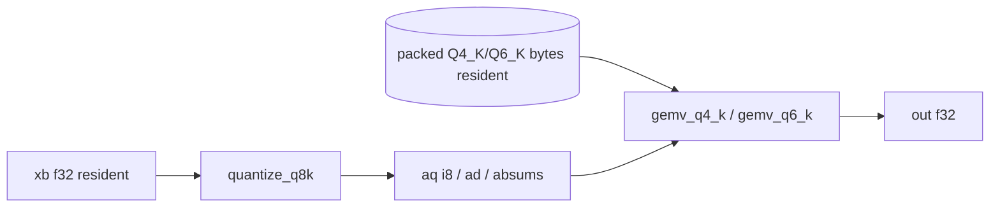

# Phase 2 — Decode speed lever: MMVQ-style packed-weight DP4A GEMV (detailed plan)

> Detailed, PR-sequenced plan for **Phase 2** of the master plan
> [`../10-evolution-plan.md`](../10-evolution-plan.md) (lines 89–116). Sibling
> phase docs: Phase 0 ([`phase-0-foundations.md`](phase-0-foundations.md), §0.4
> KV/attention seam — `pub(crate) KvCache` in `RunState`), Phase 1
> ([`phase-1-breadth.md`](phase-1-breadth.md)). Capture references: our CUDA backend
> [`../04-cuda-backend.md`](../04-cuda-backend.md), our quantization
> [`../05-quantization.md`](../05-quantization.md), the status doc
> [`../09-status-and-roadmap.md`](../09-status-and-roadmap.md), and llama.cpp's
> kernels [`../../Research/03-cuda-kernels.md`](../../Research/03-cuda-kernels.md).

## Summary

Decode on the CUDA backend is **batch-1 GEMV, bandwidth-bound**: every weight is
read once with no reuse, so *bytes streamed ≈ time*. We currently stream **f16**
weights (~2 B/weight) where llama.cpp streams **packed Q4_K** (~0.56 B/weight) —
the ~3.5× ratio that *is* the measured ~3.4× decode gap (`HANDOFF.md:88-90`,
`../04-cuda-backend.md:297-301`). This phase ports llama.cpp's `mmvq` design
(`../../Research/03-cuda-kernels.md` §3): a device activation-quant kernel plus a
warp-cooperative, **coalesced** GEMV that reads weights **packed** and dot-products
them with `__dp4a`, specialized tightly for **Blackwell sm_120, batch-1, Q4_K +
Q6_K only**. **Dependencies:** none hard — it slots into the existing resident
`forward_step` (`src/backend/cuda.rs:718-805`) and reuses the CPU integer-dot
oracles (`src/quant.rs`). **Definition of done:** the new GEMV is bit-exact (at the
integer-dot level) vs `vec_dot_q4_k`/`vec_dot_q6_k`, a microbench on the real
TinyLlama Q4_K_M decides adopt-or-park against the f16 path, and `2.2` removes the
prefill→decode host KV round-trip. **Effort: L** — real kernel craft; the payoff
ceiling is proven (llama.cpp 419 tok/s) but our kernel's bandwidth efficiency vs
cuBLASLt's tuned f16 GEMV is the live uncertainty (the closed PR #23 lost 1.6×).

─────────────────────────────────────────────────────────────────────────────

## 2.1 — MMVQ-style packed-weight DP4A decode GEMV (CUDA)

### Design

Three new nvrtc kernels added to `KERNEL_SRC` (`src/backend/cuda.rs:62-205`) and
compiled once by `Kernels::compile` (`:219`), with handles appended to the
`Kernels` struct (`:208-216`):

| Kernel | Role | Reads | Writes |
|---|---|---|---|
| `quantize_q8k` | activation → block-256 int8 (once per distinct activation/step) | `xb` f32 (`dim`) | `aq` i8, `ad` f32 (`dim/256`), `absums` i32 (`dim/16`) |
| `gemv_q4_k` | warp-cooperative packed Q4_K GEMV | packed Q4_K bytes + `aq/ad/absums` | `out` f32 (`oc`) |
| `gemv_q6_k` | warp-cooperative packed Q6_K GEMV | packed Q6_K bytes + `aq/ad` | `out` f32 (`oc`) |

Two new caches/buffers back them:
- **`weight_packed(&QMatrix) -> Arc<CudaSlice<u8>>`** — uploads the raw quant
  bytes once, keyed by source data pointer, mirroring `weight_f16`
  (`src/backend/cuda.rs:358-383`). This is the bandwidth win: ~0.62 GB resident
  for TinyLlama vs the f16 cache's ~2.2 GB (`:1318`). The f16 cache stays for
  prefill (compute-bound; MMQ deferred per master plan §Phase 5).
- **Resident q8k scratch in `DecodeCuda`** (`:248-283`): `aq: CudaSlice<i8>`
  (`dim`), `ad: CudaSlice<f32>` (`dim/256`), `absums: CudaSlice<i32>` (`dim/16`),
  allocated in `build_decode` (`:610-650`).



#### (a) The activation-quant kernel — must match the oracle, not literal q8_1

llama.cpp's MMVQ quantizes activations to **`q8_1`** — block-32, `d = amax/127`,
store `half2(d, sum)` (`../../Research/03-cuda-kernels.md` §6, lines 311–328). Our
CPU oracle does **not** consume q8_1: `vec_dot_q4_k`/`vec_dot_q6_k`
(`src/quant.rs:476`, `:528`) consume **`Q8KActivation`** — block-**256**, signed-max
`iscale = -128/max`, `d = 1/iscale`, `q = round(iscale·v).clamp(-128,127)`, with
`bsums` summed per group of **16** (`quantize_activation_q8k`, `src/quant.rs:436-467`;
`Q8KActivation`, `:415-422`; capture `../05-quantization.md:169-188`).

> **Critical parity invariant.** For a bit-exact test against the oracle the device
> kernel must reproduce **`quantize_activation_q8k` exactly**, *not* llama.cpp's
> block-32 q8_1. So our "q8_1" kernel is really **`quantize_q8k`**: block-256,
> signed-max `iscale`, the same `round`+`clamp`, the same per-16 `bsums`. The
> packed-weight bandwidth win is identical — only the activation block size differs
> (256 vs 32), and the activation is a single tiny vector read many times, so its
> block size is bandwidth-irrelevant. This is the one place we deliberately diverge
> from `Research/03` to keep the CPU oracle authoritative.

Concrete signature (device):
```cuda
// One block per 256-elem super-block; warp reduces amax/sum. Mirrors
// quantize_activation_q8k (src/quant.rs:436): signed max, iscale=-128/max,
// q=round(iscale*v) clamped, bsums per 16. All-zero block -> zeros.
extern "C" __global__ void quantize_q8k(signed char* aq, float* ad, int* absums,
                                        const float* x, int n /* multiple of 256 */);
```
Tie-break note: the oracle picks `max` as the **first** element of maximal `|v|`
(strict `>` in `src/quant.rs:444`). The device reduction must reproduce
first-wins (carry the index in the warp max-reduce) — otherwise an exact `|v|`
tie flips `iscale`'s sign. Ties are measure-zero on real activations; see Open
questions for whether we enforce first-wins or accept a documented near-exact
activation.

#### (b) The packed Q4_K GEMV

Q4_K block = 144 B: `d`(f16) · `dmin`(f16) · `scales`(12 B: eight 6-bit `sc` +
eight 6-bit `m`) · `qs`(128 B: 256 nibbles), 8 sub-blocks of 32
(`../05-quantization.md:93-108`; `src/quant.rs:233`). The kernel mirrors the
oracle's arithmetic (`vec_dot_q4_k_scalar`, `src/quant.rs:490-522`) bit-for-bit at
the integer level, using llama.cpp's in-register idioms
(`../../Research/03-cuda-kernels.md` §4, lines 225–251):

- **Warp per row** (`rows_per_block` rows per block — start at 1 row/warp,
  2 warps/block; a single tunable, *not* llama.cpp's `calc_nwarps` arch tables,
  Research/03 §3.2 lines 206–221). Lane `l` of 32 strides the row's `qs` in 4-byte
  words so consecutive lanes touch consecutive words → one **coalesced** 128-byte
  transaction per warp step (the decisive difference from PR #23, below).
- **Nibble unpack in-register**: `(v>>0)&0x0F0F0F0F` / `(v>>4)&0x0F0F0F0F` split a
  32-bit `qs` word into eight byte-packed 4-bit weights for `dp4a`.
- **6-bit sub-block scales** unpacked from `scales` with the same masking as
  `get_scale_min_k4` (`src/quant.rs:223`): low four `(q&63)`, upper four steal high
  bits — identical to the oracle so `sc`/`m` are equal integers.
- **Dot**: per sub-block `sub = Σ dp4a(nibble_word, aq_word)` in i32; `acc += sc·sub`.
  Min term folded via the activation `bsums`: `min_acc = Σ absums[g]·m[g/2]` —
  exactly the oracle's two accumulators (`src/quant.rs:512-518`).
- **Fold**: per super-block `d·bigd·acc − dmin·bigd·min_acc`, then warp-reduce
  across lanes; lane 0 writes `out[row]`. Note `bigd = ad[sb]` is a **single**
  per-256 scale (our scheme), simpler than llama.cpp's per-32 `d8` sum — again,
  match the oracle, not upstream.
- **`__dp4a` via inline PTX** (`dp4a.s32.s32`), mirroring the file's existing
  header-free inline-PTX convention for `cvt` (`src/backend/cuda.rs:64-79`) so
  nvrtc needs no `sm_61_intrinsics.h`. Requires raising the nvrtc target to
  `--gpu-architecture=compute_61`+ (sm_120 device → `compute_120`); use
  `compile_ptx_with_opts` instead of the bare `compile_ptx` at `:220`.

#### (c) The packed Q6_K GEMV

Q6_K block = 210 B: `ql`(128 B low-4) · `qh`(64 B high-2) · `scales`(16 B **signed
i8**) · `d`(f16), 16 sub-blocks of 16 (`../05-quantization.md:110-122`;
`src/quant.rs:260`). Mirrors `vec_dot_q6_k_scalar` (`src/quant.rs:544-576`):

- Lanes read `ql`/`qh` words coalesced; combine `(low4 | (hi2<<4))` and subtract 32
  with `__vsubss4(x, 0x20202020)` (Research/03 §4 line 246, `vec_dot_q6_K_q8_1`),
  reproducing the oracle's `a[i] = (q − 32)` reconstruction (`src/quant.rs:561-564`).
- `dp4a(weight_word, aq_word)` per sub-block; `acc += (signed sc)·s`; fold
  `d·bigd·acc`. **No min term, no `bsums`** — Q6_K is symmetric (the −32 is folded
  into the weight), matching the oracle which ignores `bsums` here (and the wgpu
  bench's "Q6_K is symmetric, no bsums", `src/backend/gpu.rs:3104`).

#### Slotting into `forward_step` + nvrtc

Add `gemv_quant_dev(out, xb_q8k, w)` and route the per-step GEMVs. In
`forward_step` (`src/backend/cuda.rs:766-796`) the q/k/v GEMVs share one
activation `xb` (`:769-771`), and w1/w3 share `xb` after the FFN rmsnorm
(`:791-792`) — so **quantize once per shared activation, reuse across GEMVs**
(≤ 4 `quantize_q8k` launches/layer: xb→qkv, attn-out→wo, xb→w1w3, hb→w2). Dispatch:

```text
if qgemv_enabled && matches!(w, QMatrix::Quant{ty: Q4_K|Q6_K, ..}):
    quantize_q8k(xb) once -> aq/ad/absums   (reused for sibling GEMVs)
    gemv_q4_k / gemv_q6_k (weight_packed(w), aq, ad, absums) -> out
else:
    gemm_dev(out, xb, w, 1)                  // existing cuBLASLt f16 path (:411)
```

`wq/wk/wv/wo/w1/w2/w3` are Q4_K in TinyLlama Q4_K_M; some `wcls`/embeddings may be
Q6_K — both hit a packed kernel, anything else falls through to f16 unchanged. The
toggle `qgemv_enabled` is a process-once env read (a `OnceLock<bool>`, mirroring
`RUSTY_LLAMA_NO_INT8` / `RUSTY_LLAMA_NO_AVX2` in `src/quant.rs`): **pre-adoption
opt-in** `RUSTY_LLAMA_CUDA_QGEMV=1`; **post-adoption** (on a measured win) it flips
to default-on for Q4_K/Q6_K with opt-out `RUSTY_LLAMA_CUDA_NO_QGEMV` — a clean
cutover, no second permanent code path (master plan §"clean cutovers", lines 18–19).

### Adoption gate — microbench + the PR #23 differentiation (critical)

**The gate.** Add `bench_decode_gemv_quant_vs_f16` modeled on the wgpu
`bench_kquant_int8_vs_dequant_gemv` (`src/backend/gpu.rs:3053-3113`): at real
decode shapes (e.g. `2048×2048` attn, `5632×2048` FFN) time the new packed GEMV
vs `gemm_dev` f16 at `rows=1`, ×50, report the ratio. Then the **decisive**
end-to-end gate: run `bench_decode_real_tinyllama` (`src/backend/cuda.rs:1203-1252`)
with the toggle **on vs off** — the real tg128 number. **Adopt only if tg128 with
the packed GEMV beats the f16 path's ~123 tok/s on the real model** (target toward
llama.cpp's 419). Else keep the kernels behind their parity tests + the opt-in flag
— the kill-criterion precedent of the Stage-2 int8 kernels (`HANDOFF.md:12-16`,
`PERFORMANCE.md:79-87`).

**Why this is not PR #23.** The closed PR #23 (`feat/cuda-decode-quant`,
`HANDOFF.md:92-100`) shipped a **naive one-block-per-row** dequant GEMV that was
bit-exact but **~1.6× slower than f16** (~78 vs ~121 tok/s): its poorly-coalesced
byte loads and per-element dequant could not beat cuBLASLt's tuned f16 GEMV. This
plan differs on exactly the four axes that made it slow:

| PR #23 (lost 1.6×) | This plan |
|---|---|
| one thread/block per row | **warp-cooperative** — 32 lanes per row, latency hidden, shared reduction |
| strided/scalar byte loads | **coalesced** — consecutive lanes read consecutive 4-byte words → one 128-B transaction/warp-step (so *bytes-streamed = time* actually holds at the packed bit-rate) |
| per-element f32 dequant then multiply | **in-register unpack + `__dp4a`** — weight never expands to f32; consumed in packed byte form, int-register only |
| (compared packed-vs-packed) | baseline is the **f16-weight** GEMM (2 B/wt); packed streams ~0.56 B/wt → a *real* 3.5× bandwidth saving |

That last row is the crux the captures stress: the wgpu Stage-2 dead-end compared
int8 against an *already-packed* dequant GEMV (same bytes → no bandwidth delta, so
int8 was pure added compute, `../../Research/03-cuda-kernels.md:347-352`,
`../03-gpu-backend-wgpu.md:115`). Here the saving is real **only because today's
shipped decode is f16, not packed** (`../04-cuda-backend.md:297-301`). The residual
risk is bandwidth *efficiency*: our kernel must clear cuBLASLt's f16 GEMV
efficiency × ~0.28 (the byte ratio) to win — plausible but unproven, hence the gate.

### Milestones (PR-sized, each independently testable/mergeable)

1. **`quantize_q8k` kernel + parity.** Add the kernel + a `dev_quantize_q8k`
   launcher + resident `aq/ad/absums` scratch. Test: device `aq`/`ad`/`absums`
   match `quantize_activation_q8k` (i8 + `bsums` exact; `d` within 1 ULP).
2. **`gemv_q4_k` + bit-exact parity.** Warp-cooperative kernel + `weight_packed`
   cache. Test: per-super-block i32 `acc`/`min_acc` equal the oracle exactly; row
   output matches `vec_dot_q4_k` within the f32-fold tolerance (below).
3. **`gemv_q6_k` + bit-exact parity.** Same, against `vec_dot_q6_k` (no min term).
4. **Microbench** `bench_decode_gemv_quant_vs_f16` (per-shape) — the per-GEMV ratio.
5. **Adopt-or-park decision** via `bench_decode_real_tinyllama` toggled on/off:
   record the real tg128 numbers honestly in `PERFORMANCE.md` / `09`; flip the
   default only on a win.
6. **Wire into `forward_step` behind the toggle** (`src/backend/cuda.rs:766-796`),
   with the quant-once-reuse optimization; coherence test `decode_multistep_coherent`
   (`:1148`) must pass with the toggle on.

### Behavior preservation / migration

- The f16 `gemm_dev` path (`:411`) and `weight_f16` cache (`:358`) are untouched;
  prefill is unchanged (compute-bound, MMQ deferred). The packed path is additive
  and gated, so default builds behave identically until the adopt-on-win flip.
- The CPU oracle stays authoritative; the kernels mirror its arithmetic, never the
  reverse (master plan §"Parity oracle stays sacred", lines 170–171).
- Post-adoption cutover is clean: Q4_K/Q6_K decode GEMVs go packed by default with
  one opt-out env var; no permanent dual path, no shim.

### Test plan

- **Quant-kernel parity** (vs `quantize_activation_q8k`): `aq` and `absums`
  byte/integer-exact; `ad` ≤ 1 ULP. Edge cases: all-zero super-block → zeros
  (`src/quant.rs:449`); a `|v|` tie to probe the first-wins tie-break.
- **Bit-exact integer core**: a test hook emits per-super-block `acc`/`min_acc`
  and asserts integer equality with the oracle — the meaningful bit-exact claim
  (unpack + `dp4a` logic correct to the bit). Honest scope: the **row output** is
  bit-exact only if one lane folds all super-blocks in order with FMA disabled;
  the warp's cross-lane f32 reduction reorders the per-super-block sums, so the
  warp kernel matches the oracle within ≤ few-ULP × `n_superblocks` — assert via a
  `close_approx`-style atol/rtol (cf. `:1372`), and additionally compare against a
  **single-thread reference GEMV** (FMA off, oracle order) that *is* bit-exact, to
  separate math bugs from reduction reorder.
- **Reuse the harness**: `cuda()` skip-guard (`:920`), `noise` (`:931`),
  `quantize_q8_0`/`GgmlType` imports (`:916`); shapes non-square and multi-row like
  `matmul_batch_q8_0_parity` (`:1015-1026`) to catch indexing bugs.
- **Behavior, not defaults**: assert the dot equals the oracle on adversarial
  weights (all-min nibbles, signed Q6_K scales spanning ±, a single nonzero
  activation lane) — not that a particular logit string is produced.
- **End-to-end coherence** with the toggle on: `decode_multistep_coherent`
  (`:1148`) and `prefill_then_decode_coherent` (`:1089`) within existing rel-L2.
- **Feature matrix**: `cargo test` + `cargo clippy --all-targets` clean **with and
  without** `--features cuda` (the kernels are `#[cfg(test)]`-skipped on CUDA-less
  hosts via `cuda()`); all `#[ignore]`d (need a device).

### Effort + risks

**Effort: L.** Real kernel craft (coalesced packed loads, warp reduction, in-register
unpack, inline-PTX `dp4a`, nvrtc arch flag).

| Risk | Mitigation |
|---|---|
| Kernel underperforms f16 like PR #23 | The four differentiators above + the microbench gate + kill-criterion (park behind tests on a loss) |
| `__dp4a` PTX won't assemble (nvrtc default arch too low) | `compile_ptx_with_opts(--gpu-architecture=compute_61+)`; the device is sm_120 |
| Float fold not bit-exact (FMA contraction, reduction order) | FMA-off intrinsics in the fold; single-thread reference kernel; integer-core test is the true bit-exact claim |
| Activation tie-break diverges (sign flip) | First-wins index in the warp max-reduce, or documented near-exact activation tolerance (Open questions) |
| Double VRAM (f16 + packed caches coexist) | ~2.2 + 0.62 GB < 12 GB on the target; acceptable; prefill-packed (MMQ) deferred |
| Warp tile config under-tuned (no arch tables) | One sensible `rows_per_block`/`nwarps` captures most of the win (Research/03 lines 375–379); tuning tables are the long tail, not the entry fee |

─────────────────────────────────────────────────────────────────────────────

## 2.2 — KV resident across prefill→decode (minor)

### Design

Today the from-scratch CUDA prefill keeps each layer's K/V in **local** device
buffers `key_dev`/`value_dev` (`src/backend/cuda.rs:852-857`), then **downloads
them to the host** cache after the loop via `store_prefill_kv`
(`:897-901`, `src/model.rs:382`). Decode's `DecodeCuda` is a *separate* lazily-built
resident state that **re-uploads** those rows from host on the first step
(`kv_filled` logic, `:742-760`). That is a full device→host→device round-trip of
the whole prompt KV for no reason when the same backend does both
(`HANDOFF.md:116-118`, master plan lines 110–112).

**Plan:** have prefill write K/V **directly into the resident `DecodeCuda` KV
buffers** and mark them filled, so decode reads them with no upload:

- Build (or reset) `DecodeCuda` at the start of the from-scratch `forward_prefill`
  (it already locks `self.decode` in `forward_step`; lift that into a shared
  `with_decode(model)` helper). The decode KV buffers are `seq_len*kv_dim`
  (`:645-646`); prefill writes the first `n` rows contiguously — compatible with the
  prefill attention kernel (stride `kv_dim`, row count `n`, `:875-878`).
- Point prefill's per-layer `gemm_dev` K/V targets at `d.key[layer]`/`d.value[layer]`
  instead of fresh `key_dev`/`value_dev`. After the loop set `d.kv_filled = n`.
- **Drop** the host KV download + `store_prefill_kv` and decode's one-time upload
  (`:742-760`, `:897-901`) for the from-scratch CUDA path — a clean cutover, no
  host round-trip. (`store_prefill_kv` only existed for this handoff; the
  `pos_base != 0` branch already delegates to the host path and is unaffected,
  `:823-826`.) `generate` drives one backend throughout (`src/model.rs:631`,`:704`),
  so no mixed CPU/CUDA decode reads the host KV after a CUDA prefill.

This aligns with the Phase 0.4 KV/attention seam
([`phase-0-foundations.md`](phase-0-foundations.md), §0.4 — the `pub(crate)
KvCache` that isolates the flat `(n_layers,seq_len,kv_dim)` layout): the resident
KV the decode GEMV writes into stays single-sequence and flat — no trait change.

### Milestones

1. Extract the `self.decode` build/lock into a shared helper used by both
   `forward_prefill` and `forward_step`.
2. Prefill writes K/V into the resident decode KV; set `kv_filled = n`; remove the
   host download + the decode-side upload.

### Behavior preservation / migration

Logits are unchanged (same math, fewer copies). The `pos_base != 0` delegation
path is untouched. Pure latency win + less host traffic.

### Test plan

- `prefill_then_decode_coherent` (`src/backend/cuda.rs:1089`) must still pass —
  now exercising the **device** KV handoff rather than the host round-trip (this is
  the exact regression guard for the cutover).
- `decode_multistep_coherent` (`:1148`) unchanged.
- A focused micro-timing in `bench_decode_real_tinyllama` (warm vs the first
  post-prefill step) to confirm the upload is gone (no assert; observational).

### Effort + risks

**Effort: S.** Risks: the decode-state lock/lifetime across both entry points, and
keeping the shape-staleness check consistent (`:723-731`); both contained to
`cuda.rs`. Low risk — "small, safe" per the master plan (line 112).

─────────────────────────────────────────────────────────────────────────────

## Open questions / decisions

- **D1 — Activation tie-break.** Enforce the oracle's *first-max-abs-wins*
  (`src/quant.rs:444`) in the device warp reduction (carry the index), or accept a
  documented near-exact activation (ties are measure-zero on real data)? Affects
  whether the quant-kernel test can claim i8-identical unconditionally.
- **D2 — Meaning of "bit-exact".** Confirm the layered claim is acceptable:
  **integer core bit-exact** (per-super-block `acc`/`min_acc` equal the oracle) +
  **row output ≤ few-ULP** (warp f32 reduction reorders the fold). Bit-exact at the
  row level would force a single-lane in-order FMA-off fold and forfeit warp
  cooperation — not worth it.
- **D3 — Pre-adoption flag default.** Opt-in `RUSTY_LLAMA_CUDA_QGEMV=1` until the
  microbench decides, then flip to default-on with opt-out — confirm the env-var
  name and that a runtime flag (not a new cargo feature) satisfies the invariant.
- **D4 — VRAM coexistence.** Accept f16 + packed caches resident together
  (~2.8 GB on TinyLlama), or free the f16 cache once decode starts (prefill is
  done by then)? Freeing complicates the pointer-keyed cache; default: accept.
- **D5 — Prefill-packed (MMQ) follow-on.** Out of scope here (master plan §Phase 5);
  noted so the `weight_packed` cache is designed reusable for it.

## Definition of done

- `quantize_q8k`, `gemv_q4_k`, `gemv_q6_k` land in `KERNEL_SRC`, compiled via
  `compile_ptx_with_opts` at the right arch; `weight_packed` cache + resident q8k
  scratch in `DecodeCuda`.
- Parity: quant kernel vs `quantize_activation_q8k`; integer-core bit-exact vs
  `vec_dot_q4_k`/`vec_dot_q6_k`; row output within ULP-scale tolerance + a
  single-thread reference; coherence tests green with the toggle on.
- `bench_decode_gemv_quant_vs_f16` + toggled `bench_decode_real_tinyllama` run on
  the real TinyLlama Q4_K_M; the tg128 numbers recorded honestly; the default
  flipped **only on a measured win**, else parked behind the flag + tests.
- `2.2`: prefill→decode KV handoff is device-resident; host round-trip removed;
  `prefill_then_decode_coherent` passes.
- `cargo test` + `cargo clippy --all-targets` clean **with and without**
  `--features cuda`; base build stays dependency-light.
