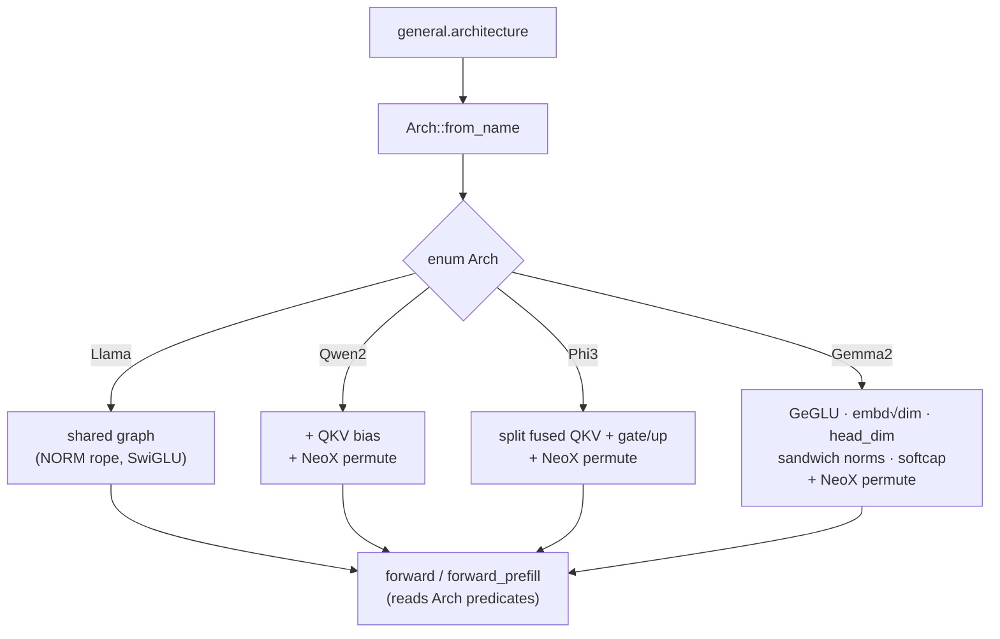

# Phase 3 — Architecture breadth: Qwen2 / Phi-3 / Gemma 2 (detailed plan)

> Detailed plan for **Phase 3** of the master plan
> [`../10-evolution-plan.md`](../10-evolution-plan.md) (§Phase 3, lines 126–139).
> **Phase 3.1 and 3.2 are SHIPPED** and documented below as built; **3.3
> (recurrent)** remains a master-plan sketch, kept here only as remaining work.
> Sibling phase docs: Phase 0
> ([`phase-0-foundations.md`](phase-0-foundations.md), §0.2 — the `Arch` enum +
> `TensorNames` seam this extends), Phase 1
> ([`phase-1-breadth.md`](phase-1-breadth.md), §1.1 sampler chain / §1.4 chat
> templates). Capture references: our model/forward
> [`../01-model-and-forward-pass.md`](../01-model-and-forward-pass.md), GGUF +
> loading [`../06-gguf-and-loading.md`](../06-gguf-and-loading.md), tokenizer +
> sampler [`../07-tokenizer-and-sampler.md`](../07-tokenizer-and-sampler.md),
> quantization [`../05-quantization.md`](../05-quantization.md), and the status doc
> [`../09-status-and-roadmap.md`](../09-status-and-roadmap.md). llama.cpp side:
> [`../../Research/05-gguf-and-model-loading.md`](../../Research/05-gguf-and-model-loading.md).

## Summary

Phase 3.1 widens the engine from "Llama family only" to **four validated
architectures — Llama, Qwen2, Phi-3, Gemma 2** — by growing the Phase-0.2
registry seam (`src/arch.rs`) rather than branching the forward loop. Each new
arch is a small, declarative **delta** off the shared Llama graph, gated by a
predicate method on `enum Arch` and a flat `TENSOR_NAMES` table; the loader
(`Model::from_gguf`, `src/model.rs`) and the forward pass (`forward` /
`forward_prefill`, `src/model.rs`) read behaviour through those predicates, never
through inline arch strings. The deltas: **Qwen2** = Llama + an additive Q/K/V
projection bias; **Phi-3** = Llama with a fused `attn_qkv` tensor and a fused
gate+up `ffn_up`, both split at load; **Gemma 2** = GeGLU FFN, `sqrt(dim)`
embedding scale, an explicit `head_dim` (so `n_heads·head_dim ≠ dim`), "sandwich"
post-attention / post-FFN RMSNorms, and tanh logit-softcapping on attention scores
(50) and final logits (30). The **one cross-cutting fix** is RoPE style: the three
new archs use **NeoX (half-split)** rotary while Llama uses **NORM (interleaved-
pair)**; rather than add a second rope kernel we keep the single NORM kernel and
**permute the NeoX archs' Q/K weights (and biases) at load** — the inverse of what
the Llama converter bakes in. **Dependencies:** Phase 0.2 (the `Arch`/`TensorNames`
seam) — hard; nothing else. **Definition of done (met):** each arch loads a real
GGUF and its greedy output matches `llama-cli` (Qwen2-0.5B / Phi-3-mini top-k
exact; Gemma2-2b top-k set match — see Validation); the CPU path stays the oracle;
`cargo test` + `clippy` clean with and without `gpu`/`cuda`. **Effort: M each**
(shipped). 3.2/3.3 stay deferred.

─────────────────────────────────────────────────────────────────────────────

## 3.1 — Near-Llama archs: Qwen2, Phi-3, Gemma 2 (SHIPPED)

### The registry seam (extends Phase 0.2)

`src/arch.rs` is the single place a `general.architecture` string becomes
behaviour. `Arch::from_name` (`src/arch.rs:106-113`) maps `"qwen2"`/`"phi3"`/
`"gemma2"` to their variants and **falls back to `Arch::Llama` for anything else**
(the permissive policy from Phase 0.2: any GGUF with Llama-named tensors still
loads). A single flat `TENSOR_NAMES` table (`src/arch.rs:79-98`, mirroring modern
`LLM_TENSOR_NAMES`) carries every name any supported arch references — including
the bias / fused / sandwich-norm extras — and *which* of those an arch actually
has is encoded in predicates, not in per-arch name tables:

| Predicate (`src/arch.rs`) | True for | Reads in the graph |
|---|---|---|
| `has_qkv_bias()` (`:121`) | Qwen2 | add `bq/bk/bv` after the Q/K/V matmuls |
| `fused_qkv()` (`:126`) | Phi-3 | split `attn_qkv` → Q/K/V at load |
| `fused_gate_up()` (`:131`) | Phi-3 | split fused `ffn_up` → gate/up at load |
| `ffn_activation()` (`:136`) | Gemma2 ⇒ `GeGlu`, else `SwiGlu` | FFN gate non-linearity |
| `sandwich_norm()` (`:144`) | Gemma2 | post-attn / post-FFN RMSNorms |
| `rope_neox()` (`:154`) | Qwen2, Phi-3, Gemma2 | permute Q/K (+bias) at load |
| `uses_resident_decode()` (`:161`) | Llama only | fused on-device decode vs per-op |



### Per-arch deltas

#### Qwen2 — additive Q/K/V projection bias

Qwen2 *is* the Llama graph plus a bias vector added to each of the Q/K/V
projection outputs. The biases load into new `Weights` fields `bq/bk/bv`
(per-layer, flattened, empty unless `has_qkv_bias()`; `src/model.rs:50-52`) from
the `attn_q.bias`/`attn_k.bias`/`attn_v.bias` tensors. In the forward pass they
are applied by `add_bias` **immediately after the Q/K/V matmuls and before RoPE**
(`src/model.rs:655-659`, the batch path mirrors it):

```text
matmul q,k,v <- xb
if has_qkv_bias: q += bq; k += bk; v += bv     // before rope
rope(q, k); attention(...)
```

Because Qwen2 is also a NeoX-rope arch, its Q/K **biases** are permuted at load
the same way as the weights (`permute_neox_bias`, see the rope section). Qwen2
tokenizers set `add_bos_token = false` (see Tokenizer fixes).

#### Phi-3 — fused `attn_qkv` + fused gate/up, split at load

Phi-3 ships a **single fused `attn_qkv` projection** and a **single fused
gate+up `ffn_up` tensor** instead of separate matrices. We keep the standard Llama
graph and split both at load with `split_rows` (`src/model.rs:1136`), so the
forward loop never sees a fused tensor:

- `attn_qkv` → `split_rows(qkv, &[q_dim, kv_dim, kv_dim])` → `wq/wk/wv`
  (`src/model.rs:269-273`).
- fused `ffn_up` → `split_rows(gate_up, &[hidden_dim, hidden_dim])` → gate (`w1`) /
  up (`w3`) (`src/model.rs:285-288`).

`split_rows` slices a `QMatrix` along its row dimension, borrowing from the mmap
for `F32`/`F16` and owning only when it must — so the split is near-zero-cost. The
resulting projections are then NeoX-permuted (Q/K) exactly like Qwen2/Gemma. Phi-3
tokenizers also set `add_bos_token = false`.

#### Gemma 2 — GeGLU, embedding scale, explicit head_dim, sandwich norms, softcap

Gemma 2 is the largest delta, but still declarative:

- **GeGLU FFN.** `ffn_activation()` returns `GeGlu`, so the gate non-linearity is
  GELU (the ggml f16-table GELU) rather than SiLU: `gelu(gate)·up`.
- **`sqrt(dim)` embedding scale.** `Config.embd_scale` is set to `(dim as
  f32).sqrt()` for Gemma2 (`src/config.rs:97-98`, set in `from_gguf`
  `src/model.rs:195-199`) and applied to the seed embedding in both the decode and
  batch paths (`src/model.rs:637-641`, `:827-831`); it is `1.0` (a no-op) for every
  other arch.
- **Explicit `head_dim`.** Gemma sets the attention head dimension independently of
  `dim`, so `n_heads·head_dim ≠ dim`. `from_gguf` reads `{arch}.attention.key_length`
  into `Config.head_dim` (`src/model.rs:172`); `head_size()` returns it when nonzero
  and derives `dim/n_heads` otherwise (`src/config.rs:135`). The forward pass and
  `RunState` are generalized to **`q_dim = n_heads·head_size`** (`src/config.rs:152`)
  and **`kv_dim = n_kv_heads·head_size`** (`:145`) rather than assuming the
  query stream is `dim` wide — the `wo` projection maps `q_dim → dim`.
- **"Sandwich" norms.** Gemma2 applies an extra RMSNorm on the *output* of the
  attention block and of the FFN block, before each residual add. They load into
  `Weights.rms_attn_post`/`rms_ffn_post` (per-layer, empty unless `sandwich_norm()`;
  `src/model.rs:53-56`, loaded `:326-328`) and are applied at `src/model.rs:687-696`
  (post-attention) and `:715-722` (post-FFN), with the batch path mirroring it.
- **Logit softcapping.** Two tanh softcaps, read from `{arch}.attn_logit_softcapping`
  / `{arch}.final_logit_softcapping` (`src/model.rs:200-201`; `0.0` ⇒ disabled for
  every other arch): the **attention** softcap (Gemma2 = 50) is threaded into
  `Backend::attention` and applied to the scores before softmax
  (`src/model.rs:683`); the **final** softcap (Gemma2 = 30) is applied to the output
  logits by `softcap()` after the classifier matmul (`src/model.rs:734`, `:785`).
- **Norm weights are used as-is.** Gemma's RMSNorm gain is *not* offset by `(1+w)`
  at runtime: modern GGUF converters bake the `+1` into the stored weights, matching
  current llama.cpp, so the shared `rmsnorm` kernel is used unchanged. (There is no
  runtime fold to maintain — one less arch-specific code path.)
- Gemma BOS id is **2**, now read from the GGUF rather than hardcoded (see below).

### Cross-cutting: NeoX vs NORM RoPE (the load-time Q/K permute)

This is the subtle one and the reason the three archs needed no backend/kernel
change. RoPE rotates dimension pairs of each head; **how the pairs are formed
differs**:

- **NORM (Llama):** interleaved pairs `(2j, 2j+1)`.
- **NeoX (Qwen2 / Phi-3 / Gemma2):** half-split pairs `(j, j + rot/2)`.

Llama GGUFs are shipped with Q/K **already permuted by the converter** so that a
single interleaved-pair ("NORM") kernel produces the correct rotation; the other
three archs ship their Q/K in natural order. Rather than carry two rope kernels in
every backend, we **keep the one NORM kernel and permute the NeoX archs' Q/K rows
at load** — the exact inverse of the converter's permutation — gated by
`rope_neox()`:

- `neox_src(i, head_size, rot)` (`src/model.rs:1195`) computes, for output row `i`,
  the source row in the natural-order tensor; `permute_neox` (`:1211`) reorders a
  `QMatrix`'s rows accordingly (borrowing where possible, owning the reordered copy
  only for Q/K — a fraction of the weights), and `permute_neox_bias` (`:1237`)
  applies the identical reorder to the Q/K **bias** vectors (so Qwen2's biases stay
  aligned). All three are wired in `from_gguf` behind `if arch.rope_neox()`
  (`src/model.rs:311-321`).

The win: **zero backend or rope-kernel changes**, one rope path everywhere, and the
only cost is an owned copy of the Q/K weights (and biases) for the NeoX archs at
load time. The alternative — a runtime rope-type flag that picks pair-formation per
arch — is noted under Open questions for large models where the owned Q/K copy
matters.

### Tokenizer fixes

The new archs exposed two latent SPM assumptions (`src/tokenizer.rs`):

- **Honor `tokenizer.ggml.add_bos_token`.** Previously a BOS was always prepended;
  now the GGUF flag (default `true`) is stored and surfaced via `Tokenizer::add_bos()`
  (`src/tokenizer.rs:78-83`), and `generate` consults it (`src/model.rs:985`).
  **Qwen2 and Phi-3 set it `false`** — forcing a BOS for them corrupts the prompt.
- **Real `bos`/`eos` ids.** SPM previously hardcoded BOS=1 / EOS=2 (the llama2.c
  `tokenizer.bin` convention). It now stores the real ids from the GGUF
  (`bos`/`eos` fields, `src/tokenizer.rs:227-228`) and exposes the EOS via
  `Tokenizer::eos()` (`:87-92`) for stop detection. **Gemma's BOS is 2**, so the old
  hardcode would have been wrong for it.

### GPU / CUDA: per-op path for the new archs

The CUDA backend's **fused resident decode loop** (the single on-device
`forward_step`) is Llama-specific — it bakes in the Llama graph shape. The new
archs run the **generic per-op path** instead, gated by
`arch.uses_resident_decode()` (`src/arch.rs:161`, Llama-only). That path still
dispatches GPU/CUDA kernels per primitive (matmul, rmsnorm, rope, attention); it is
simply not the single fused on-device loop. So Qwen2/Phi-3/Gemma2 are GPU-accelerated
per-op, while Llama keeps its resident-decode fast path — no kernel was rewritten to
add an arch.

### Config / Weights deltas (at a glance)

| Field | Type | Default (non-arch) | Set for | Where |
|---|---|---|---|---|
| `Config.arch` | `Arch` | `Llama` | all | `src/config.rs:92` |
| `Config.head_dim` | `usize` | `0` (derive) | Gemma2 (`key_length`) | `src/config.rs:96`, `model.rs:172` |
| `Config.embd_scale` | `f32` | `1.0` | Gemma2 = `√dim` | `src/config.rs:98`, `model.rs:195` |
| `Config.attn_logit_softcap` | `f32` | `0.0` (off) | Gemma2 = 50 | `src/config.rs:100`, `model.rs:200` |
| `Config.final_logit_softcap` | `f32` | `0.0` (off) | Gemma2 = 30 | `src/config.rs:102`, `model.rs:201` |
| `Weights.bq/bk/bv` | `Vec<f32>` | empty | Qwen2 | `src/model.rs:50-52` |
| `Weights.rms_attn_post/rms_ffn_post` | `Vec<f32>` | empty | Gemma2 | `src/model.rs:53-56` |

`head_size()`/`q_dim()`/`kv_dim()` (`src/config.rs:135`,`:152`,`:145`) are the
helpers the forward pass uses so the explicit-`head_dim` case is transparent to
every callsite.

### Validation

All three were validated **greedy vs `llama-cli`** on real GGUFs (real model files
are gitignored; this is the manual end-to-end gate, the master plan's per-arch
acceptance, lines 138–139):

- **Qwen2 0.5B** — greedy top-k matches llama.cpp **exactly**.
- **Phi-3-mini** — greedy top-k matches llama.cpp **exactly**.
- **Gemma2-2b** — matches llama.cpp's **top-k token *set***; the residual
  greedy tie-break differences are floating-point **accumulation-order noise**
  (the softcap + sandwich-norm chain accumulates in a different order than
  llama.cpp's fused kernels), not a logic divergence.

### Test plan (synthetic, NO-NETWORK)

CI cannot download real GGUFs, so the per-arch loader is covered by **synthetic
GGUF fixtures** built in-process. A new `synthetic_gguf_arch(&Config, arch: &str)`
builder in `src/dummy.rs` emits the qwen2/phi3/gemma2 tensor sets, mirroring the
existing `synthetic_gguf` / `synthetic_gguf_typed` / `synthetic_lora_gguf` builders
(the `GgufWriter` usage, `GGUF_ALIGNMENT`, `{arch}.`-prefixed metadata keys, and
tensor-info layout); the loader tests live in `tests/gguf.rs` alongside the existing
style (the `cfg()` helper + `Model::from_gguf`). The synthetic per-arch tests assert
the **wiring of each delta**, behaviour not defaults:

- **Qwen2** (`qwen2_loads_with_qkv_bias_and_forward_finite`): a `qwen2` GGUF emits
  `attn_*.bias` tensors → `bq/bk/bv` are non-empty and the right length;
  `has_qkv_bias()` true; `add_bos_token=false` is honored; a forward pass is finite.
- **Phi-3** (`phi3_fused_qkv_and_gate_up_split_shapes`): a `phi3` GGUF with fused
  `attn_qkv` / fused `ffn_up` → `split_rows` yields Q/K/V and gate/up of the expected
  shapes; `fused_qkv()`/`fused_gate_up()` true.
- **Gemma2** (`gemma2_loads_softcaps_and_sandwich_norms` +
  `gemma2_explicit_head_dim_q_dim_ne_dim_forward_finite`): `attention.key_length` →
  `head_dim` (so `q_dim ≠ dim`); `embd_scale = √dim`; the two softcap keys →
  `attn/final_logit_softcap`; `post_attention_norm` / `post_ffw_norm` → non-empty
  `rms_attn_post`/`rms_ffn_post`; `ffn_activation()` = `GeGlu`; Gemma BOS id
  round-trips; a forward pass with `q_dim ≠ dim` stays finite.
- **NeoX permute:** for a NeoX arch, the loaded Q/K rows equal the `neox_src`
  reordering of the source tensor (and the bias for Qwen2) — the inverse-permute is
  exercised without a real model.
- **Llama unchanged:** the existing synthetic Llama load + greedy output is
  byte-identical (the seam is additive; no Llama behaviour moved).

These run with no network and no real GGUF, exactly as `tests/gguf.rs` does today.

### Behavior preservation / migration

- **Llama is untouched.** Every new behaviour is behind a predicate that is false
  for `Arch::Llama`; the shared graph, the NORM rope kernel, and the CUDA
  resident-decode loop are unchanged, so Llama output is byte-identical.
- **Clean cutover, no shims.** The old inline name-prefix dispatch is fully replaced
  by the registry; there is no second arch-dispatch convention left behind
  (master plan §"clean cutovers", lines 18–19).
- **Oracle stays sacred.** No new `Backend` op was added for 3.1 — the deltas reuse
  existing matmul/rmsnorm/rope/attention primitives (plus `add_bias`/`softcap`
  host-side helpers), so the CPU path remains the parity oracle for GPU/CUDA with no
  new kernel to validate.

─────────────────────────────────────────────────────────────────────────────

## 3.2 — MoE (Mixtral + Qwen2-MoE) — SHIPPED

Routed mixture-of-experts (Mixtral) plus Qwen2-MoE's always-on shared expert.
The key design call: rather than the `MUL_MAT_ID`-equivalent fused expert-gather
op the original sketch anticipated, the FFN is expressed as **host-side routing
composed with the existing per-row `matmul`** — so it is correct and identical on
every backend (CPU oracle, GPU, CUDA per-op) with no new `Backend` method. The
fused gather is left as a decode-speed follow-on.

**Selection.** The routed MoE path is keyed on the GGUF hparam
`{arch}.expert_count` (`Config::n_expert > 0`), not the arch name — mirroring
llama.cpp, where MoE is a layer-graph property. **Mixtral is not its own `Arch`**
(its `general.architecture` is `llama`); **Qwen2-MoE is `Arch::Qwen2Moe`** only
because it needs the Qwen2 attention deltas (QKV bias + NeoX rope), with the MoE
wiring layered on top.

- **Loading** (`Model::from_gguf`): when `n_expert > 0`, each layer loads a router
  (`ffn_gate_inp`, a `(n_expert, dim)` projection) plus three stacked expert
  tensors (`ffn_gate_exps` / `ffn_up_exps` / `ffn_down_exps`), each a 3-D
  `(n_expert, rows, cols)` GGUF tensor. A new `qmatrix_from_gguf_3d` flattens the
  expert axis into the row axis and `split_rows` carves the per-expert
  `(rows, cols)` matrices (expert-major, contiguous bytes — zero-copy, quantized
  or F32). The dense `w1`/`w2`/`w3` stay empty (and vice-versa). New tensor names
  added to the shared `TensorNames` table; the four MoE names are the only
  additions.
- **Forward** (`moe_ffn_row`): router logits → softmax over **all** experts →
  top-`k` by probability (ties → lower index) → weight each selected expert's
  SwiGLU/GeGLU output. Whether the selected weights are renormalized to sum to 1
  is `config.expert_weights_norm`: **Mixtral renormalizes (`norm_w=true`),
  Qwen2-MoE uses the raw softmax probabilities (`norm_w=false`)** — the one
  behavioral routing delta, source-verified against llama.cpp. The single helper
  is shared by all three forward paths (`forward_with`, `prefill_residual`,
  `Batch::decode_step`), which branch dense-vs-MoE only at the FFN block; routing
  is per-token, so the MoE FFN runs row-by-row (no batch GEMM) while the dense
  path keeps its batched matmuls.
- **Shared expert** (Qwen2-MoE, `config.n_ff_shexp > 0`): after the routed sum,
  `moe_ffn_row` adds `sigmoid(ffn_gate_inp_shexp · xn) · SwiGLU_shexp(xn)` — an
  always-on FFN at its own `n_ff_shexp` gated by a single sigmoid logit. Routed
  experts use `n_ff_exp` (`expert_feed_forward_length`); the shared expert uses
  `n_ff_shexp` (`expert_shared_feed_forward_length`). The gate tensor is a 1-D
  `(dim)` GGUF vector loaded as a `(1, dim)` matrix (`qmatrix_from_gguf` grew a
  1-D row-vector case). FFN scratch (`hb`/`hb2`) is sized to
  `max(hidden, n_ff_exp, n_ff_shexp)` and sliced per use.
- **Resident decode gate**: Mixtral is `Arch::Llama`, so the CUDA/GPU fused
  resident decode would otherwise claim it. `Config::uses_resident_decode()` now
  also requires `n_expert == 0`, routing MoE to the generic per-op path on every
  backend.

**Validation.** Numeric parity unit tests against from-scratch references:
Mixtral routed sum (`moe_ffn_row` vs weighted-expert-sum; top-1 = argmax expert)
and Qwen2-MoE (top-k with **raw** probs, no renorm, **plus** the sigmoid-gated
shared SwiGLU). End-to-end: synthetic Mixtral (`synthetic_gguf_moe`) and
Qwen2-MoE (`synthetic_gguf_qwen2moe`) GGUFs load with the right shapes, prefill
is finite, greedy generation is reproducible, batched `decode_step` is
bit-identical to independent per-sequence runs, and prefill is bit-identical to
the sequential path. **No real-model-vs-`llama-cli` greedy check yet** — no MoE
GGUF is in the repo (Mixtral Q4 ~26 GB); the synthetic parity tests check the
routing/shared-expert math from scratch. **Effort: M (Mixtral) + M (Qwen2-MoE).**

**Remaining / follow-ons.** **Fused `MUL_MAT_ID` gather** — the per-row expert
GEMVs are correctness-first, not a fused device-side gather; a decode-speed
follow-on (and the resident-decode path for MoE).

## 3.3 — Recurrent (Mamba / RWKV) — sketch (remaining)

Still a sketch; **not built**, and the most distant from the existing graph. These
are not attention models: there is **no KV cache**, but a **separate recurrent state
model** plus new ops (selective scan / WKV). It is large and cleanly separable from
3.1/3.2, so it stays deferred unless demanded (master plan §D2: "3.3 deferred";
**Effort: XL**).

─────────────────────────────────────────────────────────────────────────────

## Non-goals / remaining

- **3.2 MoE (Mixtral + Qwen2-MoE)** — ✅ SHIPPED (see §3.2 above). Remaining: a
  fused `MUL_MAT_ID` gather for decode speed.
- **3.3 recurrent (Mamba / RWKV)** — a separate state model (not a KV cache) + new
  ops; large and separable; deferred.
- **Large-model NeoX rope** — 3.1 pays an owned Q/K (and bias) copy at load to keep
  one NORM rope kernel. For very large models that copy is non-trivial; a later
  option is a **runtime rope-type flag** that selects NeoX vs NORM pair-formation in
  the kernel, avoiding the owned copy entirely (see Open questions).
- **Not in scope** (master plan non-goals): all of llama.cpp's 132 archs, QK-norm
  variants we don't validate, and any arch we can't check greedy-vs-`llama-cli` on a
  real GGUF.

## Open questions / decisions

- **D-3.1a — NeoX rope: load-time permute vs runtime flag.** Shipped choice is the
  load-time Q/K permute (zero kernel change, one rope path). Revisit to a runtime
  rope-type flag only if the owned Q/K copy becomes a real memory cost on a large
  NeoX model. *Recommended: keep the permute until a large model forces the issue.*
- **D-3.1b — Gemma `(1+w)` norm.** We rely on modern converters baking the `+1`
  offset into the stored norm weights (matching current llama.cpp), so no runtime
  fold. If an older Gemma GGUF without the baked offset must load, a converter-version
  guard (fold at load) would be needed — out of scope until such a file appears.
- **D-3.1c — Gemma2 greedy tie-break.** Gemma2 matches llama.cpp's top-k *set* but
  not always the single greedy pick due to fp accumulation order. Accepted as
  parity-equivalent (set match + documented noise); tightening would require matching
  llama.cpp's exact fused accumulation order, which the master plan's non-goal
  (no full numeric parity) explicitly declines.
- **D-3.1d — Unknown-arch policy.** `from_name` still falls back to `Llama` for
  unrecognized strings (Phase 0.2's permissive policy). Tightening to *reject*
  genuinely-unknown archs is now possible (multiple `Arch` variants exist) but was
  left permissive to avoid breaking Llama-compatible GGUFs; flip only if a silent
  mis-load is observed.

## Definition of done (met for 3.1)

- `Arch` carries `Llama/Qwen2/Phi3/Gemma2` with predicate methods; one flat
  `TENSOR_NAMES` table; `from_name` routes the three new strings and falls back to
  Llama (`src/arch.rs`).
- Qwen2 QKV bias (`bq/bk/bv`), Phi-3 fused-tensor splits (`split_rows`), Gemma2
  GeGLU + `√dim` embd scale + explicit `head_dim`/`q_dim` + sandwich norms
  (`rms_attn_post`/`rms_ffn_post`) + dual logit softcap all wired through the shared
  forward pass; the NeoX Q/K (+bias) load-time permute (`permute_neox`/`neox_src`/
  `permute_neox_bias`) is the only RoPE change and needs no backend edit.
- Tokenizer honors `add_bos_token` and stores real `bos`/`eos` ids.
- Non-Llama archs run the per-op GPU/CUDA path (`uses_resident_decode()`);
  Llama's resident decode is unchanged.
- Greedy parity vs `llama-cli`: Qwen2-0.5B / Phi-3-mini top-k exact, Gemma2-2b
  top-k set match; synthetic NO-NETWORK loader tests cover every per-arch delta;
  `cargo test` + `cargo clippy --all-targets` clean **with and without** `gpu`/`cuda`.
- **3.2 / 3.3 remain sketches** (non-goals above) — deepened just-in-time when a
  target model lands.
