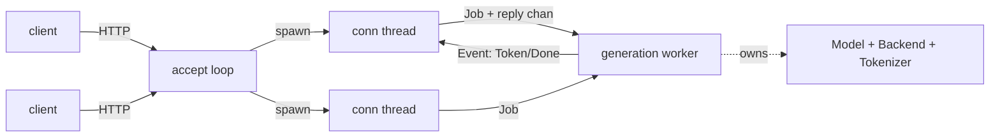

# Phase 4 — Serving: HTTP server, continuous batching, paged KV (detailed plan)

**Status: 4.1 (HTTP server) + 4.2 (continuous batching) SHIPPED. 4.3 (paged KV)
remains — the memory-efficiency layer for many/long sequences.**

The engine already had everything a server sits on top of: fast decode
([`phase-2-decode-gemv.md`](phase-2-decode-gemv.md), 2.4× CUDA), architecture
breadth ([`phase-3-archs.md`](phase-3-archs.md): Llama/Qwen2/Phi-3/Gemma 2), the
sampler chain (Phase 1.1), chat templates (Phase 1.4), and the `KvCache` seam
(Phase 0.4). Phase 4 is about *serving* it. We deliver the user-facing payoff —
a working server — first (top-down), then layer concurrency underneath.

─────────────────────────────────────────────────────────────────────────────

## 4.1 — OpenAI-compatible HTTP server (DONE)

`src/server.rs`, behind the **`server` cargo feature** (pulls only
`serde`/`serde_json`; the HTTP/1.1 layer is hand-rolled on `std::net`, so the
base build stays at its three small deps — same posture as the `gpu`/`cuda`
features).

### Architecture

- A **single generation worker thread** owns `Model` + `Backend` + `Tokenizer`.
  This sidesteps two problems at once: backends needn't be `Sync` for concurrent
  use, and the self-referential `Model`↔`Gguf`↔`Checkpoint` (mmap) borrow chain
  stays on one stack for the server's lifetime (it can't be moved across
  threads). The worker loads everything, signals readiness (so bind/accept waits
  for the model and load errors propagate), then processes one `Job` at a time.
- **Per-connection threads** parse HTTP, build a `Job` (raw messages/prompt +
  resolved `SamplerConfig` + `max_tokens` + a reply channel), hand it to the
  worker, and stream `Event`s back to the socket. Concurrent clients are accepted
  in parallel; generation is **serialized** (one job at a time — 4.2 lifts this).
- The worker reuses [`crate::model::generate_tokens`] with a callback that
  **skips the prompt-echo pieces** (the first `n-1`) and **buffers bytes to UTF-8
  boundaries** before emitting, so SSE/JSON never carry a split code point.

### Surface

- `POST /v1/chat/completions` — renders via the arch's chat template (auto-detected
  or `--chat-template`), applies `add_bos`/`emits_bos` correctly.
- `POST /v1/completions` — raw prompt.
- `GET /v1/models`, `GET /health`.
- **Streaming** (`"stream": true`) → Server-Sent Events (role chunk, content
  deltas, `[DONE]`); otherwise a single JSON body with `usage` token counts.
- Sampling knobs (`temperature`, `top_p`, `top_k`, `min_p`, `frequency_penalty`,
  `presence_penalty`, `seed`, `max_tokens`) map onto the existing `SamplerChain`.
- CLI: `rusty_llama <model.gguf> --serve [--host 127.0.0.1] [--port 8080]
  [--backend cpu|gpu|cuda] [--chat-template …]`.

### Validation

- Unit tests (`src/server.rs`): OpenAI request parsing, sampler defaults, role
  mapping, JSON-helper shape, SSE-chunk field omission.
- E2E (`tests/server.rs`, model-gated): spawns the server on a real GGUF, drives
  `/v1/completions` over a raw socket, asserts the OpenAI response shape +
  `usage`, and that a malformed body is a clean `400`.
- Manual curl smoke (Qwen2-0.5B): chat → "Paris" with correct `usage`; streaming
  emits proper `delta` chunks; `/v1/completions` and error paths behave.

─────────────────────────────────────────────────────────────────────────────

## 4.2 — Continuous batching (DONE)

The server worker is a **continuous-batching scheduler**: a fixed pool of `cap`
slots (`RUSTY_LLAMA_BATCH`, default 8), each a [`RunState`] with its own KV.

- **Admit**: a free slot pops a queued job, renders+tokenizes the prompt, and
  prefills it (the free `forward_prefill`, per-op path — so the host KV the
  batched decode reads is consistent on every backend, not just the CPU oracle).
- **Decode**: one [`Batch::decode_step`] per round runs a single batched forward
  over all active slots — the matmuls batch (N batch-1 GEMVs become one N-row
  GEMM, the throughput win), while rope, the KV write, and attention loop per
  slot (each at its own position, against its own cache). Each slot samples its
  next token, streams it, and is evicted on EOS / token budget / full context;
  freed slots admit queued prompts the next round.
- **Correctness**: `batched_decode_matches_independent_sequences` proves a
  batched decode of N sequences is bit-identical to N independent single-sequence
  runs (the CPU ops are row-wise, so batching changes only scheduling, not math).
  A concurrent server e2e fires simultaneous requests through the scheduler.
- Works on every backend via the per-op path (on CUDA the batched matmuls are
  N-row GEMMs); the resident single-sequence CUDA decode stays for the CLI.

## 4.3 — Paged KV (remaining; memory efficiency)

Today each slot reserves a full `seq_len × kv_dim` KV (`cap` slots → `cap ×`
that), which caps practical concurrency for long-context models. Block-table KV
(fixed-size pages) would let sequences share a pool instead. Generalizes the flat
single-sequence `KvCache` (Phase 0.4) to `(block, slot)` addressing — the
foundation for memory-efficient batching and long context; attention reads gather
across a sequence's block list.

─────────────────────────────────────────────────────────────────────────────

## Non-goals / notes

- The single-sequence server is **complete and useful now** (serve any supported
  model over an OpenAI-compatible API, streaming included). 4.2/4.3 are pure
  throughput/concurrency scaling — they change *how many* sequences run at once,
  not *whether* the server works.
- Dependency posture preserved: serving is feature-gated; the base build is
  unchanged. No async runtime — threads + channels keep it legible and dep-light.
- Auth/TLS, multi-model routing, function-calling, and `logprobs` are out of
  scope for the minimal server.
