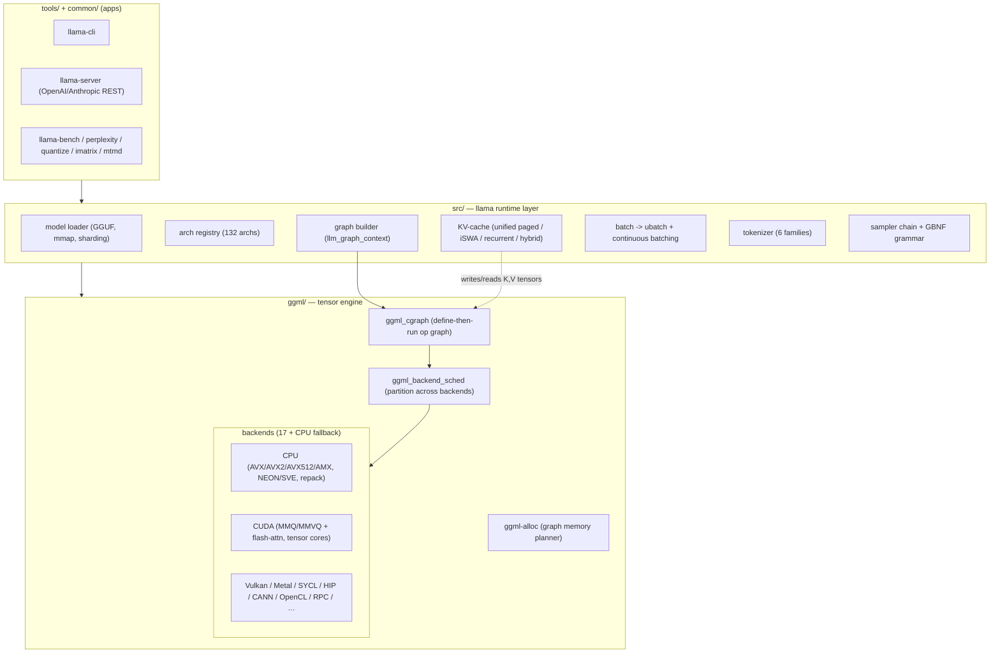

# 00. llama.cpp Architecture: End-to-End Overview

## Summary

`llama.cpp` is two layers stacked: **ggml**, a portable tensor library that
represents a forward pass as a *graph of typed tensor ops* and executes it on
pluggable hardware backends; and **llama** (the `src/` tree), the model/runtime
layer that loads GGUF weights, builds the per-architecture graph, manages the
KV-cache and batching, and tokenizes/samples. On top sit `common/` (shared
helpers) and `tools/` (CLI, server, bench, quantize, …). Three ideas explain the
whole system: (1) **define-then-run** — ops build a graph, a backend runs it;
(2) a **scheduler** partitions one graph across heterogeneous backends
(CPU+GPU hybrid); (3) **weights stay in their packed quant format end-to-end**,
which is the source of both its memory efficiency and its decode speed.

This document is the map; the eight numbered docs that follow are the territory.

─────────────────────────────────────────────────────────────────────────────

## Provenance

- Upstream: `github.com/ggml-org/llama.cpp` (MIT). Snapshot **commit
  `fe7c8b2414bb39e3dbc192fb494a1eb054b90890`**, captured **2026-06-18**.
- Every numeric/structural claim in this capture is grounded in a read of the
  cited source file at that commit. Where a fact could not be verified it is
  marked `[unverified]`.
- Purpose: inform `rusty_llama`'s roadmap (feature breadth vs raw speed). The
  honest gap analysis and ROI ranking live in `09-rusty-llama-gap-analysis.md`.

─────────────────────────────────────────────────────────────────────────────

## The two-layer design

The boundary is strict: the llama layer never writes a kernel — it only emits
`ggml_*` op nodes. Swapping hardware is "write a new backend," not "rewrite the
model." (This is the same separation `rusty_llama` chose with its `Backend`
trait, at a far smaller scale — see `09`.)

─────────────────────────────────────────────────────────────────────────────

## Repository map

| Area | Path | What it is | Detailed in |
|---|---|---|---|
| Tensor engine | `ggml/src/ggml.c`, `ggml/include/ggml.h` | tensor struct + ~90-op graph, define-then-run | `01` |
| Memory planner | `ggml/src/ggml-alloc.c` | graph allocator, lifetime + inplace reuse | `01` |
| Backend abstraction | `ggml/src/ggml-backend*.cpp` | device/buffer vtables, registry, **scheduler** | `02` |
| CPU backend | `ggml/src/ggml-cpu/` | runtime-SIMD dispatch, repack GEMM | `02` |
| CUDA backend | `ggml/src/ggml-cuda/` | MMQ/MMVQ matmul + flash-attn kernels | `03` |
| Quant formats | `ggml/src/ggml-common.h`, `ggml-quants.c` | block layouts (legacy/k/i/fp4/ternary) | `04` |
| Quant pipeline | `src/llama-quant.cpp`, `tools/imatrix` | per-tensor type mix + importance matrix | `04` |
| GGUF + loading | `ggml/src/gguf.cpp`, `src/llama-model-loader.cpp` | container, mmap, sharding, async upload | `05` |
| Arch registry | `src/llama-arch.cpp/.h` | 132 architectures, tensor-name tables | `05` |
| Runtime/decode | `src/llama-context.cpp`, `llama-batch.cpp`, `llama-graph.cpp` | decode loop, graph build | `06` |
| KV-cache | `src/llama-kv-cache*.cpp`, `llama-memory-*.cpp` | paged ring + variants | `06` |
| Tokenizers | `src/llama-vocab.cpp`, `unicode.cpp` | SPM/BPE/WPM/UGM/RWKV/PLaMo | `07` |
| Samplers + grammar | `src/llama-sampler.cpp`, `llama-grammar.cpp` | ~18 samplers, GBNF, json-schema | `07` |
| Apps & services | `tools/server`, `tools/mtmd`, `src/llama-adapter.cpp`, `common/chat.cpp` | server, multimodal, LoRA, chat/tools | `08` |

─────────────────────────────────────────────────────────────────────────────

## End-to-end request lifecycle

What happens from a prompt to streamed tokens (single-request view; the server
multiplexes many of these via continuous batching, see `08`):

1. **Load.** `llama-model-loader` mmaps the GGUF (or merges shards), reads the
   typed KV metadata, picks the arch from `general.architecture` against the
   132-entry registry, and assigns each tensor a backend buffer type; weights
   are uploaded **in their packed quant format** (async pinned-ring to GPU).
   → `05`
2. **Tokenize.** The prompt string is split by the vocab family selected from
   `tokenizer.ggml.model` (+ a pretokenizer regex for BPE) into token ids. → `07`
3. **Batch → ubatch.** `llama_decode` takes a `llama_batch`; `llama-batch.cpp`
   validates it and splits into `ubatch`es bounded by `n_ubatch`. Only the
   token(s) that need logits are flagged as outputs (prefill: just the last). → `06`
4. **Reserve KV.** The memory module finds KV slots (ring allocator over cells);
   each layer's K/V are tensors of dtype `type_k`/`type_v` (f16 or quantized). → `06`
5. **Build graph.** Per-arch builders (`llm_graph_context`: `build_attn`,
   `build_ffn`, `build_norm`, `build_rope`) assemble the layer subgraphs into one
   `ggml_cgraph`. The graph is **reused** verbatim across decode steps because
   the KV length is padded to a fixed multiple. → `06`, `01`
6. **Schedule + execute.** `ggml_backend_sched` partitions the graph into
   per-backend "splits," inserts cross-device copies, and runs each split on its
   device. Matmuls route by batch size: GPU decode (≤8 tokens) → **MMVQ** GEMV
   over packed weights; prefill (>8) → **MMQ** int8 tensor-core GEMM; attention →
   **flash-attention** with online softmax. → `02`, `03`
7. **Logits → sample.** The final layer's logits (for output rows only) are read
   back; the **sampler chain** (penalties → DRY → top-k → top-p → min-p → temp →
   dist, by default) picks the next token, optionally constrained by a **GBNF
   grammar**. → `07`
8. **Detokenize + repeat.** The token is decoded to bytes and streamed; it
   becomes the next single-token `ubatch` (step 3) until EOS / limit. Context
   shift or speculative decoding may intervene. → `06`

─────────────────────────────────────────────────────────────────────────────

## Why llama.cpp is fast (the performance model)

The speed comes from attacking the two phases by their actual bottleneck — and
they are *different* bottlenecks (this is the single most important takeaway, and
the one `rusty_llama`'s gap maps onto exactly):

| Phase | Bottleneck | llama.cpp's weapon | Source |
|---|---|---|---|
| **Prefill** (batched, compute-bound) | matmul FLOPs | **MMQ**: int8 **tensor-core** GEMM (`mma.sync m16n8k32 s8`) over packed weights, activations quantized to `q8_1` on the fly; fused flash-attention | `03` |
| **Decode** (batch-1, bandwidth-bound) | weight bytes streamed/token | **MMVQ**: GEMV that reads weights in **packed quant format** (Q4_K ≈0.56 B/weight) + `__dp4a` int8 dot — never expands to f16 | `03`, `04` |
| Both | per-op overhead, memory | one fused graph, graph **reuse** across steps, flat `ggml-alloc` memory, KV-cache stays resident | `01`, `06` |

Two structural facts beneath the table:
- **The cuBLAS fallback is what MMQ avoids.** Dequantizing weights to an f16 VRAM
  buffer and calling cuBLAS GemmEx (`convert.cu` `to_fp16_cuda` + `cublasGemmEx`)
  is the *slow* path; MMQ keeps weights packed and uses int8 tensor cores — less
  bandwidth **and** more math. `rusty_llama`'s current CUDA prefill (cache f16 +
  cuBLASLt) is structurally that avoided fallback. → `03`
- **The decode gap is arithmetic, not magic.** f16 GEMV moves ~2 B/weight; Q4_K
  MMVQ moves ~0.56 B/weight ⇒ ≈3.5×, which is essentially `rusty_llama`'s measured
  ~3.4× decode deficit (`PERFORMANCE.md`). The fix is a packed-weight DP4A GEMV,
  not more tuning of f16. → `03`, `09`

Everything else (Vulkan/Metal coopmat, AMX/NEON CPU kernels, per-arch warp-count
tables) is the same idea replicated across a decade of hardware.

─────────────────────────────────────────────────────────────────────────────

## Capability surface at a glance

| Dimension | llama.cpp (this snapshot) |
|---|---|
| Architectures | **132** (Llama/Qwen/Gemma/Phi/DeepSeek/Mixtral·DBRX·gpt-oss MoE/Mamba/RWKV/BERT/T5/Command-R/Granite…) |
| Backends | **17** + CPU (CUDA, HIP, MUSA, Vulkan, Metal, SYCL, CANN, OpenCL, WebGPU, OpenVINO, BLAS, ZenDNN, zDNN, Hexagon, VirtGPU, RPC) |
| Quant formats | ~30 storage types: legacy Q4_0…Q8_0, k-quants Q2_K…Q6_K, i-quants IQ1…IQ4, MXFP4/NVFP4, ternary TQ; + imatrix-guided |
| Tokenizers | 6 families (SPM, BPE+56 pretokenizers, WPM, UGM, RWKV, PLaMo-2) |
| Samplers | ~18 (greedy, top-k/p, min-p, typical, temp/dynatemp, top-n-sigma, XTC, mirostat v1/v2, penalties, DRY, logit-bias, grammar) |
| KV-cache | unified paged ring + iSWA sliding-window + recurrent/SSM + hybrid + DSA; configurable KV quant |
| Serving | OpenAI- **and** Anthropic-compatible server: slots, continuous batching, prompt-cache/KV-shift reuse, structured output, multimodal, in-server speculative, WebUI |
| Multimodal | image/audio/video via `libmtmd` (2-GGUF: LM + mmproj projector) |
| Adapters | LoRA (hot-swap, per-request scale), control vectors, aLoRA |
| Speculative | draft-model + n-gram/prompt-lookup (no second model) + eagle3/mtp |
| Distributed | RPC backend (TCP/RDMA), multi-GPU layer/tensor split |

─────────────────────────────────────────────────────────────────────────────

## How to read this capture

Start here, then by interest:

- **Foundations:** `01-ggml-core-and-graph.md` → `02-backends-and-dispatch.md`.
- **Speed story (most relevant to rusty_llama):** `03-cuda-kernels.md` +
  `04-quantization.md`.
- **Model plumbing:** `05-gguf-and-model-loading.md` → `06-inference-pipeline.md`.
- **Text path:** `07-tokenization-and-sampling.md`.
- **Product breadth:** `08-capabilities-and-tooling.md`.
- **What to build next:** `09-rusty-llama-gap-analysis.md` (synthesis + ROI ranking).

─────────────────────────────────────────────────────────────────────────────

## Relevance to rusty_llama (brief)

`rusty_llama` already mirrors llama.cpp's core architectural bet — a backend
abstraction (`Backend` trait) over a Llama forward pass, with CPU + wgpu + a
CUDA/cuBLASLt backend, GGUF loading, and Q4_K/Q6_K/Q8_0 quant. The gaps are
**breadth** (1 arch vs 132; 4 samplers vs ~18; no server/multimodal/LoRA) and
one **depth** lever that actually closes the decode gap (a packed-weight DP4A
GEMV à la MMVQ). The full, ROI-ranked treatment — including which gaps are
cheap wins and which are treadmill — is `09-rusty-llama-gap-analysis.md`.
