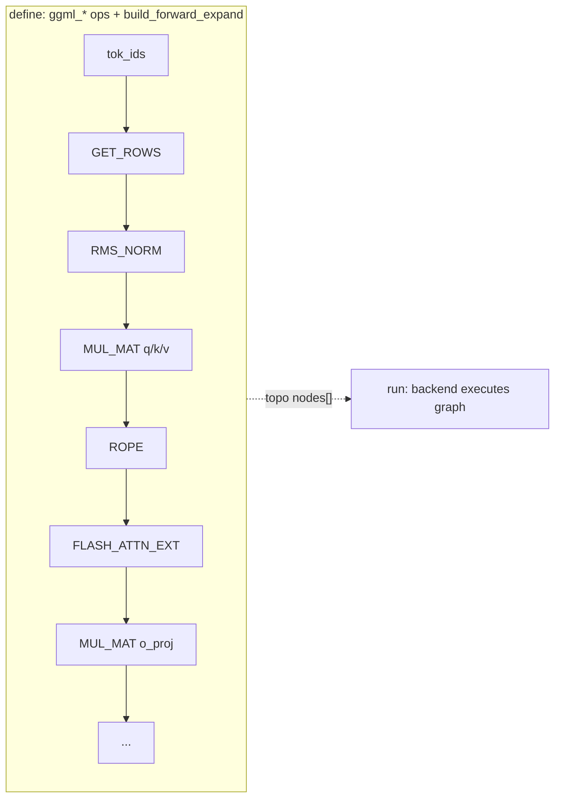

# 01. ggml Core: Tensors, Ops & the Compute Graph

## Summary

`ggml` is the tensor library underneath llama.cpp. Its model is **define-then-run**:
you allocate tensors and chain tensor *operations* in a `ggml_context` arena; each op
does **no computation** — it only mints a new `ggml_tensor` node whose `op`/`src[]`
record how it would be computed. The set of nodes is a directed acyclic graph
(`ggml_cgraph`); a *backend* (CPU, CUDA, …; see `02-backends-and-dispatch.md`)
walks the graph in topological order and actually executes it. The three things that
matter most: (1) a tensor is just shape (`ne[]`) + byte strides (`nb[]`) + a data
pointer, so transpose/permute/reshape/view are **zero-copy** stride games; (2) ops are
graph *nodes*, not eager calls; (3) the graph allocator (`ggml_gallocr` in
`ggml-alloc.c`) plans tensor lifetimes and **reuses buffers**, keeping per-token compute
memory flat regardless of graph depth.

Sources read: `ggml/include/ggml.h`, `ggml/src/ggml.c`, `ggml/src/ggml-alloc.c`,
`ggml/include/ggml-backend.h`, `ggml/src/ggml-impl.h`, `ggml/src/ggml-common.h`,
`ggml/include/ggml-cpu.h`.

─────────────────────────────────────────────────────────────────────────────

## 1. The `ggml_tensor` struct

Defined in `ggml/include/ggml.h`. An N-D tensor is metadata + a pointer into a buffer:

```c
struct ggml_tensor {
    enum ggml_type type;                 // F32/F16/BF16/quant/int (§5)
    struct ggml_backend_buffer * buffer; // backing buffer (set once allocated)
    int64_t ne[GGML_MAX_DIMS];           // # elements per dim (GGML_MAX_DIMS = 4)
    size_t  nb[GGML_MAX_DIMS];           // stride in BYTES per dim
    enum ggml_op op;                     // how this tensor is produced (§2)
    int32_t op_params[GGML_MAX_OP_PARAMS / sizeof(int32_t)]; // 64 bytes = 16 i32
    int32_t flags;                       // INPUT/OUTPUT/PARAM/LOSS/COMPUTE bitmask
    struct ggml_tensor * src[GGML_MAX_SRC];   // operands (GGML_MAX_SRC = 10)
    struct ggml_tensor * view_src;       // non-NULL => this is a view (§1.2)
    size_t               view_offs;      // byte offset into view_src->data
    void * data;                         // pointer to element storage
    char   name[GGML_MAX_NAME];          // GGML_MAX_NAME = 64
    void * extra;                        // backend-private (e.g. ggml-cuda.cu)
    char   padding[8];
};
```

Key constants (`ggml.h`): `GGML_MAX_DIMS=4`, `GGML_MAX_SRC=10`, `GGML_MAX_OP_PARAMS=64`
(bytes), `GGML_MAX_NAME=64`, `GGML_MEM_ALIGN=16` (64-bit). `GGML_TENSOR_SIZE =
sizeof(struct ggml_tensor)`.

### 1.1 ne[] / nb[] and the (mostly) row-major layout

`ne[0]` is the **fastest-moving / innermost** dimension; layout is row-major in the
sense that dim 0 is contiguous. Strides are computed in `ggml_new_tensor_impl`
(`ggml/src/ggml.c`):

```
nb[0] = ggml_type_size(type)
nb[1] = nb[0] * (ne[0] / ggml_blck_size(type))   // # blocks across a row
nb[i] = nb[i-1] * ne[i-1]                          // i >= 2
```

For an unquantized F32 row this is just `nb[0]=4`, `nb[1]=4*ne[0]`. For a **quantized**
type, `nb[0]` is the *block* byte size and `blck_size > 1`, so `nb[1]` counts blocks not
elements — `ggml_row_size(type, ne) = type_size*ne/blck_size` (`ggml.c`). Because every
op consults `nb[]`, tensors need not be contiguous: a transpose just swaps two `nb[]`
entries. `ggml_nbytes()` (`ggml.c`) walks `ne`/`nb` to get the true byte span (handles
both `blck_size==1` and quantized rows); `ggml_is_contiguous*` / `ggml_is_transposed` /
`ggml_is_permuted` test stride patterns.

### 1.2 Views and no-copy reshapes

A view shares storage: `ggml_view_impl` (`ggml.c`) calls
`ggml_new_tensor_impl(..., view_src=a, view_offs=offset)`, sets `op = GGML_OP_VIEW`,
`src[0]=a`, and points `data = a->data + offset` — **no allocation, no copy**. The base
tensor is followed transitively (`view_src->view_src` collapses). `ggml_view_1d/2d/3d/4d`
let the caller set custom `nb[]` so a view can re-stride as well as re-offset.

The "structural" ops are likewise pure metadata. `ggml_op_is_empty` (`ggml-impl.h`)
returns true for `GGML_OP_NONE, GGML_OP_RESHAPE, GGML_OP_TRANSPOSE, GGML_OP_VIEW,
GGML_OP_PERMUTE` — these produce a view, never touch data. To force a packed copy you
insert an explicit `GGML_OP_CONT` (`ggml_cont`), e.g. the conv-via-im2col path does
`ggml_cont(ggml_permute(...))` (`ggml.c`). `ggml_reshape*` are documented as views (the
header notes "make a copy instead of view" is a *future* autograd TODO).

`op_params` is a 64-byte blob carrying op-specific scalars (set via
`ggml_set_op_params*` in `ggml-impl.h`): RoPE freq/dims, softmax scale, the `ggml_prec`
of a matmul (`ggml_mul_mat_set_prec`), clamp bounds, etc. `flags` marks a tensor as
graph `INPUT`/`OUTPUT`, trainable `PARAM`, `LOSS`, or `COMPUTE` (`enum ggml_tensor_flag`).

─────────────────────────────────────────────────────────────────────────────

## 2. The op set — graph nodes, not eager calls

`enum ggml_op` (`ggml.h`) has ~90 entries up to `GGML_OP_COUNT`. Calling e.g.
`ggml_add(ctx, a, b)` allocates a result tensor with `op=GGML_OP_ADD`, `src[0]=a`,
`src[1]=b` and returns immediately — **nothing is computed**. The op enum is the union of
everything any backend can execute; `GGML_OP_NAME[]` (`ggml.c`) names them.

| Category | Representative ops |
|---|---|
| Binary elementwise | `ADD`, `SUB`, `MUL`, `DIV`, `ADD1`, `ADD_ID`, `ACC`, `SCALE` |
| Unary (sub-dispatched) | `GGML_OP_UNARY` + `enum ggml_unary_op` (22: `RELU`, `GELU`, `GELU_ERF`, `SILU`, `SIGMOID`, `TANH`, `EXP`, `FLOOR`…) |
| Gated activations | `GGML_OP_GLU` + `enum ggml_glu_op` (6: `SWIGLU`, `GEGLU`, `REGLU`, `SWIGLU_OAI`…) |
| Reductions | `SUM`, `SUM_ROWS`, `MEAN`, `CUMSUM`, `ARGMAX`, `ARGSORT`, `TOP_K` |
| Matmul | **`MUL_MAT`** (dense), **`MUL_MAT_ID`** (MoE), `OUT_PROD` |
| Normalization | `NORM`, **`RMS_NORM`**, `GROUP_NORM`, `L2_NORM` |
| Position / attention | **`ROPE`**, `SOFT_MAX`, **`FLASH_ATTN_EXT`**, `DIAG_MASK_INF` |
| Embedding / gather | **`GET_ROWS`** (token-embedding lookup), `SET_ROWS`, `GET_ROWS_BACK` |
| Shape (zero-copy, §1.2) | `RESHAPE`, `VIEW`, `PERMUTE`, `TRANSPOSE`, `CONT`, `CPY`, `DUP`, `CONCAT` |
| Conv / pool | `IM2COL(_3D)`, `CONV_2D/3D`, `CONV_TRANSPOSE_*`, `POOL_1D/2D` |
| SSM / linear-attn | `SSM_CONV`, `SSM_SCAN`, `RWKV_WKV6/7`, `GATED_DELTA_NET` (Mamba/RWKV) |
| Training-only (§3) | `CROSS_ENTROPY_LOSS`, `OPT_STEP_ADAMW`, `OPT_STEP_SGD`, `*_BACK` |
| Escape hatches | `MAP_CUSTOM1/2/3`, `CUSTOM` (user callback) |

The two matmul shapes (both emit F32 output, `ggml.c`):

- **`ggml_mul_mat(ctx, a, b)`** — `a` = weights `[k, n, …]`, `b` = activations
  `[k, m, …]`; result `ne = {a->ne[1], b->ne[1], b->ne[2], b->ne[3]}`. Asserts
  `!ggml_is_transposed(a)` and `ggml_can_mul_mat` (`a->ne[0]==b->ne[0]`). Dims 2/3
  broadcast (`a` batch can be 1). Precision via `ggml_mul_mat_set_prec` → `op_params`.
- **`ggml_mul_mat_id(ctx, as, b, ids)`** — Mixture-of-Experts. `as=[cols,rows,n_expert]`,
  `b=[cols,n_expert_used,n_tokens]`, `ids=[n_expert_used,n_tokens]` (I32 router choice);
  out `[rows,n_expert_used,n_tokens]`. `src[0]=as, src[1]=b, src[2]=ids`. One op selects
  and applies the per-token expert matrices — no host-side expert loop.

`GGML_OP_GET_ROWS` is how the token-embedding table is indexed (`src[0]`=embeddings,
`src[1]`=I32 token ids) — the embedding lookup is itself a graph node.

─────────────────────────────────────────────────────────────────────────────

## 3. The graph model

### 3.1 The context arena

`struct ggml_context` (`ggml.c`) is a flat bump-allocated arena:

```c
struct ggml_context { size_t mem_size; void * mem_buffer; bool mem_buffer_owned;
                      bool no_alloc; int n_objects;
                      struct ggml_object * objects_begin, * objects_end; };
```

`ggml_init(params)` allocates one aligned block of `mem_size` bytes (or adopts a
caller buffer). Every tensor/graph is a `ggml_object` appended at the end by
`ggml_new_object` — a pointer-bump allocator with `GGML_OBJECT_SIZE` headers and
`GGML_MEM_ALIGN` padding; no per-object free. `ggml_used_mem` = end offset; `ggml_reset`
rewinds the arena to empty without freeing. With `no_alloc=true`, tensor *metadata* lives
in the context but *data* is left to a backend buffer + the graph allocator (§4) — this
is the inference path (weights mmap'd, activations planned by `gallocr`).

### 3.2 Building a `ggml_cgraph`

`struct ggml_cgraph` (`ggml-impl.h`):

```c
struct ggml_cgraph {
    int size, n_nodes, n_leafs;
    struct ggml_tensor ** nodes;      // ops to execute, in topo order
    struct ggml_tensor ** grads, ** grad_accs; // training only (§3.4)
    struct ggml_tensor ** leafs;      // constant/param inputs
    int32_t * use_counts;             // refcount per hash slot
    struct ggml_hash_set visited_hash_set;
    enum ggml_cgraph_eval_order order; // LEFT_TO_RIGHT default
    uint64_t uid;
};
```

`ggml_new_graph(ctx)` = `ggml_new_graph_custom(ctx, GGML_DEFAULT_GRAPH_SIZE=2048,
grads=false)`. The whole graph (node/leaf arrays + a hash set sized `ggml_hash_size(size*2)`
+ use_counts + bitset) is carved from the context arena in one `ggml_object`
(`ggml_graph_nbytes` / `ggml_new_graph_custom`, `ggml.c`).

`ggml_build_forward_expand(graph, tensor)` adds `tensor` and all its ancestors. It calls
`ggml_visit_parents_graph` (`ggml.c`), a **DFS post-order** walk over `src[]`: a node is
emitted only after all its sources, giving a valid **topological order** where
`nodes[n_nodes-1]` is the requested output. Each visited node is recorded in
`visited_hash_set` (linear-probed, hashed on pointer >> 4, `ggml-impl.h`) so shared
sub-expressions are emitted once; `use_counts[slot]` counts how many consumers reference
each tensor (drives buffer freeing in §4). A leaf (`op==GGML_OP_NONE`, not a param) goes
to `leafs[]`; everything else to `nodes[]`. Multiple `build_forward_expand` calls append
to the same graph (`n_old`/`n_new` bookkeeping). Eval order can be flipped
(`GGML_CGRAPH_EVAL_ORDER_RIGHT_TO_LEFT`).



### 3.3 Define-then-run (no eager exec)

Building the graph performs zero math. Execution is a separate call:
- CPU: `ggml_graph_plan(cgraph, n_threads, threadpool)` computes a `ggml_cplan`
  (work-buffer size + thread count), then `ggml_graph_compute(cgraph, &cplan)` runs it
  (`ggml-cpu.h`). `ggml_graph_compute_with_ctx` allocates the work buffer from the context.
- Backend-agnostic: `ggml_backend_graph_compute(backend, cgraph)` (`ggml-backend.h`),
  or via the multi-backend scheduler `ggml_backend_sched_graph_compute` (→
  `02-backends-and-dispatch.md`). The same graph metadata is *single-use for allocation
  but multi-use for compute* — you can re-run a built+allocated graph many times.

### 3.4 Autograd exists but is unused at inference

ggml also implements reverse-mode autodiff: `ggml_set_param`/`ggml_set_loss`,
`ggml_build_backward_expand` (`ggml.c`) walks nodes in reverse filling `grads[]`/
`grad_accs[]`, and the `OPT_STEP_ADAMW`/`OPT_STEP_SGD`/`CROSS_ENTROPY_LOSS` ops + the
`ggml-opt` API drive training. **Inference uses the forward graph only** — `grads=false`,
no backward pass, no optimizer ops. (Mentioned for completeness; not on the llama.cpp
token-generation path.)

─────────────────────────────────────────────────────────────────────────────

## 4. `ggml-alloc.c` — the graph allocator (gallocr)

`ggml_gallocr` plans where every compute tensor's bytes live and **reuses storage** so a
50-layer transformer's activations fit in roughly one layer's worth of scratch. This is
the single biggest reason ggml's runtime memory is flat and predictable.

### 4.1 Structures

```c
struct hash_node { int n_children, n_views, buffer_id;
                   struct buffer_address addr; bool allocated; };  // per tensor
struct ggml_gallocr {
    ggml_backend_buffer_type_t * bufts;        // [n_buffers]
    struct vbuffer ** buffers;                 // realized backend buffers
    struct ggml_dyn_tallocr ** buf_tallocs;    // a sub-allocator per buffer
    int n_buffers;
    struct ggml_hash_set hash_set; struct hash_node * hash_values;
    struct node_alloc * node_allocs; struct leaf_alloc * leaf_allocs;
};
```

The sub-allocator `ggml_dyn_tallocr` is a **best-fit free-list** over `tallocr_chunk`s
(`free_blocks[MAX_FREE_BLOCKS=256]`, kept sorted by offset for fast merge), split into up
to `GGML_VBUFFER_MAX_CHUNKS=16` chunks; `ggml_dyn_tallocr_alloc` picks the smallest
fitting block (or grows the last chunk), `..._free_bytes` returns and coalesces. It tracks
only **offsets**, not real memory — that is the "measure" half.

### 4.2 Lifetime + buffer reuse (`ggml_gallocr_alloc_graph_impl`)

One pass over the topo-ordered graph:
1. Allocate leafs and explicit `GGML_TENSOR_FLAG_INPUT` tensors first (must persist).
2. Count `n_children` and `n_views` for every tensor by scanning `src[]` and `view_src`.
3. Walk `nodes[]` in order; for each node allocate its dst (`ggml_gallocr_allocate_node`),
   then **decrement parents' `n_children`** — when a parent hits `n_children==0 &&
   n_views==0` it is no longer live and `ggml_gallocr_free_node` returns its bytes to the
   free list for the next node to reuse. Views defer to their `view_src`.

**Inplace reuse:** if `ggml_op_can_inplace(op)` (true for `ADD`, `MUL`, `SCALE`,
`RMS_NORM`, `SOFT_MAX`, `ROPE`, `GGML_OP_UNARY`, … — ops whose backend impl can write
over an input), `allocate_node` first tries to **overwrite a parent's buffer**: it needs
that parent to be galloc-owned, not a graph output, same layout (`ggml_are_same_layout`),
and uniquely used (`n_children==1 && n_views==0`). If so the node takes the parent's
address and the parent is marked not-allocated (skips the free). This collapses long
elementwise chains onto a single buffer.

Outputs (`GGML_TENSOR_FLAG_OUTPUT`) and externally-set tensors (`data != NULL` or
`buffer != NULL`, via `ggml_gallocr_is_allocated`) are never freed/reused.

### 4.3 Measure vs allocate, and "needs realloc"

`ggml_gallocr_reserve_n_impl(galloc, graph, …, no_alloc)`:
- `no_alloc=true` (**measure**) → `ggml_gallocr_reserve_n_size` runs the planning pass and
  reports each buffer's peak size **without touching device memory**. llama.cpp uses this
  on a worst-case graph to size the compute buffer up front.
- `no_alloc=false` (**allocate**) → `ggml_gallocr_reserve` realizes the backend buffers to
  the computed peak.

`ggml_gallocr_alloc_graph(galloc, graph)` is the per-iteration entry: it calls
`ggml_gallocr_needs_realloc` and only re-plans when the graph's topology or tensor shapes
changed; otherwise it reuses the cached `node_allocs`/`leaf_allocs` and just re-binds
addresses (`ggml_gallocr_init_tensor`). So steady-state decode does **no allocation work**
per token — the plan and the buffer are stable, which is why memory stays flat.

`ggml_tallocr` (the simpler linear allocator, `ggml_tallocr_new`/`..._alloc`) is the
non-graph path used to pour weights into a buffer sequentially.

─────────────────────────────────────────────────────────────────────────────

## 5. Types & type traits

`enum ggml_type` (`ggml.h`, 0..41, `GGML_TYPE_COUNT=42`). Float/int "scalar" types and the
quant family (block layouts deferred to `04-quantization.md`):

| type | id | blck_size | notes |
|---|---|---|---|
| `F32` | 0 | 1 | first-class; matmul accumulate type |
| `F16` | 1 | 1 | first-class half |
| `BF16` | 30 | 1 | google bfloat16 |
| `Q4_0/Q4_1/Q5_0/Q5_1` | 2,3,6,7 | 32 | legacy round-to-nearest |
| `Q8_0/Q8_1` | 8,9 | 32 | 8-bit |
| `Q2_K…Q8_K` | 10–15 | 256 | k-quants (super-blocks) |
| `IQ2_XXS…IQ4_XS` | 16–23 | — | i-quants (codebook) |
| `MXFP4/NVFP4` | 39,40 | 32/— | micro-scaled FP4 |
| `I8/I16/I32/I64/F64` | 24–28 | 1 | integer / double |

Each type has a row in the `type_traits[GGML_TYPE_COUNT]` table (`ggml.c`), typed by
`struct ggml_type_traits` (`ggml.h`):

```c
struct ggml_type_traits {
    const char * type_name;
    int64_t blck_size;             // elements per block (1 for F32/F16; 32/256 for quants)
    int64_t blck_size_interleave;  // repack/interleave hint
    size_t  type_size;             // BYTES per block
    bool    is_quantized;
    ggml_to_float_t   to_float;    // dequant to F32
    ggml_from_float_t from_float_ref; // quantize reference impl
};
```

Accessors `ggml_blck_size`, `ggml_type_size`, `ggml_row_size`, `ggml_type_name`,
`ggml_is_quantized` read this table. The traits are how the *whole* engine stays
type-generic: stride math (§1.1), `nbytes`, and allocation sizes all derive from
`{blck_size, type_size}` without special-casing each format. CPU adds a parallel
`ggml_type_traits_cpu` (`ggml-cpu.h`) with `vec_dot`/`from_float`/`vec_dot_type`/`nrows`
for SIMD kernels. The block *structs* themselves (`block_q4_K`, …) live in
`ggml-common.h`; see `04-quantization.md`.

─────────────────────────────────────────────────────────────────────────────

## 6. Threading at the ggml level (brief)

ggml itself is single-threaded for graph *construction*; parallelism is a **backend**
concern. On CPU, `ggml_graph_plan` produces a `ggml_cplan { work_size, work_data,
n_threads, threadpool, abort_callback }` and `ggml_graph_compute` fans the nodes across a
threadpool (`GGML_DEFAULT_N_THREADS=4`, hard cap `GGML_MAX_N_THREADS=512`); per-op tasks
split rows across threads, with a shared work buffer for repacked operands. A persistent
`ggml_threadpool` (`ggml_threadpool_new`, `ggml-cpu.h`) avoids per-call thread spawn, and
`ggml_backend_cpu_set_n_threads`/`set_threadpool` wire it into the CPU backend. NUMA
strategies (`ggml_numa_init`) exist for many-socket hosts. Details and the GPU stream
model are in `02-backends-and-dispatch.md`.

The graph-facing backend API (`ggml-backend.h`) is thin: `ggml_backend_graph_compute`,
`ggml_backend_graph_plan_create/compute`, `ggml_backend_supports_op` (does this device
implement this op-node?), and the scheduler that assigns nodes to devices and inserts
cross-device copies — all covered in doc 02.

─────────────────────────────────────────────────────────────────────────────

## Relevance to rusty_llama

rusty_llama today is an **eager, per-op** engine: a `Backend` trait
(`src/backend/mod.rs`) exposes concrete methods (`matmul`, `matmul_batch`, `swiglu`,
`rmsnorm`, `rope`, `attention`, …) and `src/model.rs` hand-writes the `forward` /
`forward_prefill` / `generate` loops that call them in sequence. That is the *opposite*
of ggml's define-then-run graph. Implications and portable ideas:

- **No graph IR, no topological scheduler.** ggml's value is that one `ggml_cgraph` +
  `ggml_backend_supports_op` lets *every* architecture and backend share one execution
  path. rusty_llama's hand-coded loop is simpler and Llama-only; every new arch (Qwen,
  Gemma, Phi, MoE) means new loop code, not new graph wiring. A lightweight node/op
  enum + a `build_forward` pass would be a large but high-leverage refactor if breadth
  (roadmap #5) becomes the goal.
- **`mul_mat_id` is a single op.** ggml expresses MoE routing as one `MUL_MAT_ID` node
  (`as`/`b`/`ids`). rusty_llama has no MoE; porting it means either a new `Backend`
  method or a per-token expert gather loop — ggml's shape contract (`ids` = I32 router
  output) is the spec to copy.
- **Zero-copy strided views.** ggml gets transpose/permute/reshape/GQA-head-slicing for
  free from `ne[]`/`nb[]`. If rusty_llama tensors are shape-only (no general byte
  strides), GQA / KV-cache slicing / head reshapes are likely explicit copies. A small
  `{ne, nb, offset, view_src}` view type would remove copies in attention and the
  KV path.
- **Flat compute memory via `gallocr`.** rusty_llama already manages resident scratch by
  hand (`DecodeState`/`DecodeCuda`/`RunState`, pointer-keyed weight caches) — effectively
  a hand-rolled, single-arch version of what `gallocr` automates. ggml's measure→allocate
  + `n_children`/inplace reuse model is worth studying if scratch ever needs to scale to
  variable graphs; for one fixed arch the hand-rolled buffers are fine and lower-overhead.
- **Inplace-op reuse** (`ggml_op_can_inplace`: residual add, RMSNorm, RoPE, softmax,
  SwiGLU) collapses elementwise chains onto one buffer. rusty_llama's fused decode/prefill
  already overwrites in place; the `ggml_are_same_layout && n_children==1` guard is the
  exact safety condition to mirror if a planner is ever added.
- **Type traits decouple format from kernels.** rusty_llama's Q4_K/Q6_K/Q8_0 handling
  in `src/quant.rs` plays the role of `type_traits` (`{blck_size, type_size, to_float}`).
  Keeping a single trait/table keyed by quant type — rather than match arms scattered
  across backends — mirrors ggml and eases adding new quants.
- **`GGML_OP_GET_ROWS` as embedding.** Treating embedding lookup as a first-class op (not
  a special-cased prologue) is a clean pattern if rusty_llama moves toward a graph.
- **Honest effort note:** adopting a ggml-style graph is a multi-week rewrite and is *not*
  the current ROI lever (decode is weight-bandwidth-bound — see
  `03-cuda-kernels.md`/`04-quantization.md`). The pragmatic takeaways are the
  cheap ones: a strided-view type, a quant-trait table, and the inplace-reuse safety rule.
