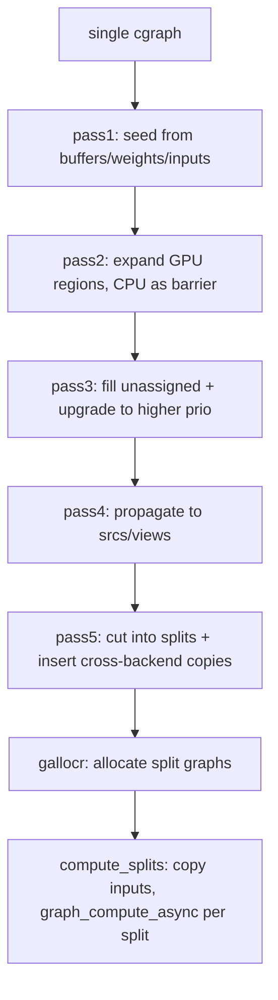

# 02. Backends & Dispatch

## Summary

`ggml-backend` is the hardware-abstraction layer that sits *between* the math
library (`ggml`) and the model code (`src/llama-*`). It defines a small set of
C vtable interfaces (`ggml_backend_i`, `ggml_backend_device_i`,
`ggml_backend_buffer_type_i`, `ggml_backend_buffer_i`, `ggml_backend_reg_i`) so
that CUDA, Vulkan, Metal, CPU, etc. are interchangeable plugins. Three things
matter most: (1) a **registry** that discovers backends — statically linked or
loaded from `.so`/`.dll` at runtime by a *score* — and exposes them as
*devices*; (2) **the scheduler `ggml_backend_sched`**, which takes a *single*
compute graph and partitions it across N backends, assigning each op a backend,
inserting cross-device tensor copies, and cutting the graph into per-backend
*splits*; and (3) the **CPU backend**, which does runtime SIMD selection (multi
-variant build + score), an interleaved-weight *repack* GEMM path, and a custom
threadpool. This scheduler is what makes hybrid CPU+GPU and multi-GPU layer
offload work — rusty_llama has no equivalent.

CUDA *kernel* internals are out of scope here (see `03-cuda-kernels.md`); how
the llama layer builds the graph and chooses per-layer buffer types is in
`06-inference-pipeline.md`.

─────────────────────────────────────────────────────────────────────────────

## 1. The backend object model

`ggml/include/ggml-backend.h` (public) and `ggml/src/ggml-backend-impl.h`
(vtables) define a 5-level hierarchy. Every concrete backend fills in the
`*_i` interface structs; the public `ggml_backend_*` functions are thin
forwarders that assert and call through `iface`.

| Type (`*_t`) | vtable (`*_i`) | Role |
|---|---|---|
| `ggml_backend_reg_t` | `ggml_backend_reg_i` | A loaded backend "library": names itself, enumerates its devices, exposes extra procs via `get_proc_address`. |
| `ggml_backend_dev_t` | `ggml_backend_device_i` | A physical device (e.g. `CUDA0`, `CPU`). Reports type/memory/props/caps, makes backends & buffer types, answers `supports_op`/`supports_buft`/`offload_op`. |
| `ggml_backend_t` | `ggml_backend_i` | A *stream* on a device: `graph_compute`, async tensor set/get, events, optional `graph_optimize`. |
| `ggml_backend_buffer_type_t` | `ggml_backend_buffer_type_i` | A *kind* of memory (alignment, max size, alloc-size-with-padding, `is_host`). `alloc_buffer` mints buffers. |
| `ggml_backend_buffer_t` | `ggml_backend_buffer_i` | A concrete allocation: `get_base`, `set/get/cpy_tensor`, `clear`, `init_tensor` (attach extras), `reset`. |

**Device types** (`enum ggml_backend_dev_type`, `ggml-backend.h`): `CPU`,
`GPU` (dedicated VRAM), `IGPU` (integrated, host memory), `ACCEL` (BLAS/AMX-style
co-processor used alongside CPU), and `META` (a wrapper over several devices for
tensor parallelism).

**Host vs device memory.** `ggml_backend_buft_is_host(buft)` is the pivotal
predicate: it returns true when the buffer is plain CPU memory in standard ggml
tensor layout. Any backend whose `supports_buft` accepts a host buffer can read
those weights without a copy — this is how BLAS and CPU share buffers, and how
the scheduler decides a copy is *unnecessary*. Devices may also expose a pinned
**host buffer type** (`get_host_buffer_type`) for fast H2D/D2H transfers.

**Buffer usage** (`enum ggml_backend_buffer_usage`): `ANY`, `WEIGHTS`,
`COMPUTE`. Marking a weights buffer `GGML_BACKEND_BUFFER_USAGE_WEIGHTS` tells
the scheduler "prefer to run ops that consume this on the buffer's backend" and
lets it reuse offloaded-weight memory between splits.

**The three capability queries** (device-level, `ggml-backend-impl.h`):
- `supports_op(dev, op)` — can this device compute this exact op (type combo,
  shapes, op-params)?
- `supports_buft(dev, buft)` — can it operate on tensors living in this memory?
- `offload_op(dev, op)` — *optional*: even if the weights are in an incompatible
  buffer, does the device *want* this op (expensive ops worth copying for)?

`ggml_backend_tensor_copy(src, dst)` is the generic cross-backend copy: it tries
`dst` buffer's `cpy_tensor`, then `src`'s, else falls back to a get-into-host +
set round trip. `ggml_backend_tensor_copy_async` adds event-ordered async copies
with automatic sync fallback.

─────────────────────────────────────────────────────────────────────────────

## 2. The registry & dynamic loading

`ggml/src/ggml-backend-reg.cpp` holds a process-global `ggml_backend_registry`
(a Meyers singleton, `get_reg()`) with two vectors: `backends` (reg + optional
dl handle) and `devices` (flattened across all regs). The constructor
**statically** registers every backend compiled in, in a fixed priority-ish
order gated by `#ifdef GGML_USE_*`: CUDA, Metal, SYCL, Vulkan, WebGPU, zDNN,
VirtGPU, OpenCL, ZenDNN, Hexagon, CANN, BLAS, RPC, OpenVINO, **CPU last**.
`register_backend` dedupes, logs, then calls `register_device` for each device
the reg enumerates. Enumeration helpers: `ggml_backend_reg_count/get/by_name`,
`ggml_backend_dev_count/get/by_name/by_type` (case-insensitive `striequals`).
`ggml_backend_init_best()` prefers `GPU`, then `IGPU`, then `CPU`.

**Dynamic loading** (`ggml-backend-dl.cpp` + reg.cpp). `ggml-backend-dl.cpp` is
just the OS shim: `dl_load_library`/`dl_get_sym`/`dl_error` over `LoadLibraryW`
(Windows) or `dlopen(RTLD_NOW|RTLD_LOCAL)` (POSIX). The interesting logic is in
reg.cpp:

- A DL backend is built with `GGML_BACKEND_DL` and stamps two exported symbols
  via the `GGML_BACKEND_DL_IMPL`/`GGML_BACKEND_DL_SCORE_IMPL` macros
  (`ggml-backend-impl.h`): `ggml_backend_init()` → `ggml_backend_reg_t`, and an
  optional `ggml_backend_score()` → `int` (higher = better, **0 = unsupported on
  this system**).
- `load_backend(path)` dlopens, checks `score()!=0`, calls `init()`, and rejects
  any reg whose `api_version != GGML_BACKEND_API_VERSION` (currently **2**).
- `ggml_backend_load_all()` → `load_best("name")` for each known family in a
  fixed order (`blas, zendnn, cann, cuda, hip, metal, rpc, sycl, vulkan,
  virtgpu, opencl, hexagon, musa, openvino, cpu`). `load_best` globs
  `(lib)ggml-<name>-*.{so|dll}` in the search paths (`GGML_BACKEND_DIR`,
  executable dir, cwd), runs each candidate's `score()`, and loads the
  **highest-scoring** one — this is the runtime mechanism that picks, e.g., the
  best CPU SIMD variant or CUDA arch build present. `GGML_BACKEND_PATH` loads an
  extra out-of-tree backend. Note the env hook `GGML_DISABLE_VULKAN` short
  -circuits Vulkan registration.

`get_proc_address` is the escape hatch for non-standard entry points: the CPU
backend exposes `ggml_backend_set_n_threads`, `ggml_backend_dev_get_extra_bufts`,
`ggml_backend_get_features`, threadpool ctors, NUMA init, etc. through it.

─────────────────────────────────────────────────────────────────────────────

## 3. The scheduler — partitioning one cgraph across backends

`ggml_backend_sched` (`ggml/src/ggml-backend.cpp`) is the heart of hybrid
execution. Construction: `ggml_backend_sched_new(backends[], bufts[],
n_backends, graph_size, parallel, op_offload)`. **Backends are listed in
priority order: low index = high priority; the CPU is expected last** (it is the
universal fallback). Key state (`struct ggml_backend_sched`):

- `hash_set` + `hv_tensor_backend_ids[]` — per-tensor assigned backend id
  (`-1` = unassigned), keyed by a hash of the tensor pointer (macros
  `hash_id`, `tensor_backend_id`).
- `hv_tensor_copies[hash][backend][copy]` — the duplicate of an input tensor
  materialized on a consumer backend.
- `splits[]` — the cut list; each `ggml_backend_sched_split` = `{backend_id,
  i_start, i_end, inputs[≤30], graph view}`.
- `n_copies` (≤ `GGML_SCHED_MAX_COPIES`=4) + per-backend `events[][]` — pipeline
  parallelism / multi-buffering when `parallel=true`.
- Limits: `GGML_SCHED_MAX_BACKENDS`=16, `GGML_SCHED_MAX_SPLIT_INPUTS`=30.

### 3a. Per-node backend choice — `ggml_backend_sched_backend_id_from_cur`

For a tensor with no user override, in order (cause codes are the debug labels):
1. **`1.dst`** — if the tensor is pre-allocated in a buffer, pick the highest
   -prio backend that `supports_buft` *and* `supports_op` (via
   `ggml_backend_sched_backend_from_buffer`). A pre-allocated tensor cannot move.
2. **`1.vsrc`** — same, but using its `view_src`'s buffer.
3. If pre-allocated but *no* backend can run the op → `GGML_ABORT` (no fallback).
4. **`1.inp`** — a graph input (`GGML_TENSOR_FLAG_INPUT`) goes to the **last
   backend (CPU)**.
5. **`1.wgt`/`1.off`** — ops with a `USAGE_WEIGHTS` source run on the weight's
   backend. *Offload heuristic:* if `op_offload` is on and the weight lives in
   host memory on the CPU backend, scan higher-prio backends; if one both
   `supports_op` and `offload_op`, run the op there (`1.off`) — this is how a
   CPU-resident layer's matmul still gets pushed to the GPU. (ROPE is skipped:
   its freq tensor is too small to choose a backend from.)

### 3b. `ggml_backend_sched_split_graph` — the 5-pass algorithm

`ggml-backend.cpp`, the comment-labeled passes:

- **Pass 1 — seed.** For every leaf and node, if unassigned, call
  `backend_id_from_cur` (above). User assignments (`set_tensor_backend`) are
  never overwritten.
- **Pass 2 — expand (4 sweeps).** Propagate assignments to adjacent unassigned
  nodes, skipping view ops. First "expand **gpu** down/up": carry a non-CPU
  backend id forward/backward, assigning it to neighbours **only if that backend
  `supports_op`** (`set_if_supported`); the CPU (lowest prio) is treated as a
  *barrier* (resets the carried id). Then "expand **rest** down/up" does the same
  *including* CPU. Net effect: GPU regions grow greedily, CPU is used only where
  weights are on CPU or where a GPU op gap forces it.
- **Pass 3 — upgrade / fill.** For each still-unassigned node, pick the backend
  that `supports_op` with the **most supported inputs** (`3.best`). For each
  assigned node, try to **upgrade** to a higher-prio backend that has the *same
  buffer type* and supports the op and all sources (`3.upg`) — e.g. move a host
  -buffer op from CPU to BLAS.
- **Pass 4 — propagate to sources.** Unassigned `src`/`view_src` inherit the
  consuming node's backend (views always follow their source); any leftover node
  gets the first backend that supports it. Asserts everything is assigned.
- **Pass 5 — cut & insert copies.** Walk nodes in order; start a new split when
  the node's backend ≠ current split backend, or when a `USAGE_WEIGHTS` source is
  on an incompatible backend (so offloaded weight memory can be reused), or when
  the split hits 30 inputs. For each source on a *different, unsupported* backend,
  **materialize a copy** (`tensor_id_copy`) on the split's backend, register it
  as a split input, and rewrite `node->src[j]` to point at the copy. If
  `n_copies>1`, graph inputs get one copy per pipeline stage.

After splitting it allocates via `ggml_gallocr` (the graph allocator; see
`01-ggml-core-and-graph.md`) sized `max(n_nodes,n_leafs) +
n_splits*30*2*n_copies`, swapping `prev_*_backend_ids` to detect when
reallocation is needed.

### 3c. `ggml_backend_sched_compute_splits` — execution

For each split (`ggml-backend.cpp`): copy its inputs onto the split backend,
then `ggml_backend_graph_compute_async(split_backend, &split->graph)`. Copy
details:
- **User inputs** (`FLAG_INPUT`) are copied *synchronously* (after waiting on the
  copy event) so the app can't overwrite data mid-flight.
- Other inputs prefer `cpy_tensor_async`; on failure they sync the source backend
  and fall back to `ggml_backend_tensor_copy`. Event records/waits order the
  pipeline stages when `n_copies>1`.
- **MoE optimization:** when an input is `USAGE_WEIGHTS` host memory feeding a
  `GGML_OP_MUL_MAT_ID`, the scheduler reads the expert-id tensor, builds a
  bitset of *used* experts, and copies **only those expert slices** (coalescing
  consecutive ids, padding the last expert to avoid NaNs in CUDA MMQ) instead of
  the whole weight — a big bandwidth win for sparse MoE offload.

An optional `eval_callback` lets a caller observe individual nodes (used by
`test-backend-ops` and perplexity tools), at the cost of per-node sync.

`ggml_backend_sched_reserve(measure_graph)` pre-sizes all buffers from a max
-shape graph; `reset` discards allocations before a new graph. `get_n_splits`
/`get_n_copies` expose the partition for profiling.

─────────────────────────────────────────────────────────────────────────────

## 4. Layer offload & multi-GPU placement

The scheduler is *mechanism*; the llama layer is *policy* (decided at model load,
detailed in `06-inference-pipeline.md`). The knobs (`docs/multi-gpu.md`):

| Flag | Meaning |
|---|---|
| `-ngl/--n-gpu-layers` (`auto`/`all`/N) | how many transformer layers' weights to place in VRAM; the rest stay in CPU buffers and run on CPU (or get offloaded op-by-op via the `op_offload` heuristic). |
| `-sm/--split-mode` `none`\|`layer`\|`tensor` (`row` deprecated) | how to spread across GPUs. |
| `-ts/--tensor-split` | per-GPU proportions. |
| `-mg/--main-gpu` | the single GPU for `none`. |
| `-dev/--device` | restrict visible devices. |

- **`layer` (default) = pipeline parallelism.** Each GPU owns a contiguous slice
  of layers; layer *l*'s KV cache lives on the GPU that owns layer *l*. Minimal
  cross-GPU traffic; scales with batch/tokens. The llama loader assigns each
  layer's tensors to that device's buffer type and marks them
  `USAGE_WEIGHTS`; the scheduler's pass-1/2 then naturally keeps each layer's
  compute on its GPU, with copies only at slice boundaries.
- **`tensor` (experimental) = tensor parallelism** via a **META device**
  (`ggml_backend_meta_device`, `GGML_BACKEND_META_MAX_DEVICES`=16): each weight
  is split along an axis (`ggml_backend_meta_split_state`, axes 0–3, plus
  `MIRRORED`/`PARTIAL`) across GPUs, requiring per-layer all-reduces (NCCL/RCCL,
  opt-in CUDA P2P via `GGML_CUDA_P2P`). Requires flash-attn on and non-quantized
  KV; not implemented for many MoE/SSM/hybrid architectures.

Placement *decision* (which `buft` each tensor gets) is llama-side in
`llama-model.cpp`/`llama-context.cpp` — see `06-inference-pipeline.md`. The scheduler only sees
the resulting buffers and follows them.

─────────────────────────────────────────────────────────────────────────────

## 5. The backend matrix

From `README.md` "Supported backends" + `docs/build.md` + the registry list.
CPU is the always-present base (not listed in the README table). "Score" gating
means a DL build only activates where its ISA/driver is present.

| Backend | Target devices | Notes |
|---|---|---|
| **CPU** | All (x86/ARM/RISC-V/PPC/s390x/WASM) | base backend; SIMD variants + repack |
| **Metal** | Apple Silicon | default on macOS (`-DGGML_METAL`) |
| **CUDA** | NVIDIA GPU | `-DGGML_CUDA`; see `03-cuda-kernels.md` |
| **HIP** | AMD GPU | CUDA code transpiled via HIP (ROCm) |
| **MUSA** | Moore Threads GPU | |
| **Vulkan** | GPU (any vendor) | portable GPU path |
| **SYCL** | Intel GPU | (also Nvidia/AMD via oneAPI) |
| **CANN** | Huawei Ascend NPU | |
| **OpenCL** | Adreno GPU (Qualcomm) | mobile |
| **WebGPU** | All (browser/native) | in progress |
| **OpenVINO** | Intel CPU/GPU/NPU | in progress |
| **BLAS** | All (Accelerate/OpenBLAS/BLIS/oneMKL) | ACCEL device; prompt-processing matmul only |
| **ZenDNN** | AMD EPYC CPU | CPU accelerator |
| **IBM zDNN** | IBM Z & LinuxONE | distinct from ZenDNN |
| **Hexagon** | Snapdragon DSP | in progress |
| **VirtGPU** | virtio-gpu (APIR) | virtualized |
| **RPC** | All (remote) | forwards a backend over the network |

BLAS, ZenDNN, zDNN appear as separate columns in `docs/ops.md`, confirming they
are independent backends, not CPU sub-features.

─────────────────────────────────────────────────────────────────────────────

## 6. CPU backend specifics

`ggml/src/ggml-cpu/ggml-cpu.c` (kernels + threadpool) and `ggml-cpu.cpp`
(backend/device/reg wrappers).

### 6a. Threadpool & compute model
`ggml_graph_compute(cgraph, cplan)` runs the op switch
(`ggml_compute_forward`) over nodes. Threading: a persistent `ggml_threadpool`
with `n_threads` workers using a **hybrid poll-then-wait** loop
(`ggml_graph_compute_poll_for_work` spins `poll`×rounds of `cpu_relax`, then
sleeps on a condvar). The main thread "kicks off" a graph by bumping a packed
`n_graph` counter (`ggml_graph_compute_kickoff`); workers detect the change and
each take ops where `ith < n_tasks`. Per-op parallelism comes from
`ggml_get_n_tasks` (most heavy ops = `n_threads`; `GET_ROWS`/`SET_ROWS` = 1).
`ggml_graph_plan` computes a `work_size` scratch buffer (e.g. for MUL_MAT it
sizes the quantized-activation buffer). OpenMP is an alternative
(`GGML_USE_OPENMP`). Set threads via `ggml_backend_cpu_set_n_threads` /
`set_threadpool`; the CPU backend's `ggml_backend_i` is otherwise minimal (no
async, no events; it does implement `graph_plan_*`).

### 6b. Matmul routing on CPU (the key dispatch rule)
`type_traits_cpu[GGML_TYPE_*]` (`ggml-cpu.c`) gives each weight type three
fields: `from_float` (quantize), `vec_dot`, and **`vec_dot_type`** — the type
the *activations* are quantized to before the dot product. Examples: Q4_0/Q5_0/
Q8_0/MXFP4 → **Q8_0**; Q4_1/Q5_1 → Q8_1; all K-quants (Q2_K…Q6_K) → **Q8_K**;
F16 → F16; F32 → F32. So a quantized matmul = quantize x→`vec_dot_type`, then an
integer-ish dot per block. `nrows=2` for Q4_0/Q4_1/Q8_0 when ARM `MATMUL_INT8`
is present (process 2 output rows at once). The CPU `supports_op` for MUL_MAT is
exactly: `src1->type == F32 || src1->type == vec_dot_type(src0->type)`. (CUDA's
MMQ-vs-cuBLAS-vs-MMV routing is the analogous decision on GPU — see
`03-cuda-kernels.md`.)

### 6c. Runtime SIMD feature dispatch
The CPU backend is compiled with all ISA paths guarded by `#if defined(__AVX2__)`
etc.; *which binary runs* is chosen at **load time** by the registry score
mechanism (§2) when `GGML_CPU_ALL_VARIANTS` builds multiple `ggml-cpu-<isa>.so`.
At runtime `ggml_cpu_has_*` (`ggml-cpu.h`: SSE3/SSSE3/AVX/AVX_VNNI/AVX2/F16C/FMA/
BMI2/AVX512{,_VBMI,_VNNI,_BF16}/AMX_INT8; NEON/ARM_FMA/FP16_VA/DOTPROD/MATMUL_INT8/
SVE/SVE_CNT/SME; RISCV_V/RVV_VLEN/VSX/VXE/WASM_SIMD/LLAMAFILE) report what the
CPU supports; `ggml_backend_cpu_get_features` exposes these as
`ggml_backend_feature` pairs (plus build flags ACCELERATE/HBM/OPENMP/KLEIDIAI/
REPACK). These flags also gate the repack path below.

### 6d. Repack / aarch64 + AMX (`ggml-cpu/repack.cpp`)
An **extra buffer type** `CPU_REPACK` (`ggml_backend_cpu_repack_buffer_type`)
re-lays-out quantized weights into **row-interleaved blocks** for wide SIMD GEMM:
e.g. `block_q4_0x4`/`x8`, `block_q8_0x4`, `block_q8_Kx4` interleave 4 (or 8) rows
so a single vector op processes multiple output rows. When a weight is allocated
in this buft, `init_tensor` attaches a `tensor_traits` (via
`ggml_repack_get_optimal_repack_type`) and `set_tensor` repacks on upload. The
**optimal layout is chosen at runtime** from the `ggml_cpu_has_*` flags: Q4_0 →
`8x8` if AVX2 or (SVE+matmul_int8 with 256-bit SVE), `4x8` if NEON+matmul_int8,
`4x4` if NEON+dotprod, `16x1` on suitable RISC-V; similar tables for Q4_K/Q5_K/
Q6_K/Q2_K (→ `8x4`/`8x8`, dot type Q8_K), IQ4_NL, MXFP4, Q8_0. Its `supports_op`
only claims `MUL_MAT`/`MUL_MAT_ID` where src0 is a 2D/3D repack tensor and src1
is host memory, routing those to a dedicated `forward_mul_mat` GEMM
(`ggml_threadpool_chunk_add` work-stealing over chunks). The **AMX** path is a
second extra buffer type (`ggml_backend_amx_buffer_type`, gated on
`__AMX_INT8__ && __AVX512VNNI__`) for Intel AMX int8 tiles; **KleidiAI** (Arm)
and a SpacemiT RISC-V IME path are further optional extra bufts. The CPU
`supports_op` checks `op->src[i]->buffer->buft` against these extra types first
and delegates to `extra_buffer_type::supports_op`. This is the "weights live in
a special CPU buffer, run a special kernel" pattern — the CPU analogue of a GPU
buffer type.

─────────────────────────────────────────────────────────────────────────────

## 7. The op × backend support matrix (`docs/ops.md`)

`docs/ops.md` is a generated table (one row per `GGML_OP`/op-variant, one column
per backend) produced by `test-backend-ops support --output csv` →
`scripts/create_ops_docs.py`. Legend: ✅ full / 🟡 partial / ❌ none. It is the
human-readable projection of every backend's `supports_op`. Observations that
matter for an inference engine: **CPU is ✅ for nearly everything** (the
universal fallback, so the scheduler always has a backend); `MUL_MAT`,
`MUL_MAT_ID`, `CPY`, `SET_ROWS`, `GET_ROWS`, `FLASH_ATTN_EXT` are 🟡 *everywhere*
(support is type/shape-conditional, never blanket); CUDA lacks a few ops the CPU
has (`POOL_1D`, `TOP_K`, `XIELU`, `GATED_DELTA_NET`) — exactly the cases where
the scheduler must cut a split back to CPU. This matrix is *why* the scheduler
exists: no single backend covers all ops, so graphs are inherently
heterogeneous.

─────────────────────────────────────────────────────────────────────────────

## Relevance to rusty_llama

rusty_llama's `src/backend/mod.rs` defines a single `Backend` trait with one
method per primitive (`rmsnorm`, `matmul`, `rope`, `attention`, `swiglu`, `add`
+ batched variants) and three impls (`CpuBackend`, `GpuBackend` wgpu,
`CudaBackend`). The model picks **one** backend for the whole forward pass and
calls ops imperatively. This is a fundamentally different (and simpler) model
than ggml's graph+scheduler. Concretely:

- **No graph, no scheduler, so no hybrid execution.** ggml partitions a *single*
  cgraph across CPU+GPU+GPU2 with automatic cross-device copies; rusty_llama
  cannot run "30 layers on GPU, 2 on CPU" — there is no per-op backend
  assignment or copy-insertion. If big-model offload (`-ngl`) ever matters, a
  cut-down scheduler (assign-by-buffer + expand + split) is the feature to port;
  it is a substantial build but well-isolated.
- **No buffer-type abstraction.** ggml separates *where memory lives* (buft,
  `is_host`, `USAGE_WEIGHTS`) from *what runs on it*. rusty_llama passes raw
  `&[f32]`/`QMatrix` slices; the CUDA backend manages residency ad hoc
  (resident decode). Adopting an explicit "weights buffer vs compute buffer +
  host/device" notion would clarify the resident-decode logic and is a
  prerequisite for any multi-GPU work.
- **Matmul routing is the directly portable idea.** ggml's CPU rule
  (quantize activations to `vec_dot_type`: Q8_0 for legacy quants, Q8_K for
  K-quants, then block dot) is exactly the structure of a fast quantized CPU
  matmul. If rusty_llama's CPU matmul dequantizes weights to f32 instead, moving
  to the quantize-activations-once + integer-block-dot scheme is the single
  biggest CPU speed lever and matches its Q4_K/Q6_K/Q8_0 set 1:1.
- **Repack is the other CPU lever.** The interleaved `q4_Kx8`/`q8_Kx4` layouts
  exist purely so one SIMD op fills multiple output rows. rusty_llama relies on
  autovectorized scalar loops; a hand-interleaved repack GEMM (chosen per CPU via
  feature flags) is how llama.cpp gets its CPU matmul throughput — worth porting
  for Q4_K/Q6_K specifically. Effort: moderate, mechanical once one type works.
- **Runtime SIMD selection.** rusty_llama gets SIMD from `target-feature`/
  autovectorization (compile-time). ggml's load-time *score* selection lets one
  binary run optimally on AVX2 *and* AVX-512 machines. Rust's
  `std::arch::is_x86_feature_detected!` + per-ISA fn pointers would replicate the
  benefit without ggml's multi-`.so` machinery.
- **Threadpool.** rusty_llama uses rayon; ggml's bespoke poll-then-sleep pool
  exists to cut wakeup latency on the many tiny ops of decode. Probably *not*
  worth replacing rayon unless profiling shows scheduling overhead dominating
  single-token latency.
- **Honest gap:** rusty_llama is Llama-arch-only with 6 fused ops; ggml's value
  here is breadth (17 backends, ~100 ops, op×backend matrix) and the scheduler
  glue. For a focused fast Llama engine, the *techniques* (matmul routing,
  repack, runtime SIMD) are higher ROI than the *architecture* (graph +
  scheduler), which only pays off once you need true hybrid/multi-device offload.
