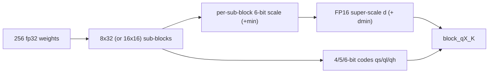

# 04. Quantization Formats & Pipeline

## Summary

llama.cpp / ggml store weights in ~30 block-quantized formats, all built on the same idea: pack a fixed run of weights into a block whose integer codes share one (or a few) FP16 scales, so a dot product becomes integer MAC + a couple of float multiplies. Three things matter most: (1) the **block layout** is the format — `block_q*` structs in `ggml/src/ggml-common.h` fix bytes-per-block and therefore bits-per-weight; (2) **k-quants** add a 256-element super-block with a two-level scale hierarchy (per-32 sub-scale × super-scale) for far better accuracy at the same bit budget; (3) the named file types (`Q4_K_M`, etc.) are **mixtures** — `src/llama-quant.cpp` picks a *different* ggml type per tensor (attn_v / ffn_down / output get more bits), and the lowest-bit **i-quants** are codebook/grid lookups that need an **importance matrix** to be usable.

Non-goals here: CUDA dequant/MMQ kernels (see `03-cuda-kernels.md`) and the GGUF container itself (see `05-gguf-and-model-loading.md`). This doc is the on-disk math: layouts, the k-quant super-block, i-quant grids, the per-tensor type-selection logic, and imatrix.

─────────────────────────────────────────────────────────────────────────────

## 1. The type system / families

`ggml_type` (the per-block storage format) is distinct from `llama_ftype` (the file-level "recipe"). The enum of storage types lives in `gguf-py/gguf/constants.py::GGMLQuantizationType`; the recipe enum is `LlamaFileType` (mirrored in C as `LLAMA_FTYPE_*`). Families:

| Family | Members | Idea |
|---|---|---|
| **Float** | `F32`, `F16`, `BF16` | verbatim / 16-bit truncation; per-element |
| **Legacy** | `Q4_0 Q4_1 Q5_0 Q5_1 Q8_0 Q8_1` | block-32, one (or one+min) FP16 scale per 32 weights, uniform affine quant |
| **k-quants** | `Q2_K Q3_K Q4_K Q5_K Q6_K` (+ `Q8_K` intermediate) | 256-weight super-block, 8×32 (or 16×16) sub-blocks, 6-bit packed sub-scales × FP16 super-scale |
| **i-quants** | `IQ1_S IQ1_M IQ2_XXS IQ2_XS IQ2_S IQ3_XXS IQ3_S IQ4_NL IQ4_XS` | codebook/grid lookup of 8- or 4-element groups + per-group sign/scale; needs imatrix below ~3 bpw |
| **FP4 micro-scaled** | `MXFP4`, `NVFP4` | 4-bit E2M1 floats with a shared microscale exponent (`MXFP4`: E8M0 per 32; `NVFP4`: UE4M3 per 16) |
| **Ternary / bitnet** | `TQ1_0`, `TQ2_0` (+ sign-only `Q1_0`) | values in {-1,0,+1}; `TQ1_0` packs 5 trits/byte (1.6875 bpw) |

Two formats are **internal only** — never stored on disk, used as the right-hand operand of integer dot products: `Q8_1` (block-32, carries `d` and a precomputed `s = d·Σqs`) and `Q8_K` (block-256, carries f32 `d`, full `int8 qs[256]`, and `int16 bsums[16]` group sums). Activations are quantized to these on the fly so k-/i-quant matmuls run in int8 (`ggml/src/ggml-quants.c`, `block_q8_1` / `block_q8_K`).

Each `block_*` carries a compile-time `static_assert` on its size, so the byte counts below are exact and enforced (`ggml-common.h`).

─────────────────────────────────────────────────────────────────────────────

## 2. Block layouts (exact, from `ggml/src/ggml-common.h`)

`QK_K = 256` is the super-block size; legacy blocks hold 32 (`QK4_0`…`QK8_0 = 32`). `ggml_half` = `uint16_t` (FP16). Four concrete structs:

```c
// 4.5 bpw  — 18 bytes / 32 weights
typedef struct { ggml_half d;            // FP16 scale
                 uint8_t   qs[QK4_0/2];  // 16 bytes, 32 nibbles (one 4-bit code each)
} block_q4_0;        // x_i = d * (q_i - 8)

// 8.5 bpw  — 34 bytes / 32 weights
typedef struct { ggml_half d;            // FP16 scale
                 int8_t    qs[QK8_0];    // 32 signed 8-bit codes
} block_q8_0;        // x_i = d * q_i

// 4.5 bpw  — 144 bytes / 256 weights (8 sub-blocks of 32)
typedef struct { union { struct { ggml_half d; ggml_half dmin; }; ggml_half2 dm; };
                 uint8_t scales[12];     // 8 sub-scales + 8 sub-mins, 6-bit each, packed
                 uint8_t qs[QK_K/2];     // 128 bytes, 256 nibbles (4-bit codes)
} block_q4_K;        // x = d*sc*q - dmin*m   (per 32-element sub-block)

// 6.5625 bpw — 210 bytes / 256 weights (16 sub-blocks of 16)
typedef struct { uint8_t  ql[QK_K/2];    // 128 bytes: low 4 bits of each 6-bit code
                 uint8_t  qh[QK_K/4];    // 64 bytes:  high 2 bits of each code
                 int8_t   scales[QK_K/16];// 16 signed 8-bit sub-scales
                 ggml_half d;            // FP16 super-scale
} block_q6_K;        // x = d * scale_j * (q - 32)
```

`bits/weight = 8 · bytes_per_block / block_elems`. Full catalog (sizes verified against the `static_assert`s and `GGML_QUANT_SIZES` in `gguf-py/gguf/constants.py`):

| ggml type | enum # | block elems | bytes/block | **bits/weight** | layout notes |
|---|---:|---:|---:|---:|---|
| F32 | 0 | 1 | 4 | 32.0 | raw |
| F16 / BF16 | 1 / 30 | 1 | 2 | 16.0 | raw 16-bit |
| Q4_0 | 2 | 32 | 18 | **4.50** | `d` + 32×4b; `q-8` |
| Q4_1 | 3 | 32 | 20 | **5.00** | `d,m` + 32×4b; `d·q+m` |
| Q5_0 | 6 | 32 | 22 | **5.50** | `d` + `qh[4]` (5th bits) + 32×4b |
| Q5_1 | 7 | 32 | 24 | **6.00** | `d,m` + `qh[4]` + 32×4b |
| Q8_0 | 8 | 32 | 34 | **8.50** | `d` + 32×int8 |
| Q8_1 | 9 | 32 | 36 | 9.00 | `d,s` + 32×int8 — *activation only* |
| Q2_K | 10 | 256 | 84 | **2.625** | `scales[16]`(4b d+4b m) + `qs[64]` + `d,dmin` |
| Q3_K | 11 | 256 | 110 | **3.4375** | `hmask[32]` + `qs[64]` + `scales[12]`(6b) + `d` |
| Q4_K | 12 | 256 | 144 | **4.50** | `d,dmin` + `scales[12]`(6b) + `qs[128]` |
| Q5_K | 13 | 256 | 176 | **5.50** | `d,dmin` + `scales[12]`(6b) + `qh[32]` + `qs[128]` |
| Q6_K | 14 | 256 | 210 | **6.5625** | `ql[128]` + `qh[64]` + `scales[16]`(int8) + `d` |
| Q8_K | 15 | 256 | 292 | ~9.125 | f32 `d` + `qs[256]` + `int16 bsums[16]` — *dot only* |
| IQ2_XXS | 16 | 256 | 66 | **2.0625** | `d` + `qs[16×u16]` (grid + signs packed) |
| IQ2_XS | 17 | 256 | 74 | **2.3125** | `d` + `qs[16×u16]` + `scales[8]` |
| IQ2_S | 22 | 256 | 82 | **2.5625** | `d` + `qs[64]` + `qh[8]` + `scales[8]` |
| IQ3_XXS | 18 | 256 | 98 | **3.0625** | `d` + `qs[96]` (grid+signs) |
| IQ3_S | 21 | 256 | 110 | **3.4375** | `d` + `qs[64]` + `qh[8]` + `signs[32]` + `scales[4]` |
| IQ1_S | 19 | 256 | 50 | **1.5625** | `d` + `qs[32]` + `qh[16×u16]` |
| IQ1_M | 29 | 256 | 56 | **1.75** | `qs[32]` + `qh[16]` + `scales[8]`; *no `d`* (FP16 super-scale bit-packed via `iq1m_scale_t`) |
| IQ4_NL | 20 | 32 | 18 | **4.50** | `d` + 32×4b → non-linear 16-entry codebook |
| IQ4_XS | 23 | 256 | 136 | **4.25** | `d` + `scales_h`(u16) + `scales_l[4]` + `qs[128]`, 6-bit sub-scales |
| MXFP4 | 39 | 32 | 17 | **4.25** | `e` (E8M0 microscale) + 32×4b E2M1 |
| NVFP4 | 40 | 64 | 36 | **4.50** | `d[4]` UE4M3 (per-16 sub-scale) + 64×4b E2M1 |
| TQ1_0 | 34 | 256 | 54 | **1.6875** | 5 trits/byte (`3^5=243<256`) + `qh` + `d` |
| TQ2_0 | 35 | 256 | 66 | **2.0625** | 2 bits/elem + `d` |
| Q1_0 | 41 | 128 | 18 | **1.125** | `d` + 128 sign bits (sign-only) |

**Effective vs nominal bpw.** The per-block numbers above are the *body* cost. A real file mixes types (see §5) and keeps output/embeddings high-precision, so the whole-model average differs. From the Llama-3.1-8B table in `tools/quantize/README.md`: `IQ1_S` 2.00, `IQ2_XXS` 2.38, `Q2_K` 3.16, `Q3_K_M` 4.00, `Q4_K_S` 4.67, **`Q4_K_M` 4.89**, `Q5_K_M` 5.70, **`Q6_K` 6.56**, **`Q8_0` 8.50**, `F16` 16.00. The `Q4_K_M` ≈ 4.89 (vs 4.50 body) is exactly the cost of the Q5_K/Q6_K bumps plus a Q6_K output tensor.

─────────────────────────────────────────────────────────────────────────────

## 3. The k-quant super-block

A k-quant super-block is **256 weights** with a **two-level scale hierarchy**, which is what buys the accuracy over legacy Q4_0/Q5_0 at the same bit width.

**Q4_K** (`block_q4_K`, 8 sub-blocks × 32 weights):
- 256 4-bit codes in `qs[128]`.
- Each 32-element sub-block has its own **6-bit scale** and **6-bit min**, all 16 of them packed into `scales[12]` (12 bytes = 16×6 bits). Unpacked by `get_scale_min_k4()` in `ggml-quants.c` — for sub-blocks 0–3 the 6 bits sit in the low bytes; for 4–7 they are reconstructed from the high 2 bits of three different bytes (`*d = (q[j+4] & 0xF) | ((q[j-4] >> 6) << 4)`).
- Two FP16 super-scales: `d` scales the sub-scales, `dmin` scales the sub-mins.
- Dequant: `x = (d·sc_j)·(q & 0xF) − (dmin·m_j)` per sub-block (`dequantize_row_q4_K`). So each weight uses `4 bits (code) + 12 bits/32 (sub-scale+min) + 32 bits/256 (super) = 4.5 bpw`.

**Q6_K** (`block_q6_K`, 16 sub-blocks × 16 weights):
- 6-bit codes split across `ql[128]` (low nibble) and `qh[64]` (high 2 bits), reassembled as `(ql & 0xF) | ((qh>>shift) & 3) << 4`.
- 16 **signed 8-bit** sub-scales in `scales[16]` (not packed/6-bit — Q6_K spends a full int8 per sub-scale), times one FP16 super-scale `d`.
- Symmetric (no min): `x = d · scale_j · (q − 32)` (`dequantize_row_q6_K`). Cost: `6 + 128/256 (scales) + 16/256 (d) = 6.5625 bpw`.

Encoding (`quantize_row_q4_K_impl`, `_q6_K_ref` in `ggml-quants.c`): per super-block compute `sigma2 = 2·Σx²/256`; for each sub-block run a weighted min/scale search (`make_qkx3_quants` for Q4_K, `make_qx_quants` for Q6_K) that minimizes weighted squared error; then the 16 sub-scales are themselves quantized to 6-bit (`make_qp_quants`) against the super-scale. Q2_K/Q3_K/Q5_K follow the same skeleton (16×16 for Q2/Q3/Q6, 8×32 for Q4/Q5).



─────────────────────────────────────────────────────────────────────────────

## 4. i-quants (codebook / grid lookup)

i-quants push below ~3 bpw by replacing per-weight codes with **vector-quantization of small groups against a fixed codebook ("grid")**. Instead of storing N independent codes, a group of 8 (IQ2/IQ1) or 4 (IQ3) weights is stored as one **grid index** plus a shared sign byte and a small per-group scale.

- The grids are constant tables in `ggml-common.h` / `ggml-quants.c`: e.g. `kgrid_2bit_256` (IQ2_XXS), `kgrid_2bit_512` (IQ2_XS), `kgrid_2bit_1024` (IQ2_S/IQ3_XXS family), `kgrid_1bit_2048` (IQ1) — each entry encodes 8 (or 4) ternary-ish lattice points. Signs come from `ksigns_iq2xs[]` / `ksigns64[]` lookup tables (`ggml-common.h`).
- At dequant the index selects a grid vector, signs flip its components, and the per-group/per-block scale multiplies: e.g. IQ2_XXS `y[j] = db · grid[j] · (signs & mask ? -1 : +1)` (`ggml-quants.c` ~L2436).
- IQ4_NL / IQ4_XS are simpler: a fixed **non-linear 16-entry codebook** (`kvalues_iq4nl`) maps 4-bit codes to non-uniformly spaced levels — better for the heavy-tailed weight distribution than a uniform Q4.

**Crucial dependency:** the low-bit i-quant *encoders* require a per-column importance weight (`quant_weights`) and pick grid indices by **weighted nearest-neighbour search** (`iq2_find_best_neighbour`, `iq3_find_best_neighbour`, `iq1_find_best_neighbour2`). Quantizing `IQ1_S/IQ1_M/IQ2_XXS/IQ2_XS/IQ2_S/IQ3_XXS` (and `Q2_K_S`'s `Q2_K`) without an imatrix is **rejected** by the pipeline (`tensor_requires_imatrix`, §5/§6). The asserts `"forgot to call ggml_quantize_init()?"` guard the runtime-built neighbour maps.

─────────────────────────────────────────────────────────────────────────────

## 5. The quantization process (`src/llama-quant.cpp`)

### 5.1 File type → default storage type

`llama_ftype_get_default_type()` maps each `LLAMA_FTYPE_*` to one base `ggml_type`:

| ftype recipe | default ggml_type |
|---|---|
| `Q4_0/Q4_1/Q5_0/Q5_1/Q8_0` | matching legacy type |
| `F16 / BF16 / ALL_F32` | F16 / BF16 / F32 |
| `Q2_K`, `Q2_K_S` | Q2_K |
| `Q3_K_S/M/L` | Q3_K |
| `Q4_K_S`, `Q4_K_M` | **Q4_K** |
| `Q5_K_S`, `Q5_K_M` | **Q5_K** |
| `Q6_K` | Q6_K |
| `IQ2_XXS/XS`, `IQ2_S/M`, `IQ3_XXS`, `IQ3_S/M`, `IQ4_NL/XS`, `IQ1_S/M` | matching i-quant |
| `TQ1_0/TQ2_0` | ternary |
| `MXFP4_MOE` | MXFP4 (MoE) |

### 5.2 What gets quantized at all

`tensor_allows_quantization()` skips: any tensor not ending in `weight`, all `*_norm.weight`, `<2`-D tensors, MoE gating (`ffn_gate_inp`), tiny conv/SSM weights (`ssm_conv1d`, `shortconv`), RWKV time-mix, positional/relative-bias and multimodal patch/position embeds, and `output.weight` unless `--quantize-output-tensor`. Those stay in their source precision (usually F32/F16).

### 5.3 Per-tensor type selection — the `_S`/`_M`/`_L` mixtures

Unless `--pure`, `llama_tensor_get_type_impl()` refines the base type per tensor using a broad **category** (`TOKEN_EMBD, ATTENTION_Q/K/V/QKV/OUTPUT, FFN_UP/GATE/DOWN, OUTPUT, OTHER`) plus arch, layer index, and GQA/expert counts. Two helpers drive the "M" logic:

- `use_more_bits(i, n) = i < n/8 || i >= 7n/8 || (i − n/8) % 3 == 2` → true for roughly the **first eighth, last eighth, and every third middle layer** (~3/8 of layers get bumped).
- `category_is_attn_v(cat)` groups `attn_v / attn_qkv / attn_kv_b` (most quant-sensitive).

Concrete behaviour of the common k-quant recipes (non-Falcon, non-MoE):

| tensor | **Q4_K_M** | Q4_K_S | **Q5_K_M** | Q6_K | Q3_K_M |
|---|---|---|---|---|---|
| `output.weight` (+tied embd) | **Q6_K** | Q6_K | Q6_K | Q6_K | Q6_K |
| `token_embd` (untied) | Q4_K | Q4_K | Q5_K | Q6_K | Q3_K |
| `attn_v` | **Q6_K** on ~3/8 layers else Q4_K | Q5_K on first 4 layers | **Q6_K** on ~3/8 else Q5_K | Q6_K | Q5_K (first 2) / Q4_K |
| `attn_qkv` | **Q5_K** | Q4_K | **Q6_K** | Q6_K | Q4_K |
| `ffn_down` | **Q6_K** on ~3/8 layers else Q4_K | Q5_K on first 1/8 | **Q6_K** on ~3/8 else Q5_K | Q6_K | tiered Q5_K/Q4_K/Q3_K |
| `attn_q/k`, `attn_output`, `ffn_gate/up` | Q4_K | Q4_K | Q5_K | Q6_K | Q3_K (output→Q4_K) |

So **"_M" = mostly the base type, but spend Q6_K on attn_v + ffn_down for ~3/8 of layers, bump attn_qkv one notch, and keep output at Q6_K** — buying most of the accuracy of the next tier up for a fraction of the size (`Q4_K_M` 4.89 vs `Q5_K_M` 5.70 bpw). `_S` ("small") applies far fewer bumps; `_L` (Q3_K_L) bumps ffn_down/attn to Q5_K. Special cases in the same function: 70B models bump shared `attn_v` to Q5_K; 8-expert MoE bump `attn_v`/`attn_k` to **Q8_0**; `MXFP4_MOE` routes 3-D expert tensors to MXFP4 and everything else to Q8_0; Falcon has its own ffn_down tiering. Users can override per-tensor with `--tensor-type <regex>=<type>`, `--output-tensor-type`, `--token-embedding-type` (the regex overrides run *before* the standard logic and win).

### 5.4 Shape fallback, imatrix gate, execution

- `tensor_type_fallback()`: if a tensor's first dim isn't divisible by the type's block size (256 for k/i-quants, 32 for legacy), it falls back (e.g. Q4_K→Q5_0, Q6_K→Q8_0, any IQ→IQ4_NL, k-quant 256→legacy 32) and, in the worst case, to F16. Counted in `qs.n_fallback`.
- `tensor_requires_imatrix()`: returns true for `IQ1_S/IQ1_M/IQ2_XXS/IQ2_XS/IQ2_S/IQ3_XXS` and for `Q2_K` *only* inside a `Q2_K_S` file. If such a target type is chosen and no imatrix was supplied, quantization **aborts** ("this quantization requires an imatrix!"); `--dry-run` just reports it. output/embeddings are exempt.
- Execution: a preliminary pass computes every tensor's target type and metadata; the main loop dequantizes each source tensor to f32 (multi-threaded `to_float`), then `llama_tensor_quantize_impl` chunks rows across threads and calls `ggml_quantize_chunk(new_type, f32, …, imatrix)`, which dispatches to the per-type `quantize_row_*` (the imatrix-aware `_impl` variant when `quant_weights != NULL`). Every chunk is checked by `ggml_validate_row_data` (rejects NaN/Inf/out-of-range codes). Output GGUF records `general.file_type = ftype` and `general.quantization_version`.

CLI surface (`tools/quantize`, `README.md`): `llama-quantize [--imatrix f] [--pure] [--leave-output-tensor] [--output-tensor-type T] [--token-embedding-type T] [--tensor-type re=T] [--allow-requantize] [--keep-split] [--prune-layers …] in.gguf out.gguf <FTYPE> [nthreads]`.

─────────────────────────────────────────────────────────────────────────────

## 6. imatrix — importance-matrix-guided quantization

**What it is.** A per-tensor, per-input-column weight vector that tells the quantizer *which columns matter*, so the weighted-error minimizer (`make_qkx3_quants`, `make_qx_quants`, grid neighbour search) protects the weights that actually move activations.

**How it's computed** (`tools/imatrix/imatrix.cpp::IMatrixCollector::collect_imatrix`). A `ggml_backend_sched` eval callback fires on every `MUL_MAT` / `MUL_MAT_ID` during a normal forward pass over calibration text. For the right-hand operand `src1` (the *activations* feeding the weight matmul), it accumulates the **sum of squared activations per input column**, summed over all token rows and chunks:

```c
for (j = 0; j < src1->ne[0]; ++j)        // ne[0] = columns = weight rows
    e.values[mat_start + j] += x[j] * x[j];
e.counts[i] += nrows;                    // token count
```

(MoE `MUL_MAT_ID` accumulates per-expert via the routed ids.) It only collects when `src1->ne[1] >= 16` and the tensor is a `blk.*` weight (plus optionally `output.weight` with `--process-output`). The result is **mean squared activation per column** = `in_sum2 / counts`, an L2 importance score.

**File format** (`common/imatrix-loader.cpp`). New format is GGUF: per tensor a `<name>.in_sum2` float tensor and a `<name>.counts` tensor, plus KV `imatrix.datasets / .chunk_count / .chunk_size`. A legacy binary `.dat` format (name/ncall/nval/sums triples) is still read by `common_imatrix_load_legacy`. Multiple imatrices can be merged (`--in-file` repeated).

**Why it lifts low-bit quant.** Inside the encoder the per-column score becomes the optimization weight, e.g. Q4_K (`quantize_row_q4_K_impl`): `weights[l] = qw[l] · sqrt(sigma2 + x[l]²)` — high-importance columns dominate the scale/min fit, so their reconstruction error shrinks at the expense of dormant columns. For i-quants the same `weights` drive the grid nearest-neighbour choice, which is why sub-3-bit types are *unusable* without it (random grid picks otherwise). Practically it cuts perplexity/KL-divergence of `Q2_K`–`IQ3` quants substantially for ~one calibration-pass of cost; `--show-statistics` reports per-tensor Σ(Act²), entropy, %-active, and layer ZD/cosine-similarity scores to diagnose calibration coverage.

─────────────────────────────────────────────────────────────────────────────

## Relevance to rusty_llama

rusty_llama already dequantizes `Q4_K`, `Q6_K`, `Q8_0` and has an AVX2 int8-dot CPU path; it is ~3–4× behind llama.cpp on TinyLlama Q4_K_M. Where this subsystem maps:

- **Coverage gap is large but mostly optional.** llama.cpp ships ~30 storage types; rusty_llama needs only the handful that real GGUFs use. The 80/20 set for Llama-family files is what you already have (`Q4_K`, `Q6_K`, `Q8_0`) plus `Q4_0`/`Q5_0`/`Q5_1` (trivial block-32 affine — cheap to add) and `Q5_K`. Adding `Q5_K` is low effort (same 8×32 super-block as Q4_K, just an extra `qh` high-bit plane) and unlocks `Q5_K_M`, a very common download.
- **`get_scale_min_k4` 6-bit unpack is the load-bearing detail.** If your Q4_K/Q5_K dequant is correct you already implement this; verify the sub-block 4–7 reconstruction (`(q[j+4]&0xF) | ((q[j-4]>>6)<<4)`) matches §3 exactly — it's the #1 silent-correctness bug in third-party k-quant readers.
- **Mixed precision is mandatory for parity, not optional.** A `Q4_K_M` file is NOT all-Q4_K: ~3/8 of attn_v/ffn_down layers are Q6_K, attn_qkv is Q5_K, output is Q6_K (§5.3). rusty_llama must already *read* these (the GGUF tags each tensor's type), but any backend kernel you write must dispatch per-tensor-type, not per-file-type. Confirm your matmul handles a Q6_K `ffn_down` sitting in an otherwise-Q4_K model.
- **i-quants (IQ1/IQ2/IQ3/IQ4_XS) are a real gap** — codebook/grid lookup + sign tables + (for encode) imatrix-weighted neighbour search. Decode-only support (the grids are constant tables) is moderate effort and would let rusty_llama load the popular `IQ4_XS`/`IQ3_M` downloads; encode support is large and low-priority for an inference engine.
- **MXFP4 is worth watching** (4.25 bpw E2M1 + E8M0 microscale, block-32, only 17 B/block): it's the format for GPT-OSS-style MoE and is dead-simple to dequantize (per-32 shared exponent). Cheap decode win if those models matter.
- **You almost certainly never need to *produce* quants.** The entire `llama-quant.cpp` selection logic, `imatrix` tool, and encoders are offline tooling — an inference engine only consumes GGUFs made by `llama-quantize`. Treat §5–§6 as "things that explain why a downloaded file has mixed tensor types," not work to port. The one exception: if you ever add a `quantize` subcommand, the `_M` mixture table (§5.3) and `use_more_bits` are the spec to copy verbatim for bit-exact output.
- **Speed gap is unlikely to be in dequant.** Since your formats are correct, the 3–4× deficit is more plausibly in matmul kernel quality (MMQ-style int8 tiling, see `03-cuda-kernels.md`), activation requant to `Q8_1`/`Q8_K`, or scheduling — not in adding more quant formats. Prioritize kernel throughput over format breadth.
- **Activation quant types** `Q8_1`/`Q8_K` (the int8 RHS with precomputed group sums `s`/`bsums`) are the bridge that makes k-quant matmul integer-only. If rusty_llama dequantizes weights to f32 then does f32 matmul, that is a major throughput leaver to pull: quantize activations to Q8_K and do int8·int8 dot like llama.cpp.
