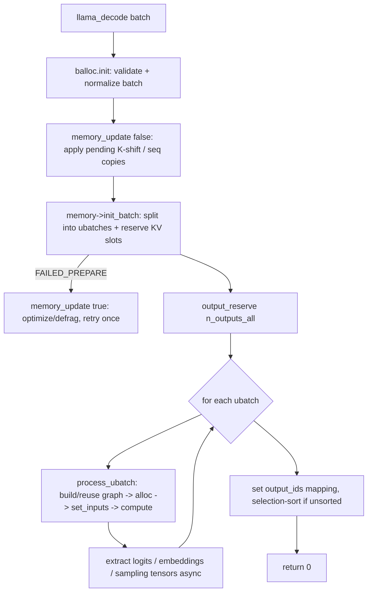

# 06. Inference Pipeline: Decode Loop, KV-Cache & Batching

## Summary

This doc traces a single `llama_decode` call end-to-end and explains the runtime that sits **above** the kernels: how a `llama_batch` becomes one or more `ubatch`es, how a compute graph is (re)built for each, how K/V is stored and read, and how that graph runs on the backend scheduler. Three things dominate the design: (1) a **unified, paged, ring-allocated KV cache** (`src/llama-kv-cache.cpp` + `src/llama-kv-cells.h`) whose padded size lets graphs be **reused across steps**; (2) **continuous batching** — many independent sequences packed into one decode, each in its own KV "stream"; and (3) a family of **memory variants** (sliding-window iSWA, recurrent/SSM, hybrid) hidden behind one `llama_memory_i` interface. Speculative decoding (draft model + n-gram) layers on top by drafting tokens cheaply and verifying many in one target batch. For kernel-level matmul/attention internals see `03-cuda-kernels.md`; for the backend scheduler that actually splits/runs the graph see `02-backends-and-dispatch.md`; for ggml graph/alloc primitives see `01-ggml-core-and-graph.md`; for samplers/grammar see `07-tokenization-and-sampling.md`.

─────────────────────────────────────────────────────────────────────────────

## 1. The decode lifecycle (`llama_decode` end-to-end)

Entry point: `llama_context::decode(const llama_batch &)` in `src/llama-context.cpp`. The high-level flow:



Step by step (`decode`):

1. **No-memory fallback.** If the context has no memory module (`!memory`), decode forwards to `encode()` — the path for encoders / non-causal embedding models.
2. **Batch validation & normalization.** `balloc->init(batch_inp, vocab, memory, n_embd, n_seq_max, output_all)` (in `src/llama-batch.cpp`, `llama_batch_allocr::init`) checks token ids / seq ids in range, then **auto-generates missing fields**: `pos` (from each sequence's `memory->seq_pos_max(s)+1`), `seq_id` (defaults to seq 0), and `logits`/`output` (all tokens if `cparams.embeddings`, else only the **last** token). `output_all = cparams.embeddings`.
3. **Backend-sampling guard.** If GPU-side samplers are attached, at most one output token per sequence is allowed.
4. **`memory_update(false)`** applies any pending shifts/copies (context-shift `k_shift`, cross-stream `seq_cp` buffer copies) before this batch.
5. **`memory->init_batch(*balloc, cparams.n_ubatch, output_all)`** splits the batch into `ubatch`es and **reserves KV slots** for all of them atomically, returning a `llama_memory_context_ptr` (`mctx`). Status handling: `FAILED_PREPARE` triggers one `memory_update(true)` optimize-and-retry; if still no slot, decode returns `1` (KV full).
6. **`output_reserve(n_outputs_all)`** sizes the host logits/embeddings output buffers.
7. **ubatch loop** (`do { … } while (mctx->next())`): set `n_outputs` for the ubatch, then `process_ubatch(...)`, then async-copy the result tensors host-ward via `ggml_backend_tensor_get_async`.
8. **Output mapping.** `out_ids[i] → output_ids[out_id] = i`; if the user batch wasn't already in output order (mainly recurrent models), a **selection sort** reorders and records lazy `output_swaps` applied on `llama_get_logits_ith`.

Return codes: `0` ok · `1` no KV slot · `2` aborted · `-1` bad input · `-2` alloc/compute fail · `-3` graph fail.

### `process_ubatch` — the inner compute (one ubatch → one graph run)

`llm_graph_result * llama_context::process_ubatch(ubatch, gtype, mctx, status)`:

1. `mctx->apply()` — commit this ubatch's reserved slots into the live cells.
2. Build `gparams = graph_params(res, ubatch, mctx, gtype)`. **Graph reuse:** if `!graph_reuse_disable && res->can_reuse(gparams)` the previous `ggml_cgraph` is reused (just re-point input memory contexts, `n_reused++`). Otherwise `res->reset()`, `ggml_backend_sched_reset()`, `gf = model.build_graph(gparams)`, then `ggml_backend_sched_alloc_graph(sched, gf)`.
3. `res->set_inputs(&ubatch)` writes token ids, positions, masks, KV indices, etc. into the input tensors.
4. `graph_compute(res->get_gf(), ubatch.n_tokens > 1)` runs it. The `batched` flag = `n_tokens > 1`, so **prefill** (multi-token ubatch) uses `cparams.n_threads_batch` and **decode** (1 token) uses `cparams.n_threads`.

### Prefill vs decode — the same code, two regimes

| Aspect | Prefill (prompt) | Decode (generation) |
|---|---|---|
| Tokens per call | up to `n_batch` (capped by `n_ctx` for causal) | typically 1 per sequence |
| ubatch width | up to `n_ubatch` | 1 (× n_seqs) |
| Outputs computed | only the **last** token's logits (unless `embeddings`) | the 1 token |
| `inp_out_ids` | slices last layer to the output rows → lm_head matmul runs on `n_outputs`, not all tokens | trivial (n_outputs==n_tokens) |
| Threading | `n_threads_batch` | `n_threads` |
| Bottleneck | compute-bound GEMM | bandwidth-bound GEMV (weights stream once) |

The `inp_out_ids` trick (see §3) is what keeps prefill's final classifier cheap: only output-marked tokens pass the final norm + `lm_head`.

─────────────────────────────────────────────────────────────────────────────

## 2. Batch → ubatch (`src/llama-batch.cpp`)

**`llama_batch`** (public API, `llama_batch_init/free/get_one`) is a struct-of-arrays over `n_tokens`: `token[]` *or* `embd[]`, `pos[]`, `n_seq_id[]`, `seq_id[][]`, `logits[]` (the per-token "produce output" flags).

**`llama_batch_allocr`** owns validation + splitting. After `init`, it precomputes per-token **sequence sets** (`seq_set` = bitset of seq ids on that token), a `seq_set_map` (set → token indices), the unique participating seq ids (`seq_id_unq`), and detects **coupled sequences** (`has_cpl`: two seqs sharing a token, e.g. a shared prompt prefix). Consistency checks enforce: positions per sequence are **consecutive** (`Y = X+1` vs the cache's stored max), no decreasing positions, no partial/incompatible sequence sub-sets, and (M-RoPE) monotonic position jumps.

**`llama_ubatch`** (the unit the graph consumes) carries: `b_equal_seqs`, `n_tokens`, `n_seq_tokens`, `n_seqs`, `n_seqs_unq`, `n_pos` (per-embd positions for M-RoPE), and views into `token/embd/pos/seq_id/seq_id_unq/seq_idx/output`. It owns its data via a shared `data_t` so a reused graph can still read it.

Three split strategies (driven by the memory module — `kv_cache::init_batch` picks one):

| Splitter | When | Behaviour |
|---|---|---|
| `split_simple(n_ubatch)` | unified KV (`n_stream==1`) | greedily take next ≤`n_ubatch` unused tokens, order preserved. `equal_seqs=false`. |
| `split_equal(n_ubatch, seq)` | per-sequence streams; iSWA | pack **non-overlapping sequence sets** so each stream gets the same token count; `sequential` forces increasing seq ids. `equal_seqs=true`. |
| `split_seq(n_ubatch)` | recurrent / `embd_all` | one sequence's tokens at a time (subset-of-current-set), for state models that can't interleave seqs. |

Padding/graph-reuse note: a ubatch is only reused if `allow_reuse` matches on `equal_seqs, n_tokens, n_seq_tokens, n_seqs, n_seqs_unq`, the participating seq ids, `n_outputs`, samplers, and the cparams flags — i.e. the **topology** must be identical.

─────────────────────────────────────────────────────────────────────────────

## 3. Graph construction (`src/llama-graph.cpp` + per-arch `build_*`)

The model's graph is assembled by an arch-specific subclass of **`llm_graph_context`** (`src/llama-graph.h`). At this commit each architecture lives in its own file under `src/models/` (e.g. `src/models/llama.cpp`, `qwen3.cpp`, `deepseek2.cpp`); the per-arch `build_arch_graph` constructs a `graph` object whose constructor *is* the build. `llm_graph_context` provides reusable, backend-agnostic node builders; the arch file wires them into layers.

### Key builder helpers (all emit ggml nodes, tagged by `cb()` for offload/alloc)

| Helper | Produces |
|---|---|
| `build_inp_embd(tok_embd)` | `ggml_get_rows` token embeddings (or accepts external `embd`) |
| `build_inp_pos()` | I32 positions (1× or 4× for M-RoPE) |
| `build_inp_out_ids()` | I32 indices of output tokens (the last-layer slice) |
| `build_norm(cur, w, b, type)` | `ggml_rms_norm` / `ggml_norm` / `ggml_group_norm` + affine |
| `build_qkv(layer, cur, …)` | fused `wqkv` view **or** separate `wq/wk/wv` (+ bias, clamp), reshaped to `[head_dim, n_head(_kv), n_tokens]` |
| `build_ffn(…, op, gate_type)` | up→(gate)→act→down; act ∈ SILU/GELU/RELU/SWIGLU/GEGLU…; gate SEQ or PAR (fused `ggml_swiglu_split`) |
| `build_moe_ffn(…)` | router `gate_inp` → top-k experts → `ggml_mul_mat_id` over `*_exps`, optional shared expert |
| `build_attn_inp_kv()` | allocates the KQ mask + K/V cache write indices as graph inputs |
| `build_attn(inp_kv, wo, …, q,k,v, …)` | **writes** K/V to cache, **reads** full K/V, calls `build_attn_mha`, applies `wo` |
| `build_attn_mha(q,k,v,mask,…)` | the actual attention (flash or explicit) |
| `build_rs(inp, s, …)` | recurrent state read/scatter (`ggml_get_rows` over state slots) |

### One transformer layer (Llama, from `src/models/llama.cpp`)

```
res->t_layer_inp[il] = inpL
inpSA = inpL
cur = build_norm(inpL, attn_norm, RMS)                 # pre-attn norm
(Qcur,Kcur,Vcur) = build_qkv(layer, cur, …)
Qcur = ggml_rope_ext(Qcur, inp_pos, rope_factors, …)   # RoPE in-place on Q,K
Kcur = ggml_rope_ext(Kcur, inp_pos, rope_factors, …)
cur = build_attn(inp_attn, wo, …, Qcur,Kcur,Vcur, kq_scale, il)   # KV write+read+MHA+Wo
if il == n_layer-1:                                    # OUTPUT SLICE
    cur   = ggml_get_rows(cur,   inp_out_ids)          # keep only output tokens
    inpSA = ggml_get_rows(inpSA, inp_out_ids)
ffn_inp = cur + inpSA                                   # residual
cur = build_norm(ffn_inp, ffn_norm, RMS)
cur = build_ffn(cur, up,gate,down, SILU, PAR)          # or build_moe_ffn
cur = cur + ffn_inp                                     # residual
inpL = build_cvec(cur, il)                              # control-vector hook
# after loop:
cur = build_norm(inpL, output_norm, RMS); res->t_embd = cur
cur = build_lora_mm(output, cur);        res->t_logits = cur
```

The result tensors (`t_logits`, `t_embd`, `t_embd_pooled`, `t_h_nextn`, per-seq sampling tensors) are exposed via `llm_graph_result`, which `decode` reads back.

### `build_attn` — KV write + read (the cache touchpoint)

In `build_attn(llm_graph_input_attn_kv*, …)`:

```
ggml_build_forward_expand(gf, mctx->cpy_k(ctx0, k_cur, k_idxs, il));  # scatter K into cache rows
ggml_build_forward_expand(gf, mctx->cpy_v(ctx0, v_cur, v_idxs, il));  # scatter V
k = mctx->get_k(ctx0, il);   # view of the whole [0..n_kv) cache for this layer
v = mctx->get_v(ctx0, il);
cur = build_attn_mha(q, k, v, kq_b, kq_mask, sinks, v_mla, kq_scale, il);
cur = build_lora_mm(wo, cur, wo_s); cur += wo_b;
```

`build_attn_mha` has two paths (`src/llama-graph.cpp`):
- **Flash** (`cparams.flash_attn && kq_b==nullptr`): `ggml_flash_attn_ext(q, k, v, mask, scale, max_bias, softcap)` — requires an **F16** mask; `ggml_flash_attn_ext_add_sinks` for attention sinks; F32 precision forced.
- **Explicit**: `kq = ggml_mul_mat(k, q)` (F32 precision) → optional softcap/Grok-tanh → `ggml_soft_max_ext(kq, mask, scale, max_bias)` + sinks → `kqv = ggml_mul_mat(v, kq)`. If `!cparams.offload_kqv`, the post-store attention nodes are pinned to `backend_cpu` to cut graph splits.

`v_mla` is the MLA "decompress" matmul (DeepSeek-style multi-head latent attention; see `src/models/deepseek2.cpp`).

─────────────────────────────────────────────────────────────────────────────

## 4. KV-Cache architecture

### 4.1 The unified paged cache (`src/llama-kv-cache.cpp`, `src/llama-kv-cells.h`)

**Tensors.** For each KV-bearing layer the cache allocates `K = ggml_new_tensor_3d(type_k, n_embd_k_gqa, kv_size, n_stream)` and (unless MLA) `V` likewise. `n_stream = unified ? 1 : n_seq_max`. With a **unified** cache (`cparams.kv_unified`), all sequences share one stream of `kv_size = n_ctx` cells; otherwise each sequence gets its own stream of `n_ctx_seq = n_ctx / n_seq_max` cells (`per-seq` isolation). Per-stream `ggml_view_2d`s expose each stream. K/V data type is configurable (`type_k`/`type_v`: f16, q8_0, q4_0…), enabling **KV-cache quantization** (see `04-quantization.md`).

**Cells metadata** (`llama_kv_cells`, one per stream): parallel arrays indexed by cell —
- `pos[i]` (llama_pos, `-1` = empty), `seq[i]` (a `std::bitset<LLAMA_MAX_SEQ>` — a cell can belong to **multiple** sequences), `shift[i]` (pending position delta for context-shift), `ext[i]` (2-D pos for M-RoPE).
- A `used` ordered set tracks occupied indices (`used_min`, `used_max_p1`); per-seq `seq_pos[s]` multisets give O(1) `seq_pos_min/max`.

**Slot allocation — `find_slot(ubatch, cont)`** is a **ring-buffer search** per stream, starting from the stream's `head`:
- If `head > used + 2*n_tokens`, reset `head = 0` (try to refill the front and keep the cache compact).
- Walk cells; a cell is usable if **empty**, or occupied by a single sequence whose position is already **outside the SWA window** (`llama_hparams::is_masked_swa(...)` → reclaimable). For `cont=true` all `n_tokens` must be contiguous; otherwise tokens are placed one-by-one (non-contiguous slot is allowed — this *is* the "paging").
- Returns a `slot_info` (`strm[]`, `idxs[]` per stream). `prepare(ubatches)` finds slots for **all** ubatches up front, applies them on a scratch copy, then rolls back — so the whole batch either fits or fails atomically.

**`apply_ubatch(sinfo, ubatch)`** commits: for each placed token it `rm`s any prior occupant (recording the overwritten max pos), `pos_set`s the new pos, `seq_add`s the seq ids, then **purges** any sequence positions below an overwritten one to preserve the invariant "all positions in `[seq_pos_min, seq_pos_max]` are present". Finally `head = last_idx + 1`.

**`get_n_kv(sinfo)`** returns the **padded** active length: `GGML_PAD(used_max_p1, max(n_pad, 256))`. This padding keeps `n_kv` constant across consecutive decode steps → the graph topology is stable → **graph reuse** kicks in (huge for decode latency). There is **no separate compaction/defrag pass**; the ring allocator + head reset + SWA reclamation keep it dense, and `init_update` only performs **K-shift** (apply `shift[]` via a rope on the cache) and queued cross-stream copies.

**Sequence ops** (the public `llama_memory` surface, all in `llama-kv-cache.cpp`):
- `seq_rm(seq, p0, p1)` — clear cells of a seq in a pos range (sets `head` back to the freed front).
- `seq_cp(src, dst, p0, p1)` — **same stream**: just OR the dst bit into shared cells (zero-copy fork, e.g. beam/parallel sampling). **Cross stream**: enqueue a buffer copy applied at next `update` (must be a full copy).
- `seq_keep`, `seq_add` (context shift: `pos += shift`), `seq_div` (self-extend: `pos /= d`).

### 4.2 KV-cache variants

| Variant | File | What it stores | Slot model |
|---|---|---|---|
| **Unified / paged** | `llama-kv-cache.cpp` | full K/V per layer | ring-allocated cells, multi-seq bitsets |
| **iSWA (interleaved sliding-window)** | `llama-kv-cache-iswa.cpp` | two sub-caches: `kv_base` (non-SWA layers, full size) + `kv_swa` (SWA layers, small) | base = full `n_ctx`; SWA size = `GGML_PAD(min(n_ctx, n_swa·(unified?n_seq:1) + n_ubatch), 256)` |
| **Recurrent / SSM** | `llama-memory-recurrent.cpp` | per-layer `r` (conv state, `n_embd_r`) + `s` (SSM state, `n_embd_s`), rows = `mem_size·(1+n_rs_seq)` | **one live state per sequence** (`cells[].tail` index); `n_rs_seq` per-token snapshots enable partial rollback |
| **Hybrid (attn + recurrent)** | `llama-memory-hybrid.cpp` | a `llama_kv_cache` for `is_recr==false` layers + a `llama_memory_recurrent` for `is_recr==true` layers | each sub-module manages its own slots; ubatches split by `split_seq` |
| **DSA (DeepSeek sparse attn)** | `llama-kv-cache-dsa.*` (context type referenced in `llama-graph.h`) | K-only sparse cache with top-k indexer | specialized indices (`build_attn_inp_k_dsa`) |

**iSWA** (`llama_kv_cache_iswa`) is just two `llama_kv_cache`s with complementary layer filters (`is_swa(il)`); ops fan out to both. The SWA cache is tiny (only needs to hold the window), saving memory for long-context models like Gemma. `seq_pos_min/max` read the SWA cache (a subset). Splitting tries `split_simple` first (unified), falling back to `split_equal`.

**Recurrent** (`llama_memory_recurrent`) has no attention K/V — Mamba/RWKV keep a **fixed-size state** that is overwritten each step, so it can't store "history per token". `find_slot` assigns one state slot per sequence keyed by `cells[seq].tail`; `seq_cp` just points dst's tail at src's state. Because state isn't per-token, a mid-sequence `seq_rm` can only succeed at the tail or via the bounded `n_rs_seq` snapshot rollback. Graph side uses `build_rs` / token-shift load-store.

**Hybrid** (`llama_memory_hybrid`) is how Jamba/Falcon-H1-style models work: attention layers get the paged cache, SSM layers get the recurrent state, and a `llama_memory_hybrid_context` advances both in lockstep (`next()`/`apply()`). `seq_pos_min = max(attn.min, recr.min)`, `seq_pos_max = min(attn.max, recr.max)` — the intersection both sub-caches agree on.

─────────────────────────────────────────────────────────────────────────────

## 5. Sequences & continuous batching

A **sequence** (`llama_seq_id`, `0 ≤ id < n_seq_max ≤ LLAMA_MAX_SEQ`) is an independent conversation/stream sharing the model + (optionally) the KV cache. Continuous batching = packing tokens from **different** sequences into one `llama_decode` so the GPU stays busy when individual sequences only contribute 1 decode token each.

Mechanics:
- The user sets `batch.seq_id[i]` per token; `balloc` groups tokens by sequence set and `split_equal` packs **non-overlapping** sequences into each ubatch as parallel **streams** (`n_seqs`, `n_seq_tokens` equal per stream).
- **`kv_unified`** chooses memory layout: `true` → one shared cell pool (`n_stream==1`), sequences distinguished only by the `seq[]` bitset + KQ mask; `false` → `n_stream == n_seq_max` isolated pools of `n_ctx_seq = n_ctx/n_seq_max` each (`n_ctx` rounded so it divides evenly; both padded to 256).
- The **KQ mask** (`set_input_kq_mask`, shape `[n_kv, n_tokens/n_stream, 1, n_stream]`) is what enforces per-sequence causal visibility within a shared cache: a query token only attends to cache cells whose `seq[]` contains its seq id and whose pos is ≤ its pos (and inside the SWA window if applicable).
- **KV sharing/fork:** intra-stream `seq_cp` is **zero-copy** (set a bit) — ideal for parallel sampling / beam search off a shared prompt. Cross-stream copies move buffer bytes at the next update.
- **Context shift** ("infinite" generation): drop the oldest positions with `seq_rm`, then `seq_add(seq, p0, p1, -shift)` to renumber the survivors; the pending `shift[]` is applied to the K cache via a rope in `init_update`/`update` (`get_can_shift()` gates this — disabled for M-RoPE and per-layer-RoPE archs).
- **Self-extend** uses `seq_div` to compress positions (grouped attention) for length extrapolation.

─────────────────────────────────────────────────────────────────────────────

## 6. Speculative decoding

**Core idea** (`docs/speculative.md`): generating *N* tokens in **one batched forward** is far cheaper than *N* sequential decodes. A cheap **drafter** proposes the next *k* tokens; the expensive **target** model verifies all *k+1* positions in a single `llama_decode`; the **longest correct prefix** is accepted, the first mismatch reseeds, and the cycle repeats. Quality is unchanged when verification uses the target's own distribution.

`common/speculative.cpp` implements pluggable drafters behind `common_speculative_impl` (`begin / process / draft / accept`), each tracking acceptance stats (`n_acc_tokens`, `n_acc_tokens_per_pos`). Multiple types can be combined (`--spec-type a,b`).

| Type | Drafter | Notes |
|---|---|---|
| `draft-simple` | small draft **model** | most common; greedy top-k draft, early-stop on low confidence |
| `draft-eagle3` | EAGLE3 head | feeds target's hidden states (`verify_g`) back into the drafter |
| `draft-mtp` | model's Multi-Token-Prediction heads | uses `h_nextn` pre-norm embeddings from the target |
| `ngram-cache` | n-gram frequency cache | `common/ngram-cache.cpp`, see below |
| `ngram-simple` / `ngram-map-k` / `ngram-map-k4v` | history pattern match | find last matching n-gram, draft the following m-gram (prompt-lookup) |
| `ngram-mod` | rolling LCG hash → next token | ~16 MB shared pool across all server slots; variable draft length |

**Draft model loop** (`common_speculative_impl_draft_simple::draft`): for each still-drafting sequence, `llama_decode` the draft model on `id_last`, sample greedily (`top_k`), and append the token to the draft batch only while its probability clears `params.p_min` (`cur_p->data[0].p < p_min` → stop early); cap at `n_max` (default 3). Draft and target must share tokenizer family: `common_speculative_are_compatible` requires matching vocab type, BOS/EOS, and a vocab-size diff ≤ `SPEC_VOCAB_MAX_SIZE_DIFFERENCE` (128) with byte-identical token text.

**Prompt-lookup / n-gram** (`common/ngram-cache.cpp`): no model at all. Three caches — `nc_context` (current context), `nc_dynamic` (this run's generations), `nc_static` (loaded from a corpus) — map an n-gram → {next-token : count}. `common_ngram_cache_draft` walks draft positions, looks up the trailing n-gram (longest first), and emits the most frequent continuation, weighted by `count_primary · count_static`. It bails on weak evidence via thresholds: lax `{66,50,50,50}%` (min samples `{2,2,1,1}`) for context, strict `{75,66,66,66}%` (min `{4,3,2,2}`) for dynamic. Excellent for code/summarization where text repeats; zero extra VRAM.

**Acceptance** (`common_speculative_accept`): after the target verifies, the accepted count updates per-position stats and feeds back to the drafter (`accept()`) — e.g. ngram-map records how many of its draft were right; adaptive variants disable themselves after repeated low acceptance.

─────────────────────────────────────────────────────────────────────────────

## Relevance to rusty_llama

rusty_llama today runs a **single sequence** with a resident CUDA prefill + resident CUDA decode (`DecodeCuda`), TinyLlama (Llama arch only), Q4_K/Q6_K/Q8_0 weights. Its "KV cache" is a **contiguous per-layer K/V buffer in `RunState`**, written sequentially by position; prefill computes KV on device and copies it to host once (`store_prefill_kv`), and decode's `DecodeCuda` **uploads that host KV once on the first step** (`kv_filled` counter), then appends each new step's K/V to row `pos`. That is a clean, fast design for one stream — but it is exactly the part llama.cpp generalizes.

- **Paged, multi-seq KV is the big architectural gap.** rusty_llama's KV is a flat ring-free buffer with no `seq[]` bitset, no slot reuse, no SWA reclamation. llama.cpp's `llama_kv_cells` (pos + seq bitset + shift) is the data structure to study before any batching work. Effort: large, but it is the foundation for everything below.
- **Drop the host KV round-trip.** llama.cpp keeps KV **resident across prefill→decode** in the same tensors; rusty_llama's one-time host upload (HANDOFF roadmap item #3) is pure overhead. Porting the unified-cache idea (prefill writes directly into the cache tensors decode reads) removes the copy entirely. Effort: medium, high ROI, well-scoped.
- **Continuous batching needs the KQ mask, not just looping.** The lever is `set_input_kq_mask` + per-token `seq_id` + `split_equal` streams. Even a fixed small `n_seq_max` (e.g. 4) with a shared cache would let a server saturate the GPU on decode (where rusty_llama is bandwidth-bound at batch-1). This is the single biggest throughput multiplier and pairs naturally with the resident-KV change.
- **Graph/topology reuse → stable decode shape.** llama.cpp pads `n_kv` to a multiple of 256 (`get_n_kv`) so the decode graph is byte-identical step to step and gets reused. rusty_llama already builds a resident `DecodeCuda`; adopting the same **pos-padding discipline** keeps its kernel launch params constant and avoids reallocation as context grows.
- **Speculative decoding is a pure-throughput win with no quality cost.** The cheapest entry is **prompt-lookup / n-gram** (`ngram-cache.cpp`) — no second model, ~no VRAM, and it directly exploits rusty_llama's bandwidth-bound decode (verify k tokens in one batch-k forward instead of k batch-1 GEMVs). A draft-model path is more work (needs a 2nd resident model + vocab-compat checks). Start with n-gram. Effort: medium; depends on first supporting a batch-of-k decode (which the batching work above provides).
- **`inp_out_ids` slice is a free prefill win.** rusty_llama should confirm its prefill only runs the final norm + classifier on the **last** token (llama.cpp's last-layer `ggml_get_rows`), not all prompt tokens — otherwise the lm_head GEMM over the full prompt is wasted work.
- **Variants (iSWA / recurrent / hybrid) are out of scope** until breadth (Qwen/Gemma/Mamba) is on the roadmap — but note iSWA's tiny SWA cache is the trick that makes long-context Gemma cheap, and the `llama_memory_i` interface is the right seam to add them without touching the decode loop. Park until arch breadth (roadmap #5) is prioritized.
