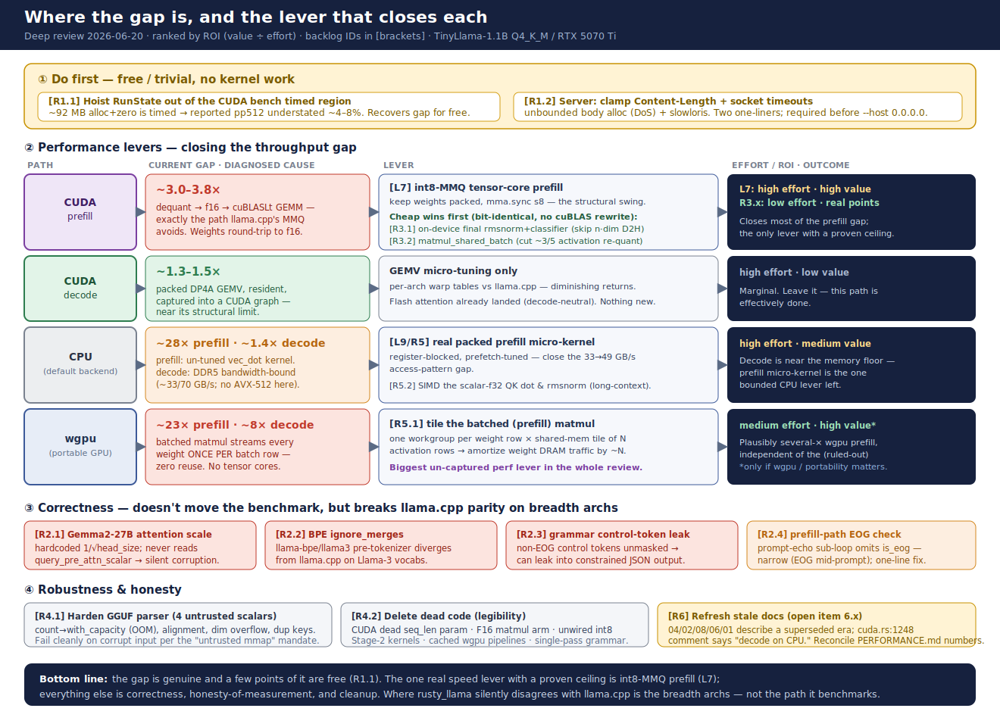

# Deep Review — 2026-06-20

A whole-repo review focused on three things the existing docs can't self-report:
**(1)** does the code actually match its performance claims, **(2)** correctness bugs
that would silently invalidate the llama.cpp comparison, and **(3)** untapped
performance and over-engineering.

**Method.** 18 agents read all ~8 K LOC across 10 subsystems against the source
(not the docs), produced 72 findings; every high-severity correctness / performance /
doc-drift finding was independently re-read by an adversarial verifier. **0 of 72 were
refuted as hallucinations** — a good signal for the codebase's legibility. The two
most decision-relevant claims were then re-verified by hand.

## Diagrams

- [llama.cpp architecture & timings](../Architecture/diagrams/llamacpp-architecture.svg)
- [rusty_llama architecture & timings](../Architecture/diagrams/rusty-llama-architecture.svg)
- [The gap & the levers that close it](../Architecture/diagrams/gap-and-levers.svg)

---

## Verdict

This is a genuinely strong, unusually disciplined codebase — the parity-test culture
(every device kernel has a CPU-oracle test with arithmetically-justified tolerances) is
better than most production inference engines. **The single most important result: there
is no correctness bug on the benchmark path** (TinyLlama Q4_K_M, CPU + CUDA). The SIMD /
CUDA integer-dot kernels are bit-exact as claimed; the q8k tie-break is handled; the
online-softmax attention is sound. **The "1.4×–3.8× behind" numbers are real and not
poisoned** — this is an honest race, not a rigged one. The remaining gap is exactly where
the docs say it is (int8-MMQ tensor cores), with a few recoverable points the docs miss.

## Current measured standing

TinyLlama-1.1B Q4_K_M, Intel Core Ultra 9 285H (AVX2, no AVX-512) + RTX 5070 Ti Laptop
(Blackwell sm_120), latest figures (BACKLOG 2026-06-19 — these **supersede** PERFORMANCE.md's
headline 4.4×/2.0×, see doc-drift below):

| Path | rusty_llama | llama.cpp | Gap | Bound by |
|---|---:|---:|---:|---|
| CUDA prefill (pp512) | ~5,230 tok/s | ~19,637 tok/s | **~3.0–3.8×** | f16-cuBLASLt vs int8-MMQ tensor cores |
| CUDA decode (tg128) | ~275 tok/s | ~415 tok/s | **~1.3–1.5×** | GEMV micro-tuning (near structural limit) |
| CPU prefill (pp512) | ~210 tok/s | 5,890 tok/s | **~28×** | un-tuned `vec_dot` micro-kernel (L9) |
| CPU decode (tg128) | ~53 tok/s | 73.6 tok/s | **~1.4×** | DDR5 bandwidth (~33 of 70 GB/s) |
| wgpu decode (tg128) | ~46 tok/s | 375.9 tok/s (Vulkan) | **~8×** | overhead / no tensor cores |
| wgpu prefill | ~735 tok/s | 16,988 tok/s (Vulkan) | **~23×** | **no weight reuse across batch rows** |

---

## 1. The most useful finding: part of the reported gap is a measurement artifact

**`bench_decode_real` / `bench_prefill_real` (cuda.rs:1901-1906, 2014-2017) allocate a
fresh ~92 MB `RunState` *inside* the timed closure.** Confirmed by reading the code:
`bench_stat` times `f()`, and `f` begins `let mut s = RunState::new(&model.config)` — a
22-layer × seq × dim host KV alloc **+ zero** on every timed rep. `llama-bench` allocates
its KV cache once, outside timing.

- **Prefill** (1 forward pass per rep): the alloc is ~4–8 % of the timed window → the
  **pp512 number is understated by that much**. Real prefill gap is nearer ~3.6× than 3.8×.
- **Decode** (128 steps per rep): ~1 %, minor.
- **The CPU bench already hoists `RunState` out** of timing — so CPU and CUDA numbers
  aren't measured the same way, which also distorts CPU-vs-CUDA comparisons.

**Fix (trivial, free, makes the comparison honest):** hoist `RunState::new` out of the
closure; build it once in warmup and reset cheap fields. Highest ROI in the review — costs
nothing and recovers a few points off the headline number.

---

## 2. Performance — where the real gap is, path by path

### CUDA prefill — the headline gap (~3–3.8×)

Diagnosis confirmed: weights are dequantized to f16 and fed to cuBLASLt
(`CUBLAS_COMPUTE_32F_FAST_TF32` / f16 GEMM) — **exactly the path llama.cpp's MMQ
deliberately avoids**. The structural lever (int8-MMQ `mma.sync s8`, weights stay packed)
is correctly identified in the docs. Two **cheap wins the docs miss**, both bit-identical:

- **The fused prefill downloads the *entire* `n*dim` residual to host** to run the final
  rmsnorm + classifier on the CPU (cuda.rs:1525-1531). You only need the **last row**.
  Slice it on-device, `dev_rmsnorm` against the resident weight, one GEMV, download only the
  vocab-sized logits → removes a ~4 MB D2H + host rmsnorm + sync **per prompt**.
- **`matmul_shared_batch` is missing.** Single-token forward shares the quantized q/k/v and
  gate/up activation (`matmul_shared`), but batched prefill re-quantizes the same activation
  per weight matrix (model.rs:838-840, 903-904, 1190-1192, 1253-1254). A default-looping
  `matmul_shared_batch` removes ~3 of every 5 activation quantizations in prefill.

### CUDA decode (~1.4×) — near structural limit

The graphed packed-DP4A GEMV is the right kernel. Residual is GEMV micro-tuning vs
llama.cpp's per-arch warp tables; diminishing returns, as the docs conclude. Nothing new.

### CPU (~1.4× decode, ~28× prefill)

Decode is DDR5-bandwidth-bound and about as tight as it gets without AVX-512. Levers:

- **The QK attention dot products are scalar f32** (`(a*b).sum()` at cpu.rs:403; same for
  the `v*v` rmsnorm reduction at :99). Negligible at 128-token context, measurable and
  easily SIMD'd at long context.
- **Prefill's ~28× is the un-tuned `vec_dot` micro-kernel** (L9). The register-tiled blocked
  GEMM (MR=4) helps but isn't a real packed micro-kernel — the known, bounded CPU lever.

### wgpu (~8× decode, ~23× prefill) — biggest *un-captured* lever in the review

`WGSL_MATMUL_BATCH` and the three quant batch variants (gpu.rs:233-252, 427, 579, 679)
**re-stream every weight element once per batch row, with zero reuse.** Prefill is
bandwidth-bound on the weight stream, so a tiled kernel (one workgroup per weight row,
dotting a shared-mem tile of N activation rows) amortizes weight DRAM traffic by ~N —
**plausibly several-× on wgpu prefill, independent of the tensor-core gap already ruled
out.** Caveat: wgpu is the least-important path (CUDA is the real GPU story), so this is
high-impact-but-low-priority unless portability matters.

---

## 3. Correctness — 8 verified findings, ranked by blast radius

**None touch the TinyLlama benchmark path.** They split into "advertised-but-untested
archs" and "server / grammar" — exactly where a from-scratch engine silently diverges from
llama.cpp.

| # | Finding | Where | Impact |
|---|---|---|---|
| 1 | **Gemma2-27B attention scale is wrong** | model.rs:241-247, cpu.rs:384 (+4 sites) | Hardcoded `1/sqrt(head_size)`; `from_gguf` never reads `query_pre_attn_scalar`. For Gemma2-**27B** (scalar 144 ≠ head_dim 128) → silent ~1.06× output corruption. 2B/9B happen to be correct. |
| 2 | **Llama-3 / BPE `ignore_merges` not honored** | tokenizer.rs:664-707 | The `llama-bpe` / `llama3` pre-tokenizer misses the `ignore_merges` rank rule → tokenization can disagree with llama.cpp on Llama-3-family models, breaking byte-exact parity for those vocabs. |
| 3 | **Control tokens bypass grammar masking** | grammar.rs:210-225; tokenizer.rs:107-113 | Non-EOG control tokens aren't masked, so they can leak into grammar-constrained ("JSON") output — correctness + structured-output safety. |
| 4 | **Unbounded HTTP body alloc** | server.rs:526 | `vec![0u8; content_length]` from an unbounded client length → single-request memory DoS. Reachable on `--host 0.0.0.0`. |
| 5 | **No socket read/write timeouts** | server.rs:500-527, 239-244 | A stalled client pins a worker thread forever (slowloris). |
| 6 | **GGUF parser trusts 4 untrusted scalars** | gguf.rs:130-142 | `tensor_count`/`kv_count` → `with_capacity` (OOM); `alignment` not power-of-2-checked; `rows*cols` can overflow `usize`; dup keys silently last-wins. Not OOB-exploitable (downstream `QMatrix` guards catch common cases), but violates the stated "untrusted mmap" contract. |
| 7 | **wgpu dispatch limit breaks large vocabs** | gpu.rs:1846+ | `ceil_div(rows*n_heads,64)` exceeds the 65535 workgroup limit for vocab 128256 (Llama-3) — **but only on DX12/Metal**; on the RTX 5070 Ti via Vulkan the limit is ~2.1 B, so it works there. Latent, off the primary path. |

**Correction to the synthesis (re-verified by hand):** the "prefill fast path generates
past EOS" claim is **overstated**. The `generate_prefilled` *generation* loop **does** check
`next == 1 || is_eog(next)` (model.rs:1455) — it is correct. Only the **prompt-echo**
sub-loop (model.rs:1441) omits `is_eog`, which matters solely if an EOG token is embedded
*mid-prompt* — a narrow edge case, not a live over-generation bug. Worth the one-line
unification, but minor.

---

## 4. Over-engineering / delete list (legibility is a stated value — bloat is real cost)

- **CUDA `attention_kernel` takes a dead `seq_len` param** threaded through `dev_attention`
  and both call sites *with inconsistent values* (decode passes `d.seq_len`, prefill passes
  `n`) — the kernel never reads it. Delete from kernel + launcher + 2 callers (cuda.rs:160,
  1013/1021/1044, 1188, 1507).
- **The F16 matmul branch / `dot_quant_row` is effectively dead** — loaders build
  `QMatrix::F32` after dequant, never `QMatrix::Quant{ty=F16}`. Confirm, then delete the F16
  arms and keep `dot_quant_row` only under `#[cfg(test)]` as the bench oracle
  (cpu.rs:22-36, 127-132, 271-280).
- **`Q8Activation.block_sums` is computed on every Q8 quant but read only by the dormant
  VNNI path** — gate it (and the `n/32` i32 alloc) on `vnni_supported()` (quant.rs:326-332).
- **`grammar.rs` is a two-pass parser that re-lexes rule bodies O(n²)** and swallows
  malformed elements silently (grammar.rs:317-350). Single-pass with deferred name→id fixup
  removes ~35 lines.
- **Per-step wgpu matmul re-resolves the pipeline every layer every token** though it never
  changes — store resolved pipelines in `LayerBinds` at build time (gpu.rs:1850).
- **Hot-loop allocations** that should be caller-owned scratch: MoE per-row selection `Vec`
  per token (model.rs:1543 → fixed array), ~9 scratch `Vec`s per prefill admit
  (model.rs:1164-1173).

---

## 5. Doc-drift (open item 6.x — confirmed real)

The Architecture docs are named the source of truth but describe a **superseded era**:

- **`04-cuda-backend.md`** — 7 kernels / default-stream / "decode runs on CPU." Code: 12
  kernels, `new_stream` (graph-capturable), resident DP4A decode + CUDA graph. The in-code
  comment at **cuda.rs:1248-1251** also says "decode runs entirely on the CPU" directly
  above the resident-GPU `forward_step`. Most misleading line in the file.
- **`02-…md`** describes materialized-softmax attention; code is flash / online-softmax.
- **`08-…md`** headlines decode at 123 tok/s / 3.4× behind; adopted path is ~275 / ~1.4×.
- **`06-…md`** says F16 is rejected; it's accepted. **`01-…md`** says Llama-only / no-MoE and
  references a nonexistent `store_prefill_kv`.
- **`PERFORMANCE.md`** headline is 4.4× prefill / 2.0× decode; latest measured is
  ~3.0–3.8× / ~1.4×.

A grep-driven pass fixes line cites, kernel counts, and stale numbers at once.

---

## Prioritized next steps

See [`BACKLOG.md`](../../BACKLOG.md) "Review follow-ups (2026-06-20)" for the tracked checklist.

1. **Hoist `RunState` out of the CUDA bench timed region** (trivial). Free, honest recovery
   of a few % on the prefill number; unifies CPU/CUDA measurement. *Do first — it changes
   the number being optimized against.*
2. **Server: clamp `Content-Length` + set socket timeouts** (two one-liners). Required
   before any non-localhost run.
3. **CUDA prefill: on-device final rmsnorm+classifier, and `matmul_shared_batch`** (low,
   bit-identical). Real prefill points without touching cuBLASLt.
4. **Correctness one-liners:** read `query_pre_attn_scalar` (or assert) for Gemma2-27B;
   honor BPE `ignore_merges`; mask control tokens in grammar; unify the prompt-echo EOG check.
5. **wgpu prefill tiling** (medium) — biggest un-captured perf lever, only if wgpu matters.
6. **Harden the 4 GGUF untrusted scalars** + delete the dead code in §4.
7. **Refresh the 4 stale Architecture docs** + the cuda.rs:1248 comment.

**Strategic read.** Raw-throughput parity is a treadmill, and the bounded CPU / CUDA-decode
levers are already pulled correctly. The one remaining *real* speed lever with a proven
ceiling is **int8-MMQ tensor-core prefill**; everything else above is correctness,
honesty-of-measurement, and cleanup. The most valuable thing this review found is not a new
kernel — it's that **the gap is genuine and a few points of it are free** (§1), and that the
places rusty_llama silently disagrees with llama.cpp are the *breadth* archs (Gemma2-27B,
Llama-3 BPE), not the path it benchmarks.
